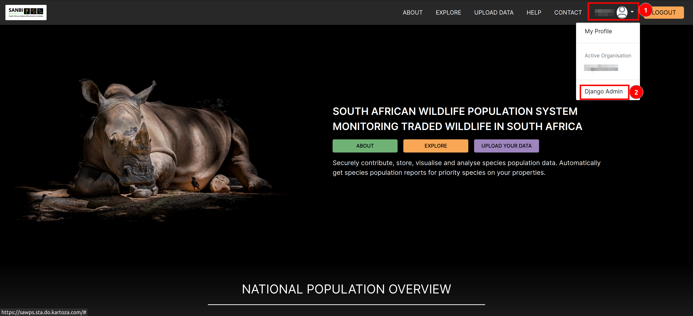
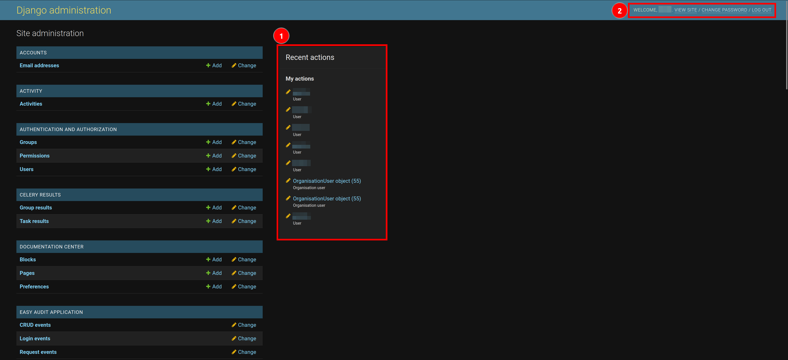
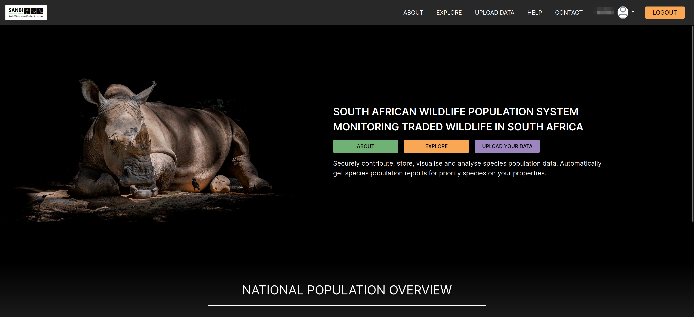
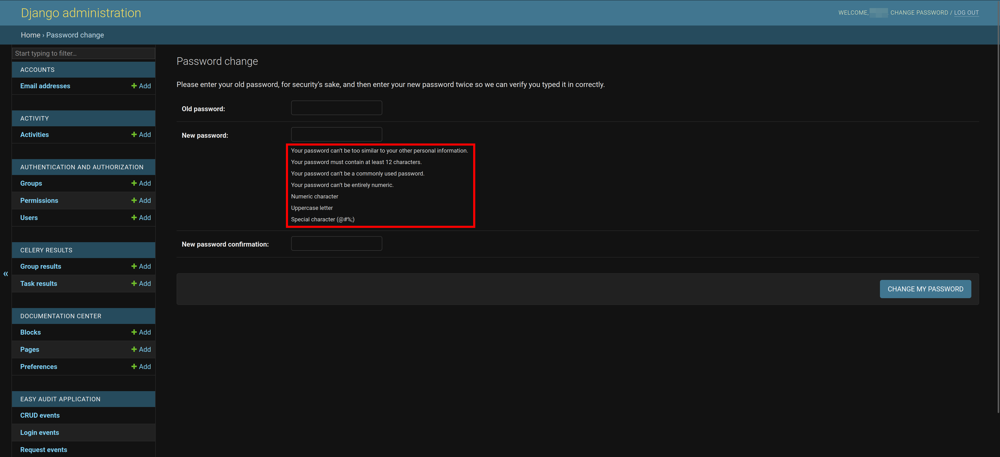
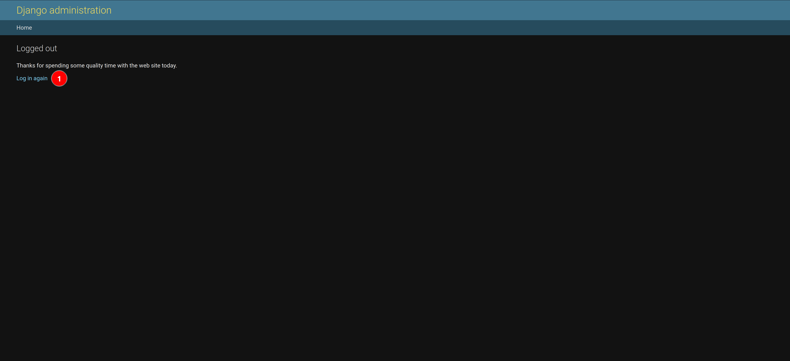

# Accessing the Administration Site

This section contains explains how administrators can access the administration site of the SAWPS platform to then move forward with administration tasks. To acquire an administrative [user role](../../user/manual/user-roles.md), users can utilise the [contact page](../../user/manual/help-contact.md) page to make a request for the necessary permissions.

## Access from the SAWPS Platform

After logging in to the SAWPS platform using an administrative account, you can click on 1️⃣ the profile menu dropdown and then click on 2️⃣ the `Django Admin` link to be redirected to the administration page.

> A **helpful hint** is to right-click and open the administration page in a new tab, but that is up to you as the administrator.

When you are first redirected to the landing page, you will be greeted by the landing page where you can see 1️⃣ a summary of your most recent actions on the administration site. There is also 2️⃣ the navigation bar, where you can see a welcome message along with the first name that you gave on your SAWPS profile, a link to `VIEW SITE`, a link to `CHANGE PASSWORD`, and a link to `LOG OUT`.

## Navigation bar links

If the you click on the `View SITE` link, you will be redirected back to the landing page of the SAWPS platform.

Clicking on the `CHANGE PASSWORD` link will redirect you to a page where you can change your password that you use to access the platform. The new password must adhere to the criteria specified on the page.

If you click on the `LOG OUT` link, you will be logged out of both the administration site and the SAWPS platform, and you will be redirected to the logout page. If you click on 1️⃣ the `Log in again` link, you will be redirected to the `LOGIN` page of the SAWPS platform where you will need to enter your account details and authentication one-time pin.

## What next?

Now that you have access to the administration site, you can move forward with [Managing Organisations](./manage-organisations.md), [Managing Users](./manage-users.md), [Managing Taxa](./manage-taxa.md), and [Managing Uploaded Data](./manage-upload-data.md).
