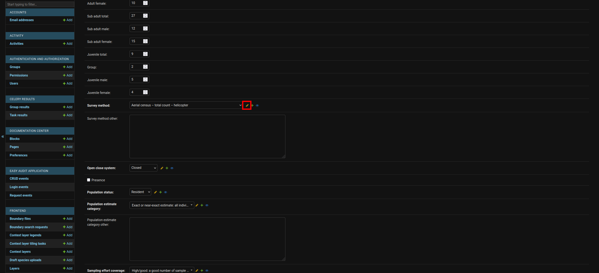
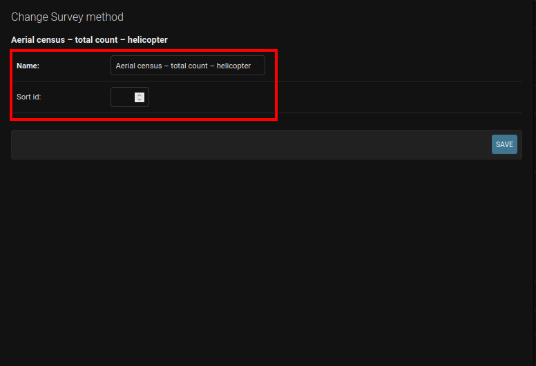
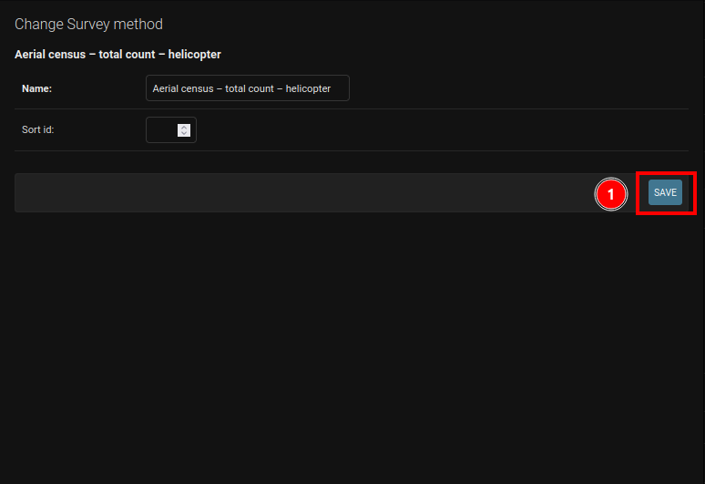

# Managing Lookup Tables

This section describes how administrators can manage the values in the look-up tables (i.e. add/edit/delete the options available in dropdown menus) on the backend so these values are reflected in the front-end and backend dropdown menus.

## Where to Manage Lookup Tables

When you are adding/managing/deleting records on the administration site you will see a little yellow pencil (Similar to ✏️). If you click on the yellow pencil, a popup window will open with a form you can edit to manage a specific lookup table.

## How to Manage Lookup Tables

On the popup that opens you will be able to edit the record within the lookup table.

The `Sort id` field is used to specify the order in which the records appear in the various dropdown menus. If you do not have a preferred order for the records you can leave the field blank (this will automatically sort the records in ascending alphabetical order) but if you would like a specific order you must specify a numeric value in the field (e.g. High would be 1, medium would be 2, and low would be 3).

Once you have made your changes you can click on 1️⃣ the `Save` button.

## Lookup tables that you can edit

On the landing page of the administration site you will see links to the various lookup tables. The tables that you can edit are as follows:

- Survey Methods
- Open Close System (must also update template)
- Population Estimate Category (must also update template)
- Population Status (must also update template)
- Sampling Effort Coverage (must also update template)
- Property Types
- Taxa (Read through [manage taxa](./manage-taxa.md) for more in-depth information)
- Titles

## Lookup tables that you should not edit

The tables that should not be edited/touched without a core developer present to guide you are:

- Activities
- Everything under Front-end heading
- Provinces
- Parcel Types
