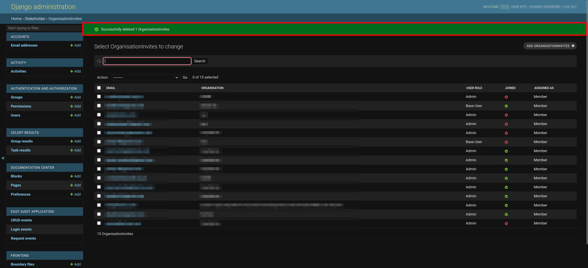

# Managing Organisations

This documentation guides administrators through managing organisations on the SAWPS platform. Management of organisations includes (but is not limited to) adding/removing members from organisations, managing organisation data, and managing notifications/reminders for the organisation.

## Where to Manage Organisations?

After you have logged into the administration site, scroll down on the landing page until you see 1️⃣ the **STAKEHOLDER** section. In this section you will see 2️⃣ the four links to the various pages required to manage organisations.

## Organisation Representatives

If you clicked on the `Organisation representative` link on the landing page, you will be redirected to a page that has 1️⃣ a list of the platform's organisation representatives and their respective organisations. The organisation representatives are the managers of their respective organisations and can manage their organisation.

### Searching for Representative(s)

If you do not see the representative you would like to see in the list due to the length of the list, you can utilise the `Search` functionality. To do so, click on 1️⃣ the `Search` field and type a few characters (i.e. letters in the representative's name), and then click on 2️⃣ the `Search` button to filter the list of representatives.

If the representative you are looking for is still not there, then you will need to follow the steps below to add them.

### Adding Organisation Representative(s)

If you would like to add another registered user as an organisation representative, you can click on 1️⃣ the `ADD ORGANISATION REPRESENTATIVE` button.

When you click on the `ADD ORGANISATION REPRESENTATIVE` button, you will be redirected to the `Add Organisation representative` page. You can then click on 1️⃣ the `Organisation` dropdown menu, you will be shown a list of all the current organisations on the platform and you should choose your desired organisation. Having specified an organisation, you can then click on 2️⃣ the `User` dropdown menu and select the registered user that you would like to be an organisation manager.

**Note:** If the organisation or user is not available in the dropdown menus, then you should follow either the [add organisation](#alternative-way-to-add-organisations) or [add user](#alternative-way-to-add-users) instructions.

Once you have chosen an organisation and a user you have three options to proceed forward:

- `Save and add another`: Which will allow you to save the current organisation manager and move forward with adding a new one.
- `Save and continue editing`: Which will allow you to save the current organisation manager and then edit the current manager.
- `SAVE`: Allows you to save and then redirects you back to the `Organisation representative` page and displays a success message.
        

### Managing Organisation Representative(s)

If you would like to change any details regarding an organisation representative (e.g. their organisation or the user acting as a representative), you can click on 1️⃣ their name in the list on the `Organisation representatives` page.

This will redirect you to the `Change Organisation Representative` page. On this page you can change the representative's organisation using 1️⃣ the `Organisation` dropdown menu, or change the representative for the organisation using 2️⃣ the `User` dropdown menu.

Once you have made your necessary changes you can click on 1️⃣ any one of the three save options or click on 2️⃣ the `Delete` button to remove the Organisation representative.

The three save options will have different actions:

- `Save and add another`: Which will allow you to save the current organisation manager and move forward with adding a new one.
- `Save and continue editing`: Which will allow you to save the current organisation manager and then edit the current manager.
- `SAVE`: Allows you to save and then redirects you back to the `Organisation representative` page and displays a success message.
        

If you clicked on the `Delete` button, you will be redirected to a page where you can either 1️⃣ confirm deleting the representative or 2️⃣ cancel and return to the list of representatives.

If you confirm the deletion of the representative then you will be redirected back to the `Organisation representative` page and shown a success message.

### Deleting Representative(s)

If you would like to delete a representative, or multiple representatives, you can do so from the `Organisation representative` page. First you select the representative(s) you would like to remove by checking 1️⃣ the boxes next to their name(s).

> **Note:** Clicking on the topmost checkbox will select all of the representatives.

Then you click on 1️⃣ the `Action` dropdown menu, select 2️⃣ the `Delete selected Organisation representatives` option, and then click on 3️⃣ the `Go` button.

This will redirect you to a page where you can either 1️⃣ confirm deleting the representative(s) or 2️⃣ cancel and return to the list of representatives. Depending on the number of representatives you are deleting the **Summary** and **Objects** will automatically be updated.

If you confirm the deletion of the representative then you will be redirected back to the `Organisation representatives` page and shown a success message.

## Organisation Users

If you clicked on the `Organisation users` link on the landing page, you will be redirected to a page that has 1️⃣ a list of the platform's organisation users and their respective organisations. The organisation users are users who are registered on the platform and are part of one, or more, organisation(s).

### Search for Organisation User(s)

If you do not see the user you would like to see in the list due to the length of the list, you can utilise the `Search` functionality. To do so, click on 1️⃣ the `Search` field and type a few characters (i.e. letters in the user's name), and then click on 2️⃣ the `Search` button to filter the list of users.

If the user you are looking for is still not there, then you will need to follow the steps below to add them.

### Add Organisation User(s)

If you would like to add another registered user as an organisation representative, you can click on 1️⃣ the `ADD ORGANISATION USER` button.

When you click on the `ADD ORGANISATION USER` button, you will be redirected to the `Add Organisation user` page. You can then click on 1️⃣ the `Organisation` dropdown menu, you will be shown a list of all the current organisations on the platform and you should choose your desired organisation. Having specified an organisation, you can then click on 2️⃣ the `User` dropdown menu and select the registered user that you would like to be part of the organisation.

**Note:** If the organisation or user is not available in the dropdown menus, then you should follow either the [add organisation](#alternative-way-to-add-organisations) or [add user](#alternative-way-to-add-users) instructions.

Once you have chosen an organisation and a user you have three options to proceed forward:

- `Save and add another`: Which will allow you to save the current organisation user and move forward with adding a new one.
- `Save and continue editing`: Which will allow you to save the current organisation user and then edit the current user.
- `SAVE`: Allows you to save and then redirects you back to the `Organisation user` page and displays a success message.
        

### Manage Organisation User(s)

If you would like to change any details regarding an organisation user (e.g. their organisation or the user associated with the organisation), you can click on 1️⃣ their name in the list on the `Organisation user` page.

This will redirect you to the `Change Organisation user` page. On this page you can change the user's organisation using 1️⃣ the `Organisation` dropdown menu, or change the organisation user using 2️⃣ the `User` dropdown menu.

Once you have made your necessary changes you can click on 1️⃣ any one of the three save options or click on 2️⃣ the `Delete` button to remove the Organisation user.

The three save options will have different actions:

- `Save and add another`: Which will allow you to save the current organisation user and move forward with adding a new one.
- `Save and continue editing`: Which will allow you to save the current organisation user and then edit the current user.
- `SAVE`: Allows you to save and then redirects you back to the `Organisation user` page and displays a success message.
        

If you clicked on the `Delete` button, you will be redirected to a page where you can either 1️⃣ confirm deleting the user or 2️⃣ cancel and return to the list of users.

If you confirm the deletion of the user then you will be redirected back to the `Organisation user` page and shown a success message.

### Delete Organisation User(s)

If you would like to delete a user, or multiple users, you can do so from the `Organisation user` page. First you select the user(s) you would like to remove by checking 1️⃣ the boxes next to their name(s).

> **Note:** Clicking on the topmost checkbox will select all of the users.

Then you click on 1️⃣ the `Action` dropdown menu, select 2️⃣ the `Delete selected Organisation users` option, and then click on 3️⃣ the `Go` button.

This will redirect you to a page where you can either 1️⃣ confirm deleting the user(s) or 2️⃣ cancel and return to the list of users. Depending on the number of users you are deleting the **Summary** and **Objects** will automatically be updated.

If you confirm the deletion of the user then you will be redirected back to the `Organisation users` page and shown a success message.

## Organisation Invites

If you clicked on the `Organisation Invites` link on the landing page, you will be redirected to a page that has 1️⃣ a list of the platform's organisation invites and their respective organisations. The organisation invites are invitations to join the platform, sent from the platform by organisation representatives (or other administrative users) to non-registered users.

### Search for Organisation Invite(s)

To view whether the invited user(s) has(have) joined the platform or not, you can utilise the `Search` functionality. Start by clicking on 1️⃣ the `Search` field and start typing a few characters (i.e. letters in the invitee's email address), and then click on 2️⃣ the `Search` button to filter the list of invitations.

If the invitee you are looking for is still not there, then you will need to follow the steps below to add them.

### Add Organisation Invite(s)

To create an invite to an organisation, click on 1️⃣ the `ADD ORGANISATIONINVITES` button.

This will redirect you to the `Add OrganisationInvites` page, where you should enter the invitee's email address, the organisation you would like them to be a part of, their user role, and what you would like to assign them as within the organisation (e.g. manager or member). When creating an invitation you should leave the `Joined` field as the default `No`.

**Note:** If the organisation is not available in the dropdown menus, then you should follow the [add organisation](#alternative-way-to-add-organisations) instructions.

Once you have filled in the fields, you have three options to proceed forward:

- `Save and add another`: Which will allow you to save the current organisation invitation and move forward with adding a new one.
- `Save and continue editing`: Which will allow you to save the current organisation invitation and then edit the current invitation.
- `SAVE`: Allows you to save and then redirects you back to the `OrganisationInvites` page and displays a success message.
        

### Manage Organisation Invite(s)

To make changes to an existing organisation invitation, you can click on 1️⃣ the email address associated with the invitation.

This will redirect you to a `Change OrganisationInvites` page where you can edit the information previously used to populate the invitation, or you can delete the invitation.

Once you have made your necessary changes you can click on 1️⃣ any one of the three save options or click on 2️⃣ the `Delete` button to remove the Organisation invitation.

The three save options will have different actions:

- `Save and add another`: Which will allow you to save the current organisation invitation and move forward with adding a new one.
- `Save and continue editing`: Which will allow you to save the current organisation invitation and then edit the current invitation.
- `SAVE`: Allows you to save and then redirects you back to the `OrganisationInvites` page and displays a success message.
        

If you clicked on the `Delete` button, you will be redirected to a page where you can either 1️⃣ confirm deleting the invitation or 2️⃣ cancel and return to the list of invitations.

If you confirm the deletion of the invitation then you will be redirected back to the `OrganisationInvites` page and shown a success message.

### Delete Organisation Invite(s)

If you would like to delete a invitation, or multiple invitations, you can do so from the `OrganisationInvites` page. First you select the invitation(s) you would like to remove by checking 1️⃣ the boxes next to their email address(es).

> **Note:** Clicking on the topmost checkbox will select all of the invitations.

Then you click on 1️⃣ the `Action` dropdown menu, select 2️⃣ the `Delete selected OrganisationInvites` option, and then click on 3️⃣ the `Go` button.

This will redirect you to a page where you can either 1️⃣ confirm deleting the invitation(s) or 2️⃣ cancel and return to the list of invitations. Depending on the number of invitations you are deleting the **Summary** and **Objects** will automatically be updated.

If you confirm the deletion of the invitation then you will be redirected back to the `OrganisationInvites` page and shown a success message.

## Organisations

If you clicked on the `Organisations` link on the landing page, you will be redirected to a page that has 1️⃣ a list of the platform's organisation representatives and their respective organisations. The organisation representatives are the managers of their respective organisations and can manage their organisation.

### Searching for Organisation(s)

If you do not see the organisation you would like to see in the list due to the length of the list, you can utilise the `Search` functionality. To do so, click on 1️⃣ the `Search` field and type a few characters (i.e. letters in the organisation's name), and then click on 2️⃣ the `Search` button to filter the list of organisations.

If the organisation you are looking for is still not there, then you will need to follow the steps below to add it.

### Add Organisation(s)

If you would like to add another organisation, you can click on 1️⃣ the `ADD ORGANISATION` button.

When you click on the `ADD ORGANISATION` button, you will be redirected to the `Add Organisation` page. You can then specify the details of the new organisation. These main details you need to include are:

- `Name`: This will be the name of the new organisation.
- `National`: In this dropdown menu you need to specify `Yes` or `No`.
  - If the organisation is a national organisation select `Yes`.
  - If the organisation is only found in a particular province, then select `No`.
- `Province`: If you specified `Yes` for the `National` field you can ignore this field, however if you specified `No` for the `National` field, you will need to select the province from the dropdown list.
- The three checkboxes are the data permissions you can specify for data uploaded to the new organisation.

>**Disclaimer:** Some fields in the image above may not be present for you on the administration page.

Once you have provided the details for your organisation you have three options to move forward:

- `Save and add another`: Which will allow you to save the current organisation and move forward with adding a new one.
- `Save and continue editing`: Which will allow you to save the current organisation and then edit the current organisation.
- `SAVE`: Allows you to save and then redirects you back to the `Organisation` page and displays a success message.
        

### Managing Organisation(s)

To make changes to an existing organisation, you can click on 1️⃣ the name of the organisation.

This will redirect you to a `Change Organisation` page where you can edit the information previously used to populate the invitation, or you can delete the invitation.

>**Disclaimer:** Some fields in the image above may not be present for you on the administration page.

Once you have made your necessary changes you can click on 1️⃣ any one of the three save options or click on 2️⃣ the `Delete` button to remove the Organisation invitation.

The three save options will have different actions:

- `Save and add another`: Which will allow you to save the current organisation invitation and move forward with adding a new one.
- `Save and continue editing`: Which will allow you to save the current organisation invitation and then edit the current invitation.
- `SAVE`: Allows you to save and then redirects you back to the `Organisations` page and displays a success message.
        

If you clicked on the `Delete` button, you will be redirected to a page where you can either 1️⃣ confirm deleting the invitation or 2️⃣ cancel and return to the list of invitations.

If you confirm the deletion of the invitation then you will be redirected back to the `Organisations` page and shown a success message.

### Removing Organisation(s)

If you would like to delete an organisation, or multiple organisations, you can do so from the `Organisations` page. First you select the organisation(s) you would like to remove by checking 1️⃣ the boxes next to the organisation(s) name(s).

> **Note:** Clicking on the topmost checkbox will select all of the organisations.

Then you click on 1️⃣ the `Action` dropdown menu, select 2️⃣ the `Delete selected Organisations` option, and then click on 3️⃣ the `Go` button.

This will redirect you to a page where you can either 1️⃣ confirm deleting the organisation(s) or 2️⃣ cancel and return to the list of organisations. Depending on the number of organisations you are deleting the **Summary** and **Objects** will automatically be updated.

If you confirm the deletion of the organisation(s) then you will be redirected back to the `Organisations` page and shown a success message.

## Alternative way to add Organisation(s)

If you are on the `Add Organisation representative` page and the organisation you would like to choose is not available in the `Organisation` dropdown menu, you can click on 1️⃣ the green plus.

> **Note:** The logic in this workflow (i.e. clicking on the green plus and then adding a new user) is also applicable on the `Add Organisation User` page.

This will cause a popup window to open, where you can specify the details of the new organisation you are adding and then click on 1️⃣ the `SAVE` button. For more information regarding populating this form, follow the [add organisations](#add-organisations) instructions.

## Alternative way to add User(s)

If you are on the `Add Organisation representative` page and the user you would like to choose is not available in the `User` dropdown menu, you can click on 1️⃣ the green plus.

> **Note:** The logic in this workflow (i.e. clicking on the green plus and then adding a new organisation) is also applicable on the `Add Organisation User` and `Add OrganisationInvites`pages.

This will cause a popup window to open, where you can specify the details of the new user you are adding and then click on 1️⃣ the `SAVE` button. For more information regarding populating this form, read through the **Adding User(s)** section in the [managing users](./manage-users.md) documentation.

