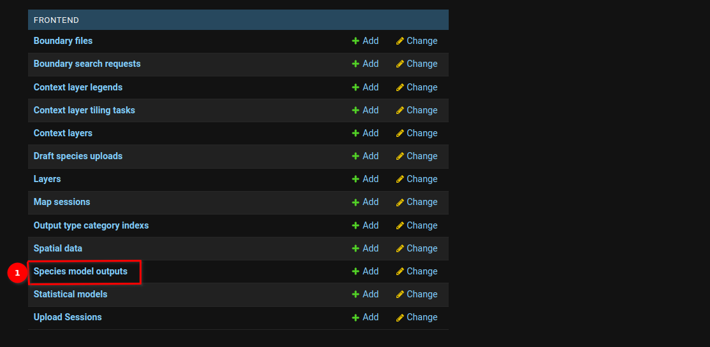
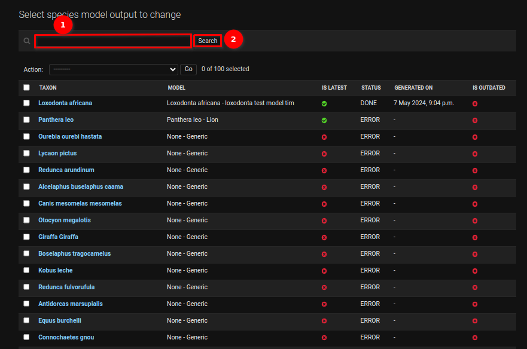
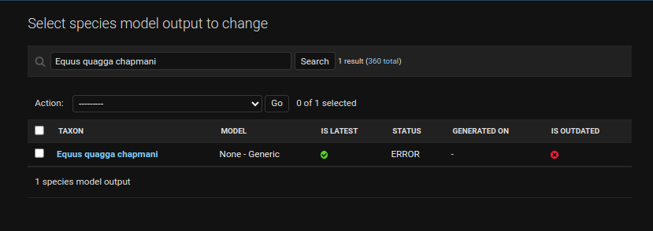
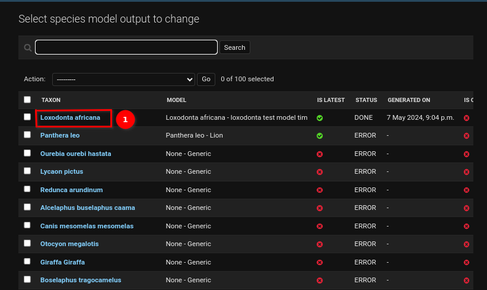
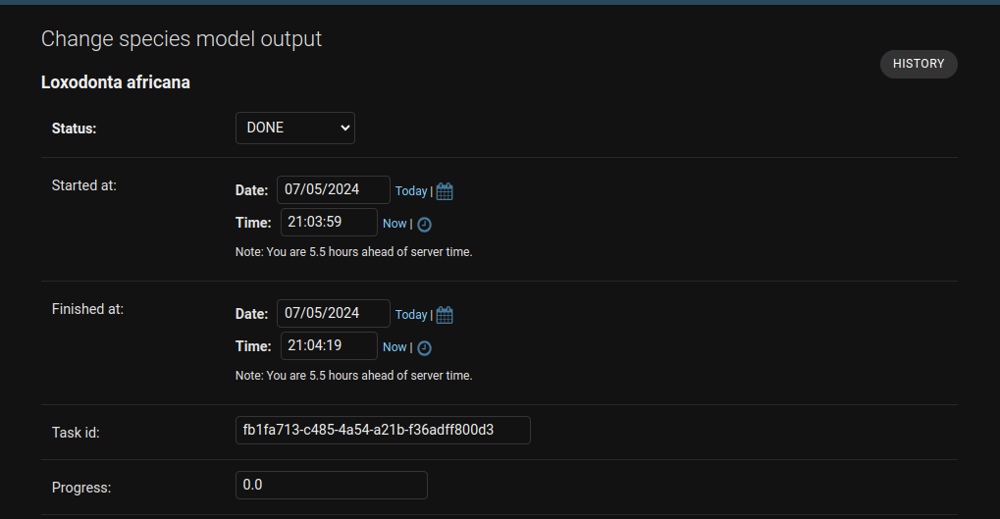
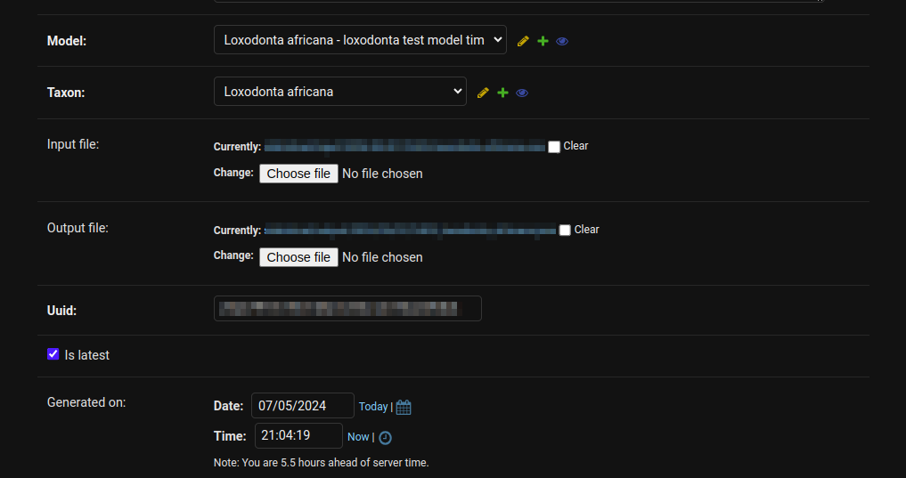
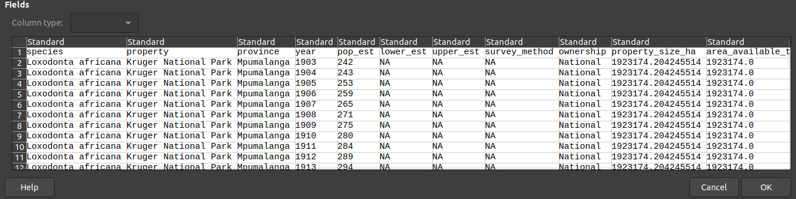
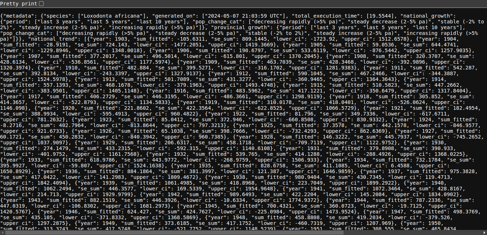

# Managing statistical model table

Welcome to the `Statistical Model` user guide. This guide will lead you through the necessary steps for data scientists to incorporate the population analysis code. By following this user guide, data scientists can seamlessly integrate the population analysis code for the species.

## How can I navigate to the statistical model table?

Click on the 1️⃣ profile icon available in the top right corner. Upon clicking on the profile icon, you will see the options. Click on the 2️⃣ `Django Admin` option to go to the Django admin panel.

After clicking on the Django Admin, you will be redirected to the Django Admin panel. Upon reaching the admin panel, scroll down and locate the `Statistical Models` table. You can find this table under the frontend section (FRONTEND > Statistical Models). To add the statistical model for the species you can click on the 1️⃣ `Statistical models`.

When you click on `Statistical Models`, you will be taken to a table displaying various statistical models. In this table, you will find the default statistical model labelled as 1️⃣ `Generic`. This model is applied to all species that do not have a specific statistical model assigned to them. You can click on the (➖) minus icon to view the generic statistical model.

## How can I add the statistical model for the species / Where I can add the population analysis code?

To add the statistical model for the species click on the 1️⃣ `ADD STATISTICAL MODEL` button. Upon clicking this button, you will be taken to the add statistical model page. Where you can add the details for the specific species statistical model along with the population analysis code.

Choose the species from the 1️⃣ `Species` dropdown for which you want to add the statistical model. Provide that species name in the 2️⃣ `Name` field. For population analysis, you can input the `population analysis code` into the 3️⃣ `Code` field. After filling in all the fields click on the 4️⃣ `Save` button to save the statistical model.

## How can I generate the statistical model output?

Statisticians have the ability to produce different types of statistical model outputs for species. To generate the statistical model output, for the species click on the 1️⃣ `Type` dropdown and choose the type of the output you want to generate. Enter the variable name into the 2️⃣ `Variable Name` field. Once all fields are filled, click on the 3️⃣ `Save` button to generate the statistical model output for the respective species.

>Note: The input and output files are generated for the species which can be downloaded from the `Species model outputs` table.

## How can I download/view the Input/Output files?

The statisticians can download/view the Input/Output files of the species statistical output model. To download/view this file you need to go to the `Species model outputs` table. You can find this table under the frontend section (FRONTEND > Species Model Outputs). Click on the 1️⃣ `Species model outputs` to go to the species model outputs table.

Upon accessing the species model outputs table, you can locate the species from which you wish to download/view the input/output files. Alternatively, you can utilise the search functionality to find the species. To search for the species enter the name scientific name of the species in the 1️⃣ `Search` field and click on the 2️⃣ `Search` button to search the species model output. 

**Searched species model output.**

Once you have located the desired species, click on the 1️⃣ `Scientific Name` of the species, to view the species model output data specific to that species.

Upon clicking on the scientific name of the species you will be taken to the `Change species model output` page.

Scroll down to find the `Input file` and `Output file` sections. Click on the 1️⃣ `Blue Link` next to the input file to download the input file and click on the 2️⃣ `Blue Link` next to the output file to view the output file.

**Downloaded Input File**

**Output JSON File**

The JSON file appears unreadable, check the 1️⃣ `Pretty Print` checkbox to format it for better readability.

