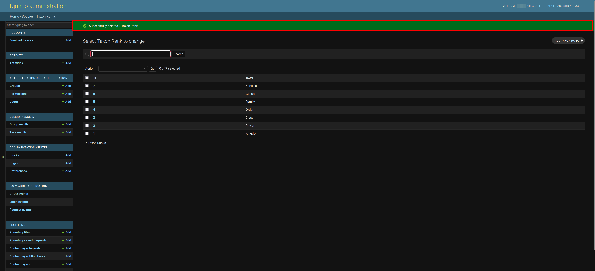

# Managing Taxa

This sections describes how administrators can manage taxa ( i.e. add, remove, modify, etc.) on the SAWPS platform.

## Where to Manage Taxa

After you have logged into the administration site, scroll down on the landing page until you see 1️⃣ the **SPECIES** section. In this section you will see 2️⃣ the two links to the various pages required to manage taxa.

## Taxa

If you clicked on the `Taxa` link on the landing page, you will be redirected to a page that has 1️⃣ a list of the platform's taxa and their respective common names.

### Search for Taxon/Taxa

If you do not see the taxon you would like to see in the list due to the length of the list, you can utilise the `Search` functionality. To do so, click on 1️⃣ the `Search` field and type a few characters (i.e. letters in the taxon's scientific name), and then click on 2️⃣ the `Search` button to filter the list of taxa.

Before adding a taxon please ensure that you have double-checked that the taxon is not already present on the platform. If the taxon you are looking for is still not there, then you will need to follow the steps below to add it.

### Add Taxon/Taxa

Adding a new species to the platform requires several steps of adding the various levels of the taxonomic hierarchy. Many of the higher levels of taxonomic rank (e.g. *Kingdom*) should already be present on the platform but some of the lower levels (e.g. *Species*) will need to be added as time progresses.

Before adding a taxon please ensure that you have double-checked that the taxon is not already present on the platform. If the taxon already exists on the platform, an error message will be displayed.

To add a new species you will always work your way down the taxon hierarchy from *Kingdom* down to *Species*. Any time you add a new species you will **always** need to check that all of the necessary higher taxonomic levels are present. The steps start with adding a new *Kingdom* (or just making sure the *Kingdom* is present on the platform).

#### Adding a Kingdom

If you would like to add another sanctioned *Kingdom*, you can click on 1️⃣ the `ADD TAXON` button.

When you click on the `ADD TAXON` button, you will be redirected to the `Add Taxon` page. You should fill in 1️⃣ the information relating to the taxon, namely:

- **Scientific Name:** Specify the *Kingdom*'s Latin Name (e.g. *Animalia* or *Plantae*).
- Taxon Rank: Select `Kingdom` from the dropdown list.

You need not specify any other fields for a kingdom.

Once you have filled in the information, you have three options to proceed forward:

- `Save and add another`: Which will allow you to save the taxon and move forward with adding a new one.
- `Save and continue editing`: Which will allow you to save the taxon and then edit the taxon.
- `SAVE`: Allows you to save and then redirects you back to the `Taxa` page and displays a success message.
        

#### Adding Other Levels

> **Note:** Always check that the parent level for the taxon you are adding is present on the platform (use the [search functionality](#search-for-taxontaxa)) before you try to add it (i.e. work your way down the taxonomic hierarchy from *Phylum* down to *Genus*).

If you would like to add another sanctioned *Phylum*, *Class*, *Order*, *Family*, or *Genus* you can click on 1️⃣ the `ADD TAXON` button.

When you click on the `ADD TAXON` button, you will be redirected to the `Add Taxon` page. You should fill in 1️⃣ the information relating to the taxon, namely:

- **Scientific Name:** Specify the *Phylum*, *Class*, *Order*, *Family*, or *Genus* Latin Name (e.g. *Phylum* = *Chordata* or *Class* = *Carnivora*).
- Taxon rank: Select the relevant taxon rank (i.e. the same word as the taxon so if you are adding a *Phylum* uou should choose *Phylum* in the dropdown menu).
- Parent: Select the taxon level that would be the parent for the current taxon level (e.g. *Phylum*'s parent is *Kingdom*, *Class*'s parent is *Phylum*, *Order*'s parent is *Class*, *Family*'s parent is *Order*, or *Genus*' parent is *Family*)

You need not specify any other fields for these taxon levels.

Once you have filled in the information, you have three options to proceed forward:

- `Save and add another`: Which will allow you to save the taxon and move forward with adding a new one.
- `Save and continue editing`: Which will allow you to save the taxon and then edit the taxon.
- `SAVE`: Allows you to save and then redirects you back to the `Taxa` page and displays a success message.
        

#### Adding a new Species

> **Note:** Always check that the *Genus* in the level above the *Species* you are adding is present on the platform (use the [search functionality](#search-for-taxontaxa)).

If you would like to add another sanctioned *Species*, you can click on 1️⃣ the `ADD TAXON` button.

When you click on the `ADD TAXON` button, you will be redirected to the `Add Taxon` page. You should fill in 1️⃣ the information relating to the taxon, namely:

- **Scientific Name:** You need to specify the fill scientific name of the species.
- Common name verbatim: You need to specify the full common name of the species.
- Colour Variant: choose an option from the dropdown menu.
- Infraspecific epithet: This is the third word in the scientific name for subspecies.
- Taxon rank: Specify `Species`
- Parent: Specify `Genus`

After you have filled in that information you can move on to managing 2️⃣ the settings for the species, namely:

- Show on front page checkbox: Toggling this changes whether or not the species' graph is displayed on the landing page of the platform.
- Is selected checkbox: Toggling this changes whether or not the species is selected.
- Front page order: Adjusting this will change where on the landing page of the platform the species appears.
- Colour: This will change the colour of the graphs and choropleth map display (i.e. the colours for the various intervals of the species' count)
- Graph icon: Set this to be the icon above the graphs for the species (e.g. a lion for the lions graph).

Once you have filled in the information, you have three options to proceed forward:

- `Save and add another`: Which will allow you to save the species and move forward with adding a new one.
- `Save and continue editing`: Which will allow you to save the species and then edit the species.
- `SAVE`: Allows you to save and then redirects you back to the `Taxa` page and displays a success message.
        

### Manage Taxon/Taxa

If you would like to change any details regarding a taxon, you can click on 1️⃣ the scientific name in the list on the `Taxon` page.

This will redirect you to the `Change Taxon` page. On this page you can change:

- **Scientific Name:** You need to specify the fill scientific name of the species.
- Common name verbatim: You need to specify the full common name of the species.
- Colour Variant: choose an option from the dropdown menu.
- Infraspecific epithet: This is the third word in the scientific name for subspecies.
- Taxon rank: Specify `Species`
- Parent: Specify `Genus`
- Show on front page checkbox: Toggling this changes whether or not the species' graph is displayed on the landing page of the platform.
- Is selected checkbox: Toggling this changes whether or not the species is selected.
- Front page order: Adjusting this will change where on the landing page of the platform the species appears.
- Colour: This will change the colour of the graphs and choropleth map display (i.e. the colours for the various intervals of the species' count)
- Graph icon: Set this to be the icon above the graphs for the species (e.g. a lion for the lions graph).

> **Note:** Not all of the above points are applicable to every taxon. Only edit them if they are applicable to the specific taxon using the logic laid out in the [Add Taxon/Taxa](#add-taxontaxa) section and subsections.

Once you have made your necessary changes you can click on 1️⃣ any one of the three save options or click on 2️⃣ the `Delete` button to remove the taxon.

The three save options will have different actions:

- `Save and add another`: Which will allow you to save the current taxon and move forward with adding a new one.
- `Save and continue editing`: Which will allow you to save the current taxon and then edit the current taxon.
- `SAVE`: Allows you to save and then redirects you back to the `Taxa` page and displays a success message.
        

If you clicked on the `Delete` button, you will be redirected to a page where you can either 1️⃣ confirm deleting the taxon or 2️⃣ cancel and return to the list of taxa.

If you confirm the deletion of the taxon then you will be redirected back to the `Taxa` page and shown a success message.

### Delete Taxon/Taxa

If you would like to delete a taxon, or multiple taxa, you can do so from the `Taxa` page. First you select the taxon/taxa you would like to remove by checking 1️⃣ the boxes next to the scientific name(s).

> **Note:** Clicking on the topmost checkbox will select all of the taxa.

Then you click on 1️⃣ the `Action` dropdown menu, select 2️⃣ the `Delete selected taxa` option, and then click on 3️⃣ the `Go` button.

This will redirect you to a page where you can either 1️⃣ confirm deleting the taxon/taxa or 2️⃣ cancel and return to the list of taxa. Depending on the number of taxa you are deleting the **Summary** and **Objects** will automatically be updated.

If you confirm the deletion of the taxon/taxa then you will be redirected back to the `Taxa` page and shown a success message.

## Taxon Ranks

If you clicked on the `Taxon Ranks` link on the landing page, you will be redirected to a page that has 1️⃣ a list of the platform's taxon ranks.

### Search for Taxon Rank(s)

If you do not see the taxon rank you would like to see in the list due to the length of the list, you can utilise the `Search` functionality. To do so, click on 1️⃣ the `Search` field and type a few characters (i.e. letters in the taxon rank's name), and then click on 2️⃣ the `Search` button to filter the list of taxon ranks.

If the taxon rank you are looking for is still not there, then you will need to follow the steps below to add it.

### Add Taxon Rank(s)

> **Note:** You should not need to add a `Taxon Rank` unless one has been deleted previously.

If you would like to add another sanctioned taxon rank, you can click on 1️⃣ the `ADD TAXON RANK` button.

When you click on the `ADD TAXON RANK` button, you will be redirected to the `Add Taxon Rank` page. You should fill in 1️⃣ the taxon rank name:

Once you have filled in the taxon rank name, you have three options to proceed forward:

- `Save and add another`: Which will allow you to save the current taxon rank and move forward with adding a new one.
- `Save and continue editing`: Which will allow you to save the current taxon rank and then edit the current manager.
- `SAVE`: Allows you to save and then redirects you back to the `Taxon Ranks` page and displays a success message.
        

### Manage Taxon Rank(s)

> **Note:** You should not need to manage any `Taxon Rank` unless one has been changed incorrectly previously.

If you would like to change any details regarding a taxon rank, you can click on 1️⃣ the taxon rank's ID in the list on the `Taxon Rank` page.

This will redirect you to the `Change Taxon Ranks` page. On this page you can change the taxon rank's name.

Once you have made your necessary changes you can click on 1️⃣ any one of the three save options or click on 2️⃣ the `Delete` button to remove the taxon rank.

The three save options will have different actions:

- `Save and add another`: Which will allow you to save the current taxon rank and move forward with adding a new one.
- `Save and continue editing`: Which will allow you to save the current taxon rank and then edit the current taxon rank.
- `SAVE`: Allows you to save and then redirects you back to the `Taxon Ranks` page and displays a success message.
        

If you clicked on the `Delete` button, you will be redirected to a page where you can either 1️⃣ confirm deleting the taxon rank or 2️⃣ cancel and return to the list of taxon ranks.

If you confirm the deletion of the taxon rank then you will be redirected back to the `Taxon Ranks` page and shown a success message.

### Delete Taxon Rank(s)

> **Note:** You should not need to delete any `Taxon Rank`.

If you would like to delete a taxon rank, or multiple taxon ranks, you can do so from the `Taxon Ranks` page. First you select the taxon rank(s) you would like to remove by checking 1️⃣ the boxes next to the taxon rank ID(s).

> **Note:** Clicking on the topmost checkbox will select all of the taxon ranks.

Then you click on 1️⃣ the `Action` dropdown menu, select 2️⃣ the `Delete selected taxon ranks` option, and then click on 3️⃣ the `Go` button.

This will redirect you to a page where you can either 1️⃣ confirm deleting the taxon rank(s) or 2️⃣ cancel and return to the list of taxon ranks. Depending on the number of taxon ranks you are deleting the **Summary** and **Objects** will automatically be updated.

If you confirm the deletion of the taxon rank(s) then you will be redirected back to the `Taxon Ranks` page and shown a success message.

