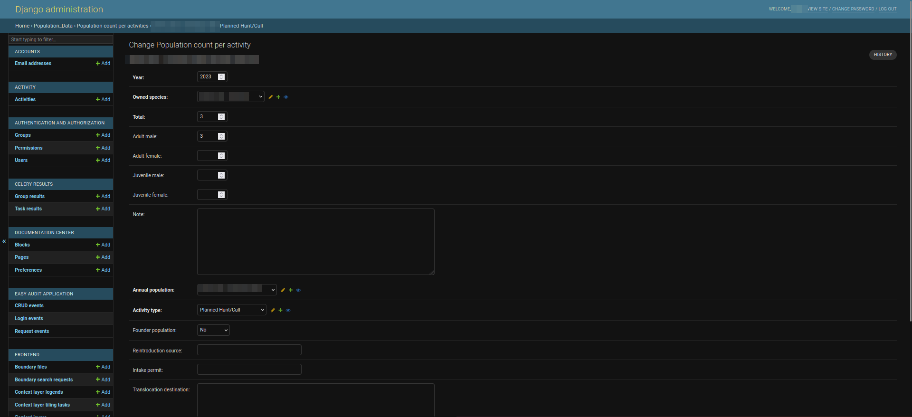

# Managing Uploaded Data

This sections describes how administrators can manage the uploaded data (e.g. properties, their permissions, etc.) on the SAWPS platform.

## Where to Manage Uploaded Data

There are two sections on the administration site which relate to managing uploaded data. The [Property](#property) and the [Population Data](#population-data) sections.

## Property

After you have logged into the administration site, scroll down on the landing page until you see 1️⃣ the **PROPERTY** section. In this section you will see 2️⃣ the two links to the various pages required to manage properties.

### Parcels Page

If you clicked on the `Parcels` link on the landing page, you will be redirected to a page that has 1️⃣ a list of all of the parcels on the platform along with their respective SG numbers.

#### Search Parcels

If you do not see the parcel you would like to see in the list due to the length of the list, you can utilise the `Search` functionality. To do so, click on 1️⃣ the `Search` field and type a few characters (i.e. letters or numbers in the parcel's SG Number), and then click on 2️⃣ the `Search` button to filter the list of parcels.

If the parcel you are looking for is still not there, then you can follow the steps below to add it.

#### Add Parcels

> **Note:** Do not add parcels here unless it is absolutely necessary and you have the exact information for the parcel.

If you would like to add a parcel, you can click on 1️⃣ the `ADD PARCEL` button.

When you click on the `ADD PARCEL` button, you will be redirected to the `Add Parcel` page. You should fill in 1️⃣ the information relating to the parcel, namely:

- **SG number:** This is the Surveyor General (SG) number/identifier given to the parcel.
- **Year:** The date on which you are adding the parcel, or on which the parcel should have been added.
- **Property:** Select a property from the dropdown menu containing all properties currently on the site. If your desired property isn't available then you will need to either; add it from the frontend (i.e. the SAWPS site) or follow the [Add Properties](#add-properties) section.
- **Parcel Type:** Select an option from the dropdown menu.
- **Farm Number:** This can be left as the default `0`.
- **Farm Name:** This should be the name associated with the farm.
- **Sub division number:** This can be left as the default `0` unless it is known.
- **Source:** This needs to be specified as one of: `erf`, `holding`, `farm_portion`, or `parent_farm`.
- **Source id:** This should be the unique ID associated with the parcel.

>**Note:** it is easier to add a property on the frontend (i.e. the SAWPS site) and let the platform automatically handle the associated parcel information.

Once you have filled in the information, you have three options to proceed forward:

- `Save and add another`: Which will allow you to save the parcel and move forward with adding a new one.
- `Save and continue editing`: Which will allow you to save the parcel and then edit the parcel.
- `SAVE`: Allows you to save and then redirects you back to the `Parcels` page and displays a success message.
        

#### Manage Parcels

If you would like to change any details regarding a parcel, you can click on 1️⃣ the SG Number in the list on the `Parcels` page.

This will redirect you to the `Change Parcel` page. On this page you can change:

- **SG number:** This is the Surveyor General (SG) number/identifier given to the parcel.
- **Year:** The date on which the parcel was added.
- **Property:** Select a property from the dropdown menu containing all properties currently on the site. If your desired property isn't available then you will need to either; add it from the frontend (i.e. the SAWPS site) or follow the [Add Properties](#add-properties) section.
- **Parcel Type:** Select an option from the dropdown menu.
- **Farm Number:** This can be left as the default `0`.
- **Farm Name:** This should be the name associated with the farm.
- **Sub division number:** This can be left as the default `0` unless it is known.
- **Source:** This needs to be specified as one of: `erf`, `holding`, `farm_portion`, or `parent_farm`.
- **Source id:** This should be the unique ID associated with the parcel.

Once you have made your necessary changes you can click on 1️⃣ any one of the three save options or click on 2️⃣ the `Delete` button to remove the parcel.

The three save options will have different actions:

- `Save and add another`: Which will allow you to save the current parcel and move forward with adding a new one.
- `Save and continue editing`: Which will allow you to save the current parcel and then edit the current parcel.
- `SAVE`: Allows you to save and then redirects you back to the `Parcels` page and displays a success message.
        

If you clicked on the `Delete` button, you will be redirected to a page where you can either 1️⃣ confirm deleting the parcel or 2️⃣ cancel and return to the list of parcels.

If you confirm the deletion of the parcel then you will be redirected back to the `Parcels` page and shown a success message.

#### Delete Parcels

> **Note:** You should not need to delete any `Parcels`.

If you would like to delete a parcel, or multiple parcels, you can do so from the `Parcels` page. First you select the parcel(s) you would like to remove by checking 1️⃣ the boxes next to the SG Number(s).

> **Note:** Clicking on the topmost checkbox will select all of the parcels.

Then you click on 1️⃣ the `Action` dropdown menu, select 2️⃣ the `Delete selected parcels` option, and then click on 3️⃣ the `Go` button.

This will redirect you to a page where you can either 1️⃣ confirm deleting the parcel(s) or 2️⃣ cancel and return to the list of parcels. Depending on the number of parcels you are deleting the **Summary** and **Objects** will automatically be updated.

If you confirm the deletion of the parcel(s) then you will be redirected back to the `Parcels` page and shown a success message.

### Properties Page

If you clicked on the `Properties` link on the landing page, you will be redirected to a page that has 1️⃣ a list of all of the properties on the platform along with their respective names.

#### Search Properties

If you do not see the property you would like to see in the list due to the length of the list, you can utilise the `Search` functionality. To do so, click on 1️⃣ the `Search` field and type a few characters (i.e. letters or numbers in the property's name), and then click on 2️⃣ the `Search` button to filter the list of properties.

#### Add Properties

New properties should be added from the frontend (i.e. the SAWPS site) due to the fact that adding a new property will update multiple tables in the database. You can follow the [Data Upload](../../user/guide/data-upload.md) instructions. Just ensure that you have the correct organisation selected as your active organisation before creating the new property.

#### Manage Properties

If you would like to change any details regarding a property, you can click on 1️⃣ the property's name in the list on the `Parcels` page.

This will redirect you to the `Change Property` page. On this page you can change multiple details relating to the property. It is not recommended to make changes to the geometry, or centroid, unless it is to remove an incorrect property boundary.

Once you have made your necessary changes, scroll down and then you can click on 1️⃣ any one of the three save options or click on 2️⃣ the `Delete` button to remove the property.

The three save options will have different actions:

- `Save and add another`: Which will allow you to save the current property and move forward with adding a new one.
- `Save and continue editing`: Which will allow you to save the current property and then edit the current property.
- `SAVE`: Allows you to save and then redirects you back to the `Properties` page and displays a success message.
        

If you clicked on the `Delete` button, you will be redirected to a page where you can either 1️⃣ confirm deleting the property or 2️⃣ cancel and return to the list of properties.

If you confirm the deletion of the property then you will be redirected back to the `Properties` page and shown a success message.

#### Delete Properties

If you would like to delete a property, or multiple properties, you can do so from the `Properties` page. First you select the property/properties you would like to remove by checking 1️⃣ the boxes next to the property name(s).

> **Note:** Clicking on the topmost checkbox will select all of the properties.

Then you click on 1️⃣ the `Action` dropdown menu, select 2️⃣ the `Delete selected properties` option, and then click on 3️⃣ the `Go` button.

This will redirect you to a page where you can either 1️⃣ confirm deleting the property/properties or 2️⃣ cancel and return to the list of properties. Depending on the number of properties you are deleting the **Summary** and **Objects** will automatically be updated.

If you confirm the deletion of the property/properties then you will be redirected back to the `Properties` page and shown a success message.

## Population Data

After you have logged into the administration site, scroll down on the landing page until you see 1️⃣ the **POPULATION_DATA** section. In this section you will see 2️⃣ the two links to the various pages required to manage population data.

### Annual Populations Page

If you clicked on the `Annual Populations` link on the landing page, you will be redirected to a page that has 1️⃣ a list of all of the parcels on the platform along with their respective SG numbers.

#### Search Annual Populations

If you do not see the annual population (indicated by a property name and then a year column) you would like to see in the list due to the length of the list, you can utilise the `Search` functionality. To do so, click on 1️⃣ the `Search` field and type a few characters (i.e. letters in the property's name), and then click on 2️⃣ the `Search` button to filter the list of annual population.

If the annual population you are looking for is still not there, then you will need to follow the steps below to add it.

#### Add Annual Populations

If you would like to add an annual population, you can click on 1️⃣ the `ADD ANNUAL POPULATION` button.

When you click on the `ADD ANNUAL POPULATION` button, you will be redirected to the `Add Annual Population` page. You should fill in 1️⃣ the required fields. These are:

- **Year:** The year of the population record.
- **Owned species:** The property on which the population resides.
- **User:** The platform user who owns the property.
- **Taxon:** The species *latin* name.
- **Property:** The property on which the population resides.
- **Total:** The total number of individuals (e.g. animals) found on the property.
- **Survey method:** Choose an option from the dropdown menu.
- **Open close system:** Choose an option from the dropdown menu.
- **Population status:** Choose an option from the dropdown menu.
- **Population estimate category:** Choose an option from the dropdown menu.
- **Sampling effort coverage:** Choose an option from the dropdown menu.

Once you have filled in the necessary information, you have three options to proceed forward:

- `Save and add another`: Which will allow you to save the current annual population and move forward with adding a new one.
- `Save and continue editing`: Which will allow you to save the current annual population and proceed with editing the current annual population.
- `SAVE`: Allows you to save the current annual population and then redirects you back to the `Annual Populations` page and displays a success message.
    

#### Manage Annual Populations

If you would like to change any details regarding an annual population, you can click on 1️⃣ the annual population's name in the list on the `Annual Populations` page.

This will redirect you to the `Change Annual Population` page. On this page you can change 1️⃣ multiple fields relating to the annual population. Namely:

- **Year:** The year of the population record.
- **Owned species:** The property on which the population resides.
- **User:** The platform user who owns the property.
- **Taxon:** The species *latin* name.
- **Property:** The property on which the population resides.
- **Total:** The total number of individuals (e.g. animals) found on the property.
- **Survey method:** Choose an option from the dropdown menu.
- **Open close system:** Choose an option from the dropdown menu.
- **Population status:** Choose an option from the dropdown menu.
- **Population estimate category:** Choose an option from the dropdown menu.
- **Sampling effort coverage:** Choose an option from the dropdown menu.

Once you have made your necessary changes you can click on 1️⃣ any one of the three save options or click on 2️⃣ the `Delete` button to remove the annual population.

The three save options will have different actions:

- `Save and add another`: Which will allow you to save the current annual population and move forward with adding a new one.
- `Save and continue editing`: Which will allow you to save the current annual population and proceed with editing the current annual population.
- `SAVE`: Allows you to save the current annual population and then redirects you back to the `Annual Populations` page and displays a success message.
    

If you clicked on the `Delete` button, you will be redirected to a page where you can either 1️⃣ confirm deleting the annual population or 2️⃣ cancel and return to the list of annual populations.

If you confirm the deletion of the annual population then you will be redirected back to the `Annual Populations` page and shown a success message.

#### Delete Annual Populations

If you would like to delete an annual population, or multiple annual populations, you can do so from the `Annual Populations` page. First you select the annual population(s) you would like to remove by checking 1️⃣ the boxes next to the property name(s).

> **Note:** Clicking on the topmost checkbox will select all of the properties.

Then you click on 1️⃣ the `Action` dropdown menu, select 2️⃣ the `Delete selected Annual Properties` option, and then click on 3️⃣ the `Go` button.

This will redirect you to a page where you can either 1️⃣ confirm deleting the annual population(s) or 2️⃣ cancel and return to the list of annual populations. Depending on the number of annual populations you are deleting the **Summary** and **Objects** will automatically be updated.

If you confirm the deletion of the annual population(s) then you will be redirected back to the `Annual Populations` page and shown a success message.

### Population Count Per Activities Page

If you clicked on the `Population Count Per Activities` link on the landing page, you will be redirected to a page that has 1️⃣ a list of all of the parcels on the platform along with their respective SG numbers.

#### Search Population Count Per Activities

If you do not see the population count per activity (indicated by an ID and then a property name column) you would like to see in the list due to the length of the list, you can utilise the `Search` functionality. To do so, click on 1️⃣ the `Search` field and type a few characters (i.e. letters in the property's name), and then click on 2️⃣ the `Search` button to filter the list of annual population.

If the population count per activity you are looking for is still not there, then you will need to follow the steps below to add it.

#### Add Population Count Per Activities

It is preferable to add new population counts per activities from the frontend (i.e. the SAWPS site). You can follow the [Data Upload](../../user/guide/data-upload.md) instructions. Just ensure that you have the correct property selected as before adding the new population count per activity (e.g. Intake or Offtake).

If you would still like to add a new population count per activity, you can click on 1️⃣ the `ADD POPULATION COUNT PER ACTIVITY` button.

When you click on the `ADD POPULATION COUNT PER ACTIVITY` button, you will be redirected to the `Add Population count per activity` page. You should fill in 1️⃣ the required fields. These are:

- **Year:** The year of the new population count per activity.
- **Owned species:** The property on which the new population count per activity occurs.
- **Total:** The total number of individuals (e.g. animals) involved in the activity.
- **Annual Population:** Choose an annual population with a year from the dropdown menu.
- **Activity Type:** Choose an option from the dropdown menu.

Once you have filled in the necessary information, you have three options to proceed forward:

- `Save and add another`: Which will allow you to save the current population count per activity and move forward with adding a new one.
- `Save and continue editing`: Which will allow you to save the current population count per activity and proceed with editing the current population count per activity.
- `SAVE`: Allows you to save the current population count per activity and then redirects you back to the `Population Count Per Activity` page and displays a success message.
    

#### Manage Population Count Per Activities

If you would like to change any details regarding an population count per activity, you can click on 1️⃣ the population count per activity's ID in the list on the `Population Count Per Activity` page.

This will redirect you to the `Add Population count per activity` page. On this page you can change multiple fields relating to the population count per activity. Namely:

- **Year:** The year of the new population count per activity.
- **Owned species:** The property on which the new population count per activity occurs.
- **Total:** The total number of individuals (e.g. animals) involved in the activity.
- **Annual Population:** Choose an annual population with a year from the dropdown menu.
- **Activity Type:** Choose an option from the dropdown menu.

Once you have made your necessary changes you can click on 1️⃣ any one of the three save options or click on 2️⃣ the `Delete` button to remove the population count per activity.

The three save options will have different actions:

- `Save and add another`: Which will allow you to save the current population count per activity and move forward with adding a new one.
- `Save and continue editing`: Which will allow you to save the current population count per activity and proceed with editing the current population count per activity.
- `SAVE`: Allows you to save the current population count per activity and then redirects you back to the `Population Count Per Activity` page and displays a success message.
    

If you clicked on the `Delete` button, you will be redirected to a page where you can either 1️⃣ confirm deleting the population count per activity or 2️⃣ cancel and return to the list of population count per activity.

If you confirm the deletion of the population count per activity then you will be redirected back to the `Population Count Per Activity` page and shown a success message.

#### Delete Population Count Per Activities

If you would like to delete a population count per activity, or multiple population count per activities, you can do so from the `Population Count Per Activity` page. First you select the population count per activity(s) you would like to remove by checking 1️⃣ the boxes next to the population count per activity ID(s).

> **Note:** Clicking on the topmost checkbox will select all of the population count per activities.

3

Then you click on 1️⃣ the `Action` dropdown menu, select 2️⃣ the `Delete selected Annual Properties` option, and then click on 3️⃣ the `Go` button.

This will redirect you to a page where you can either 1️⃣ confirm deleting the population count per activity(s) or 2️⃣ cancel and return to the list of population count per activity. Depending on the number of population count per activities you are deleting the **Summary** and **Objects** will automatically be updated.

If you confirm the deletion of the population count per activity(s) then you will be redirected back to the `Population Count Per Activity` page and shown a success message.

