# Managing Users

This sections describes how administrators can manage users ( i.e. their associated organisations, their permissions, etc.) on the SAWPS platform.

## Where to Manage Users

After you have logged into the administration site, you should be able to see 1️⃣ the **AUTHENTICATION AND AUTHORIZATION** section. In this section you will see 2️⃣ the link to the `Users` management page.

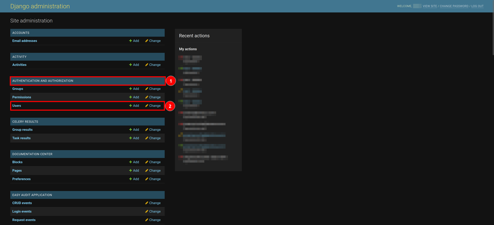

## Users Page

Once you click on the `Users` link, you will be redirected to a page that has 1️⃣ a list of all the registered users on the SAWPS platform.

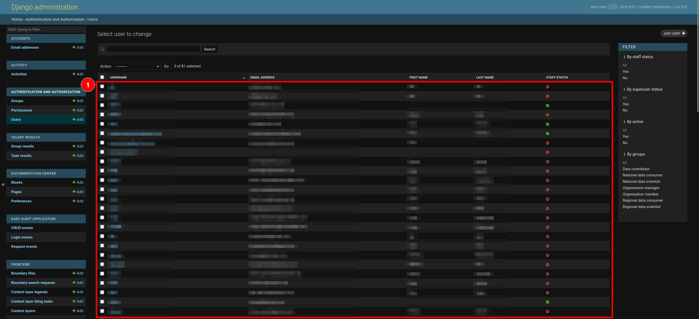

### Filter List of Users

On the right-hand side of the `Users` page, you will see a panel titled `FILTER`.

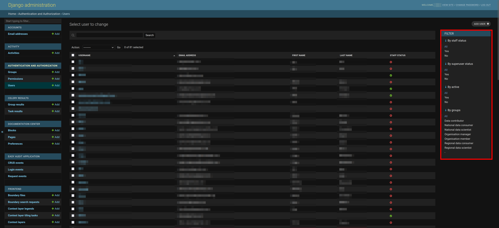

The various options in the `FILTER` panel allow you to change the number of users you can see in the list. You can also set more than one filter at a time to ensure you only see the specific users you would like to see (the filters applied in this example resulted in only 16 of the 81 total users being displayed).

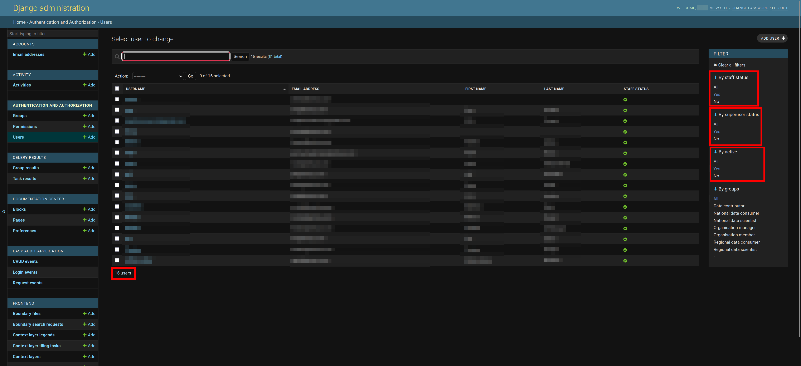

If you would like to reset the list to a point where no filters have been applied, you can simply click on 1️⃣ the `Clear all filters` button.

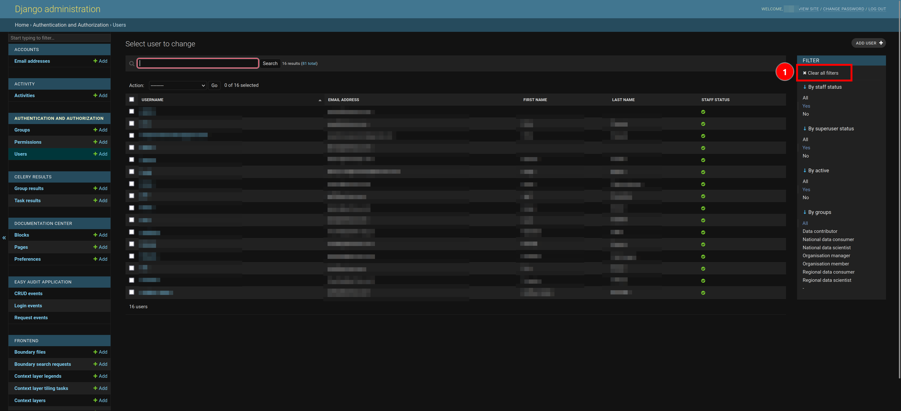

### Search for User(s)

If you do not see the user you would like to see in the list after filtering (or due to the length of the list), you can utilise the `Search` functionality. To do so, click 1️⃣ the `Search` field and type a few characters (i.e. letters in the user's name), and then click on 2️⃣ the `Search` button to filter the list of users. Ensure that you have cleared any of the filters you have applied otherwise your search will only search through the filtered list of users and not all of the users.

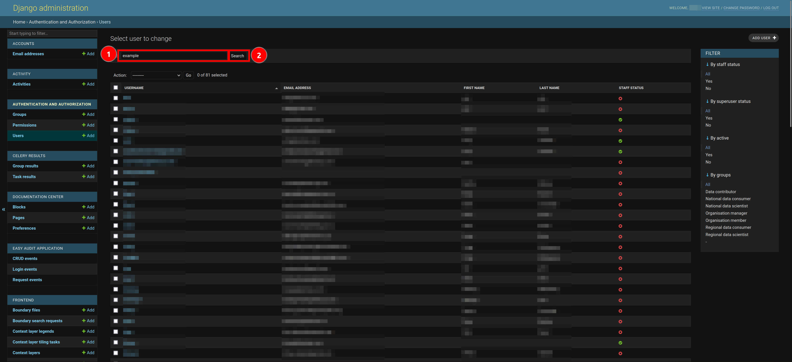

If the representative you are looking for is still not there, then you will need to follow the steps below to add them.

### Add User(s)

If you would like to add a user, you can click on 1️⃣ the `ADD USER` button.

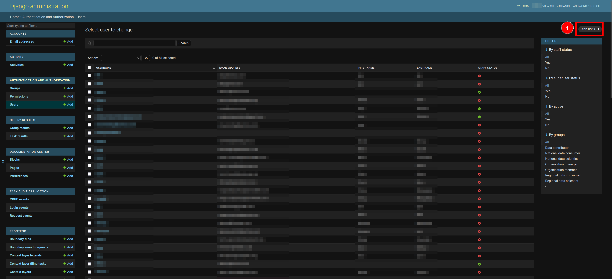

When you click on the `ADD USER` button, you will be redirected to the `Add User` page. You should fill in 1️⃣ the user's username (usually their first name but in all lowercase text), and 2️⃣ the password to secure the account. **NB** Pay careful attention to the list of requirements for a password underneath the `Password` field (Using a password manager to generate a password is recommended). Once you have generate a **secure** password (following the requirements), you must then re-enter the password in 3️⃣ the `Password confirmation` field. You are not required to fill in the fields in 4️⃣ the `USER` section of the page but filling them in helps to ensure accuracy of the user's profile on the platform.

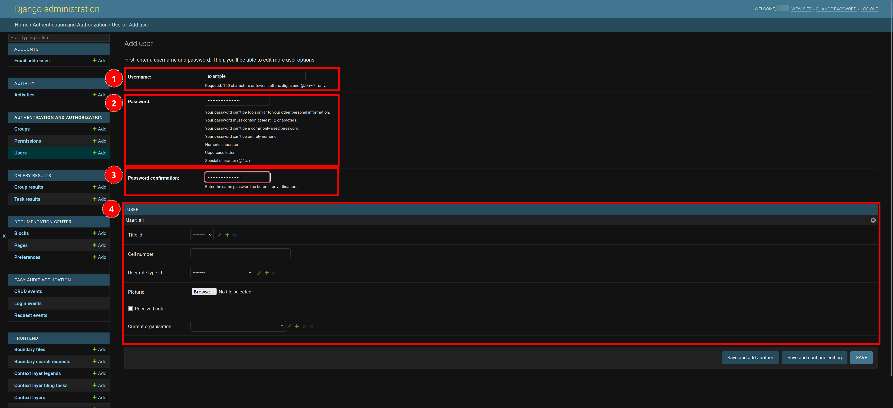

Once you have filled in the necessary information, you have three options to proceed forward:

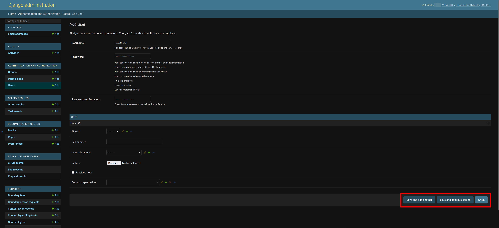

- `Save and add another`: Which will allow you to save the current user and move forward with adding a new one.
- `Save and continue editing`: Which will allow you to save the current user and proceed with editing the current user.
- `SAVE`: Allows you to save the user and then redirects you to the `Change User` page where you need to specify 1️⃣ the user's first name, last name and email address. You can also set 2️⃣ the user's permissions if you know what their user role will be.
    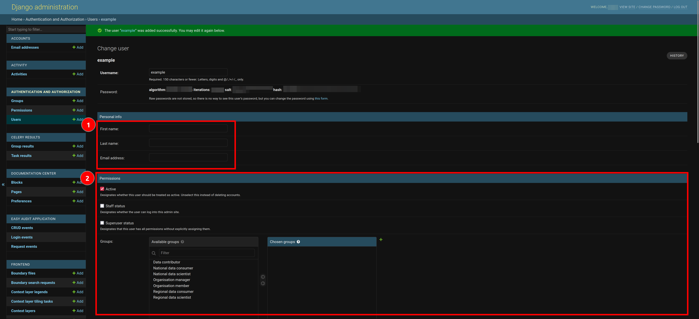

    Once you have filled in the necessary information, scroll down and then you can click on 1️⃣ any one of the three save options or click on 2️⃣ the `Delete` button to remove the user.

    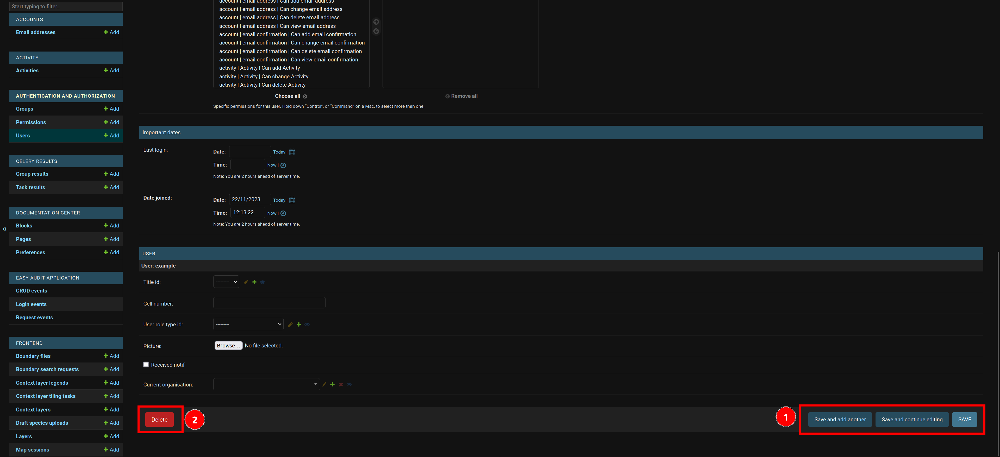

    The three save options will have different actions:

  - `Save and add another`: Which will allow you to save the current user and then redirect you back to the `Add User` page.
  - `Save and continue editing`: Which will allow you to save the current user and continue with editing the current user.
  - `SAVE`: Allows you to save the user and then redirects you back to the `Users` page and displays a success message.
        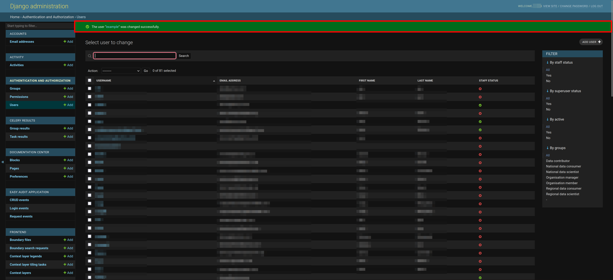

    If you clicked on the `Delete` button, you will be redirected to a page where you can either 1️⃣ confirm deleting the user or 2️⃣ cancel and return to the list of users.

    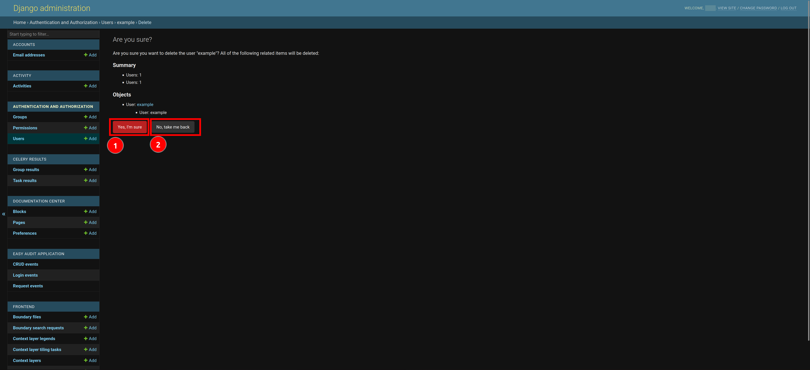

    If you confirm the deletion of the invitation then you will be redirected back to the `Users` page and shown a success message.

    

### Manage User(s)

To make changes to an existing user, you can click on 1️⃣ the username of the user.

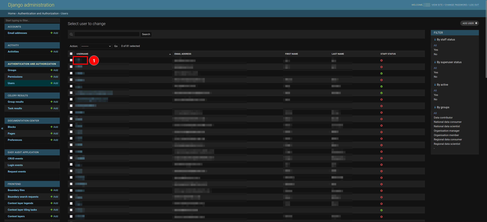

This will redirect you to a `Change Organisation` page where you can edit the information previously used to populate the invitation, or you can delete the invitation.

In the `Groups:` section, the user should always be part of the `Organisation member` group and then depending on whether the organisation they are a part of is National or Provincial, you should select the relevant `National` or `Provincial` user group(s) (i.e. A National Organsiation would have a National data consumer).

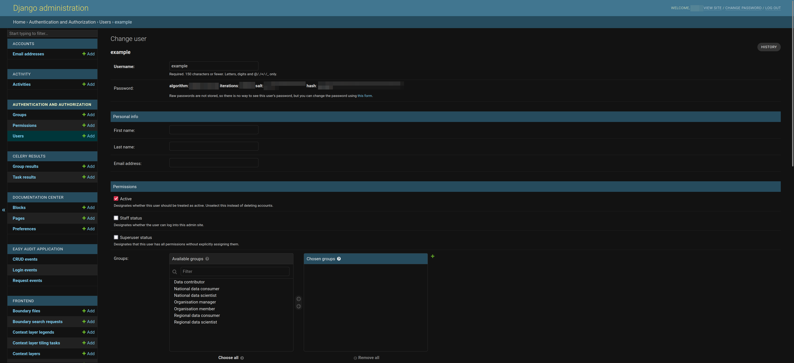

Once you have changed the necessary information, scroll down and then you can click on 1️⃣ any one of the three save options or click on 2️⃣ the `Delete` button to remove the user.

The three save options will have different actions:

- `Save and add another`: Which will allow you to save the current user and then redirect you back to the `Add User` page.
- `Save and continue editing`: Which will allow you to save the current user and continue with editing the current user.
- `SAVE`: Allows you to save the user and then redirects you back to the `Users` page and displays a success message.
    

If you clicked on the `Delete` button, you will be redirected to a page where you can either 1️⃣ confirm deleting the user or 2️⃣ cancel and return to the list of users.

If you confirm the deletion of the invitation then you will be redirected back to the `Users` page and shown a success message.

### Delete User(s)

If you would like to delete a user, or multiple users, you can do so from the `Users` page. First you select the user(s) you would like to remove by checking 1️⃣ the boxes next to the user(s) name(s).

> **Note:** Clicking on the topmost checkbox will select all of the users.

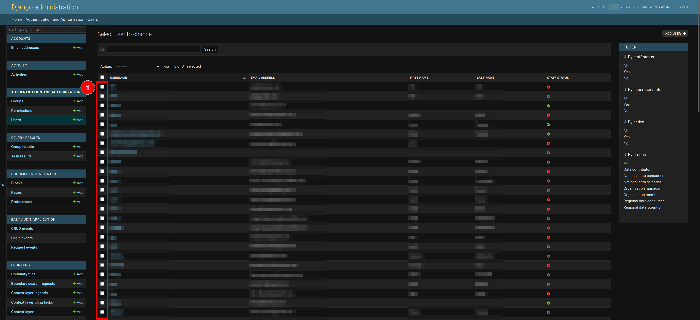

Then you click on 1️⃣ the `Action` dropdown menu, select 2️⃣ the `Delete selected user` option, and then click on 3️⃣ the `Go` button.

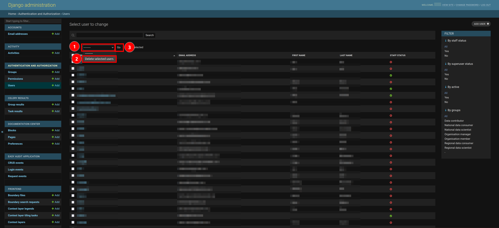

This will redirect you to a page where you can either 1️⃣ confirm deleting the user(s) or 2️⃣ cancel and return to the list of users. Depending on the number of users you are deleting the **Summary** and **Objects** will automatically be updated.

If you confirm the deletion of the user(s) then you will be redirected back to the `User` page and shown a success message.

