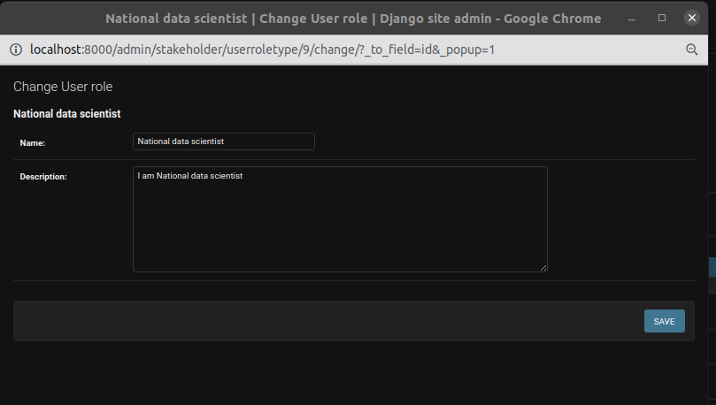
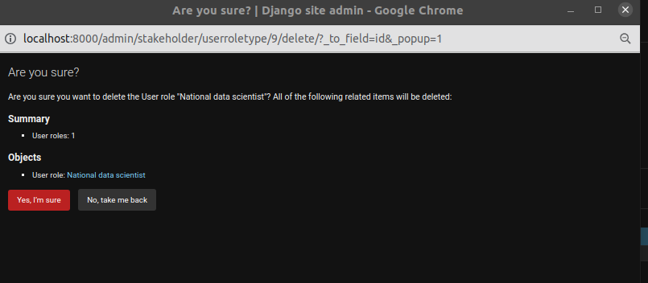
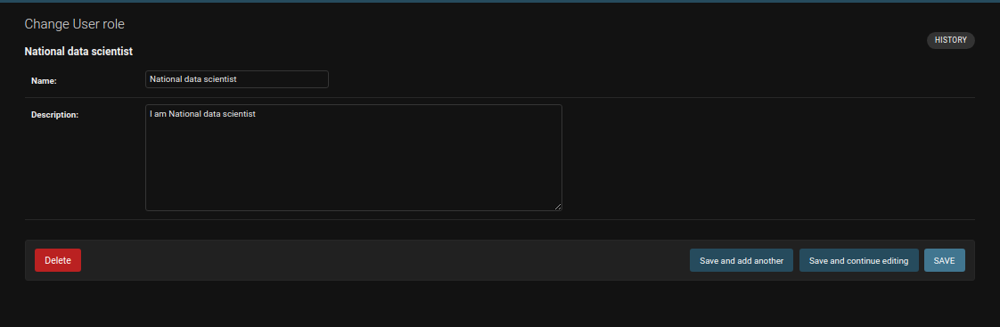

# Add Admin Table

## Activity

1. **Form fields**: Form where administrators can input values for the activity.

    This table is used to store existing activity types e.g. `Unplanned/natural deaths`.

    * **Colour**: Used as the colour identifier in reports and charts. The default is black (`#000000`).
    * **Width**: Column width in the Activity Report.
    * **Export fields**: Used as export fields in the Activity Report. The value should be an array/list, containing an  `Annual Population Per Activity` field to export. The fields currently available are:
        * founder_population
        * reintroduction_source
        * intake_permit
        * offtake_permit
        * translocation_destination

    This is an example of a correct **Export fields** value:
    `["translocation_destination", "founder_population"]`

    Any update on this table will be reflected on the [Activity Report](../../user/manual/explore/reports.md).

3. **Save and add another**: Save the current record, then redirect administrators to a new page to add a new record.

4. **Save and continue editing**: Save the current record while still showing the current record.

5. **Save**: Save the current record, then get redirected to the Django Admin Table/record list.

## Group

1. **Permissions**: Available permissions for the group. Administrators can choose permissions from the list and assign them to the group.

2. **Arrow**: Using these arrows, administrators can add or remove the permissions from the group.

3. **Plus icon**: Clicking on the plus icon allows the administrators to add a new permission. The popup for creating a new permission will open.

    

    1. **Form Fields**: Form where administrators can input values for the new permission.

    2. **Save**: Button to save the new permission.

4. **Choose All**: Button to choose all of the permissions and assign them to the group.

5. **Remove All**: Button to choose all of the permissions and remove them from the group.

6. **Save and add another**: Save the current record, then be redirected to a new page to add a new record.

7. **Save and continue editing**: Save the current record while still showing the current record.

8. **Save**: Save the current record and then be redirected to the Django Admin Table/record list.

## Add User

The administrators will be presented with a form to enter the user's information. Here are the fields to fill in:

1. **Username**: Administrators should enter a unique username for the new user. It should be 150 characters, or less, and may contain only letters, digits, and the characters '@', '.', '+', '-', and '_'.

2. **Password**: Administrators should create a strong password for the user. The password must meet these criteria:
    - Be at least 12 characters long.
    - Should not resemble the user's personal information.
    - Should not be a commonly used password.
    - Should not be entirely numeric.
    - Must include at least one numeric character.
    - Must include at least one uppercase letter.
    - Must include at least one special character (e.g., @, #, %, or ;).

3. **Password Confirmation**: Administrators should re-enter the same password for verification.

4. **Title Id**: Administrators should choose the title from the dropdown.

5. **Icons**: By using these icons, the administrators can add a new user role, and delete, edit, and view details of the chosen user role.

    - **Edit Icon**: Clicking on the `Edit` icon allows the administrators to edit the user role. After clicking on the icon, a popup will open for editing the user role.
        - 

    - **Plus Icon**: Clicking on the `Plus` icon allows the administrators to add a new user role. After clicking on the icon, a popup will open for adding a new user role.
        - 

    - **Cross Icon**: Clicking on the `Cross` icon allows the administrators to delete the user role. After clicking on the icon, a popup will open for deleting the user role.
        - 

    - **Eye Icon**: Clicking on the `Eye` icon allows administrators to view the details of the user role. After clicking on the icon, a popup will open for viewing the details of the user role.
        - 

6. **Choose File**: Choose a profile picture for the user.

7. **Save and add another**: Save the current record, then redirect to a new page to add a new record.

8. **Save and continue editing**: Save the current record while still showing the current record.

9. **Save**: Save the current record, then redirect to the Django Admin Table/record list.

## Add TOTP (Time-based One Time Pin) Device

1. **User**: The administrator can add the user for whom TOTP is being created. Existing users can be searched by clicking the search icon next to the user input field.

2.  **Name**: The administrator can add the name of this device in the name input field.

3. **Confirmed**: Check the checkbox if the device is ready for use.

4. **Key**: A pre-generated hex-encoded secret key, which can be up to 40 bytes in length.

5. **Steps**: The time step in seconds.

6. **To**: The Unix time at which to begin counting steps.

7. **Digits**: The number of digits to expect in a token.

8. **Tolerance**: The number of time steps in the past or future to allow.

1. **Drift**: The number of time steps the prover is known to deviate from a centralised clock.

2. **Throttling**: A timestamp of the last failed verification attempt. Null if the last attempt succeeded.

3. **Throttling Failure Count**: Number of successive failed attempts.

6. **Save and add another**: Save the current record, then redirect to a new page to add a new record.

7. **Save and continue editing**: Save the current record while still showing the current record.

8. **Save**: Save the current record, then redirect to the Django Admin Table/record list.

## Add Taxon Table

1. **Form Fields**: This form allows administrators to input values for the taxon.

    The Taxon table is designed to store information about various taxonomic entities.

    - **Scientific Name**: Field to input the scientific name of the taxon.

    - **Common Name Verbatim**: Field for entering the common name of the taxon.

    - **Colour Variant**: Dropdown menu for selecting colour variants.

    - **Infraspecific Epithet**: Field for specifying the infraspecific epithet.

    - **Taxon Rank**: Dropdown menu for selecting the taxonomic rank.

    - **Parent**: Dropdown menu for selecting the parent taxon.

    - **Show on Front Page**: Checkbox indicating whether the taxon should be displayed on the front page.

    - **Is Selected**: Checkbox indicating whether the taxon is selected.

    - **Front Page Order**: Field to input the order of appearance on the front page (default: 0).

    - **Colour**: Field to specify the color.

    - **Graph Icon**: This icon is used in graphs and charts.
        - **Click here for a sample**: Clicking on the `Click here for sample` link will show administrators a sample for the graph icon.
            

    - **Topper Icon**: This icon is generated automatically from the graph icon for use in the `Reports` and `Charts` topper. The administrators can re-upload the topper icon by re-uploading the graph icon.
        - **Click here for a sample**: Clicking on the `Click here for sample` link will show administrators a sample for the topper icon.
            

    - **Icon**: This icon is generated automatically from the graph icon for use in the population overview graph on the landing page. The administrators can re-upload the icon by re-uploading the graph icon.
        - **Click here for a sample**: Clicking on the `Click here for sample` link will show administrators a sample for the icon.
            

3. **Save and Add Another**: This option saves the current taxon record and redirects administrators to a new page to add another taxon record.

4. **Save and Continue Editing**: Choosing this option saves the current taxon record while still displaying the current record for further editing.

5. **Save**: This option saves the current taxon record and redirects administrators to the Django Admin Table/record list.

## Add Statistical Model Table

1. **Taxon**: Statisticians can choose the specific taxon for which they intend to perform statistical analysis. The taxon can be selected from the dropdown menu provided. If the taxon is not specified during the addition of a statistical model, the model is considered applicable to every taxon in the system. However, it's important to note that if a taxon has its own specified statistical model, that model will take precedence for that particular taxon.

2. **Code**: In the "Code" input field, statisticians are required to insert the R code that corresponds to the statistical analysis they wish to conduct. This field is where the actual statistical calculations and procedures are defined. The execution of R code within the system follows a structured process:

    - **Data Export**: The system exports CSV data of the specified species.

    - **R Code Execution**: The exported CSV data serves as input for the execution of the provided R code. The system processes the R code to perform the intended statistical analysis on the species data.

    - **JSON Retrieval**: Upon completion of the R code execution, the system retrieves the output in JSON format.

    - **Statistical Model Output**: A StatisticalModelOutput record is then created, capturing the results of the statistical analysis for further reference and analysis.

3. **Type**: Choose the type of statistical model output from the dropdown menu provided. This selection allows statisticians to categorise and distinguish the nature of the output generated by the statistical analysis.

4. **Variable Name**: Define the exact variables used in the R code for statistical analysis. These variables store trends data (for charts) or other data intended for JSON export, enhancing clarity and organisation in result interpretation.

5. **Save and Add Another**: This option saves the current statical record and redirects administrators to a new page to add another statistical record.

6. **Save and Continue Editing**: Choosing this option saves the current statistical record while still displaying the current record for further editing.

7. **Save**: This option saves the current statistical record and redirects administrators to the Django Admin Table/record list.

8. **Data Download Template**: Click on the `Data Download Template` button, to download the CSV file.

## Add Organisation Invites Record

1. **Form Fields**: This form allows administrators to input values for the organisation invite.

    - **Email:** Enter the email of the user being invited.

    - **User Dropdown:** Select a user from the dropdown list if they already exist or create a user by clicking on the plus icon. The administrator can view the selected user's record by clicking on the eye icon and can edit by clicking on the edit icon.

    - **Organisation Dropdown:** Select a organisation from the dropdown list if they already exist or create a organisation by clicking on the plus icon. The administrator can view the selected organisation's record by clicking on the eye icon and can edit by clicking on the edit icon.

    - **Joined Dropdown:** Select the joined status from the dropdown list.

    - **User Role Dropdown:** Select the user role from the dropdown list if it already exists or create a user role by clicking on the plus icon. The administrator can view the selected user role's record by clicking on the eye icon and can edit by clicking on the edit icon.

    - **Assigned As Dropdown:** Select the assigned as status from the dropdown list.

    - **UUID:** The UUID is generated automatically when a record is created in the database.

2. **Save and Add Another**: This option saves the current organisation invites record and redirects administrators to a new page to add another organisation invites record.

3. **Save and Continue Editing**: Choosing this option saves the current organisation invites record while still displaying the current record for further editing.

4. **Save**: This option saves the current organisation invites record and redirects administrators to the Django Admin Table/record list.

## Add Organisation Manager Record

1. **Form Fields**: This form allows administrators to input values for the organisation manager.

    - **Organisation Dropdown:** Select a organisation from the dropdown list if they already exist or create a organisation by clicking on the plus icon. The administrator can view the selected organisation's record by clicking on the eye icon and can edit by clicking on the edit icon.

    - **User Dropdown:** Select a user from the dropdown list if they already exist or create a user by clicking on the plus icon. The administrator can view the selected user's record by clicking on the eye icon and can edit by clicking on the edit icon.

2. **Save and Add Another**: This option saves the current organisation manager record and redirects administrators to a new page to add another organisation manager record.

3. **Save and Continue Editing**: Choosing this option saves the current organisation manager record while still displaying the current record for further editing.

4. **Save**: This option saves the current organisation manager record and redirects administrators to the Django Admin Table/record list.
