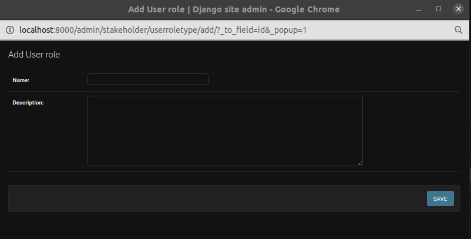

# Add Admin Table

## Activity

1. **Form fields**: Form where administrators can input values for the activity.

    This table is used to store existing activity types e.g. `Unplanned/natural deaths`.

    * **Colour**: Used as the colour identifier in reports and charts. The default is black (`#000000`).
    * **Width**: Column width in the Activity Report.
    * **Export fields**: Used as export fields in the Activity Report. The value should be an array/list, containing an  `Annual Population Per Activity` field to export. The fields currently available are:
        * founder_population
        * reintroduction_source
        * intake_permit
        * offtake_permit
        * translocation_destination

    This is an example of a correct **Export fields** value:
    `["translocation_destination", "founder_population"]`

    Any update on this table will be reflected on the [Activity Report](../../user/manual/explore/reports.md).

3. **Save and add another**: Save the current record, then redirect administrators to a new page to add a new record.

4. **Save and continue editing**: Save the current record while still showing the current record.

5. **Save**: Save the current record, then get redirected to the Django Admin Table/record list.

## Group

1. **Permissions**: Available permissions for the group. Administrators can choose permissions from the list and assign them to the group.

2. **Arrow**: Using these arrows, administrators can add or remove the permissions from the group.

3. **Plus icon**: Clicking on the plus icon allows the administrators to add a new permission. The popup for creating a new permission will open.

    

    1. **Form Fields**: Form where administrators can input values for the new permission.

    2. **Save**: Button to save the new permission.

4. **Choose All**: Button to choose all of the permissions and assign them to the group.

5. **Remove All**: Button to choose all of the permissions and remove them from the group.

6. **Save and add another**: Save the current record, then be redirected to a new page to add a new record.

7. **Save and continue editing**: Save the current record while still showing the current record.

8. **Save**: Save the current record and then be redirected to the Django Admin Table/record list.

## Add User

The administrators will be presented with a form to enter the user's information. Here are the fields to fill in:

1. **Username**: Administrators should enter a unique username for the new user. It should be 150 characters, or less, and may contain only letters, digits, and the characters '@', '.', '+', '-', and '_'.

2. **Password**: Administrators should create a strong password for the user. The password must meet these criteria:
    - Be at least 12 characters long.
    - Should not resemble the user's personal information.
    - Should not be a commonly used password.
    - Should not be entirely numeric.
    - Must include at least one numeric character.
    - Must include at least one uppercase letter.
    - Must include at least one special character (e.g., @, #, %, or ;).

3. **Password Confirmation**: Administrators should re-enter the same password for verification.

4. **Title Id**: Administrators should choose the title from the dropdown.

5. **Icons**: By using these icons, the administrators can add a new user role, and delete, edit, and view details of the chosen user role.

    - **Edit Icon**: Clicking on the `Edit` icon allows the administrators to edit the user role. After clicking on the icon, a popup will open for editing the user role.
        - 

    - **Plus Icon**: Clicking on the `Plus` icon allows the administrators to add a new user role. After clicking on the icon, a popup will open for adding a new user role.
        - 

    - **Cross Icon**: Clicking on the `Cross` icon allows the administrators to delete the user role. After clicking on the icon, a popup will open for deleting the user role.
        - 

    - **Eye Icon**: Clicking on the `Eye` icon allows administrators to view the details of the user role. After clicking on the icon, a popup will open for viewing the details of the user role.
        - 

6. **Choose File**: Choose a profile picture for the user.

7. **Save and add another**: Save the current record, then redirect to a new page to add a new record.

8. **Save and continue editing**: Save the current record while still showing the current record.

9. **Save**: Save the current record, then redirect to the Django Admin Table/record list.
