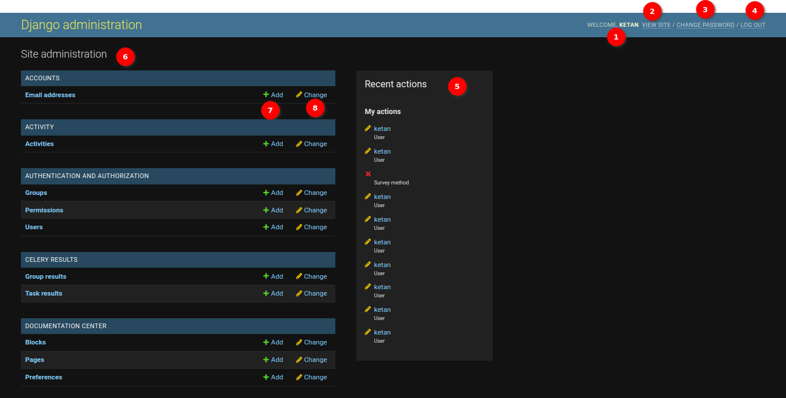
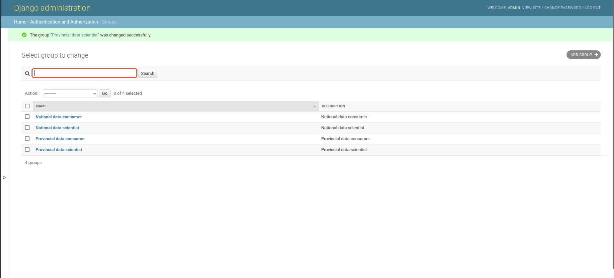

# Django Admin Page Documentation

## Description

The Django Admin is the central hub to create, read, update, or delete your data. Only user with staff status can enter the admin page.

## Heading to Django Admin

__

1. Click on your profile icon, then click **Django Admin**.

## Django Admin Layout

The Welcome page will be the first thing user see. It typically displays a welcome message and provides an overview of the available actions and options within the admin panel.

__

In the top right corner of the admin panel, user will find a section that usually displays user's username. In this section, user have the following options:

1. **Welcome**: Displays welcome with admin name.

2. **View Site**: Clicking on this option will take user to the `SAWPS` website.

3. **Change Password**: Clicking on this option allows user to change user's admin password. User will be prompted to provide your current password and set a new one.

    

    **Input Fields**

    1. **Old Password**: In this field, user should provide the current password associated with the user account. This is a mandatory field.

    2. **New Password**: In this field, user should enter the new password user want to set for the user account. The password should meet the following criteria:

    * Your password can't be too similar to your other personal information.
    * Your password must contain at least 12 characters.
    * Your password can't be a commonly used password.
    * Your password can't be entirely numeric.
    * Your password should include the following:
    * Numeric character
    * Uppercase letter
    * Special character (@#%;)

    * Ensure that the new password adheres to these requirements.

    3. **New Password Confirmation**: Re-enter the new password in this field to confirm it. It should match the password entered in the `New Password` field.

    4. **Change My Password Button**: Once user have filled in the required information, click the `CHANGE MY PASSWORD` button to submit the form. If all the input is valid and the new password meets the criteria, the password for the user account will be updated.

After successfully changing the password, user will receive a confirmation message indicating that the password has been updated.

4. **Log Out**: Clicking on this option will log user out of the admin panel and return user to the login page.

    

    1. **Log in again**: Clicking this option will open login page.

5. **Recent Actions**: The `Recent Actions` section is typically located on the right side of the admin panel and provides a list of recent actions that have been performed within the admin interface. These actions may include additions, deletions, or changes to data in your project. Clicking on any of the available links will take user to the detail of recent action.

6. **Site Administration**: Site Administration this section provides links to various models and apps registered with the admin panel. It serves as the primary navigation point for managing your project's data. Clicking on any of the available links will take user to the respective model's management page.

7. **Add**: This button is used to create a new item of the associated model. Clicking on it will open a form where you can enter the details of the new item.

8. **Change**: This button is used to edit an existing item from the list. When user click the `Change` button user will be redirected to a page where user can see all the associate data of that model and can select data to change.

To see data in a table, click on the table name.

## Django Admin Table

1. **Add button**: Clicking on this button will allow user to add new record in the table.

    

    1. **Form fields**: Form where user can input values for record.

    3. **Save and add another**: Save current record, then redirect to a new page to add new record.

    4. **Save and continue editing**: Save current record while still showing current record.

    5. **Save**: Save current record, then redirect to Django Admin Table/record list.

2. **Search**: Search feature to search specific record of the table.

3. **Toggle select records**: Checkbox to select/deselect records.

4. **Action**: Action dropdown user can choose the action from this dropdown and perform on selected object.

5. **Go**: Clicking on this button will allow user to perform selected option on selected object.

6. **Objects**: Available objects containing records. User can see the details of the object by clicking on the link.

To edit a record, click on the record.

## Django Admin Form

__

1. **Form fields**: Form where we can input values for our record.

2. **Delete button**: Delete currently opened record. It will take you to confirmation page.

3. **Save and add another**: Save current record, then redirect to a new page to add new record.

4. **Save and continue editing**: Save current record while still showing current record.

5. **Save**: Save current record, then redirect to Django Admin Table/record list.

6. **History**: Button to see actions applied to current record.

## Activities Table

__

This table is used to store existing activity types e.g. `Unplanned/natural deaths`.

1. **Colour**: Used as color identifier in reports and charts. The default is black (`#000000`).
2. **Width**: Column width in the Activity Report.
3. **Export fields**: Used as export fields in Activity Report. The value should be an array/list, containing
`Annual Population Per Activity` field to export. Currently available fields are:
    * founder_population
    * reintroduction_source
    * intake_permit
    * offtake_permit
    * translocation_destination

This is an example of correct **Export fields** value:
`["translocation_destination", "founder_population"]`

Any update on this table will be reflected on the [Activity Report](../../user/manual/explore/reports.md).

## Group Table

__

This table is used to store existing user groups, that will affect available options in the [Report](../../user/manual/explore/reports.md).
You can assign a user to groups in the User Table.

## User Table

__

This table is used to store existing users. Some of the fields are:

1. **Active**: A flag to indicate active user. When a user is no longer active, unselect this instead of deleting the user.
2. **Staff status**: A flag to indicate whether user can log into Django admin page.
3. **Superuser status**: A flag to indicate whether user has all permissions without explicitly assigning them in **5**.
4. **Groups**: Group that a user belong to. Double click on the available groups (left panel) to add into chosen group (right panel). To remove user from a group, double click on chosen group (right panel). Group will affect user menu on the frontend page, such as in [Report](../../user/manual/explore/reports.md).
5. **User permissions**: Specific permission for users, if they are not superuser.
