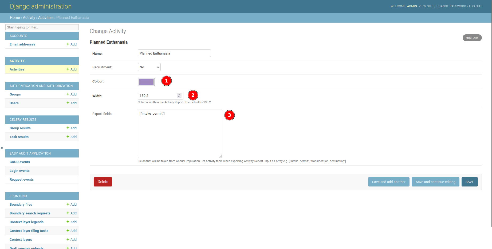

# Django Admin Page Documentation

## Description

The Django Admin is the central hub to create, read, update, or delete your data. Only user with staff status can enter the admin page.

## Heading to Django Admin

__

1. Click on your profile icon, then click **Django Admin**.

## Django Admin Layout

__

1. **Application**: Application or module that exist in this site.
2. **Table**: Table or model, where the data is stored.
3. **Recent Actions**: List of activities recently happened in admin site.

To data in a table, click on the table name.

## Django Admin Table

__

1. **Table records**: Show the first page of table records.
2. **Count of selected records**: Shows the number of selected records.
3. **Toggle select records**: Checkbox to select/deselect records.
4. **Add new records**: Button to add a new record.

To edit a record, click on the record.

## Django Admin Form

__

1. **Form fields**: Form where we can input values for our record.
2. **Delete button**: Delete currently opened record. It will take you to confirmation page.
3. **Save and add another**: Save current record, then redirect to a new page to add new record.
4. **Save and continue editing**: Save current record while still showing current record.
5. **Save**: Save current record, then redirect to Django Admin Table/record list.
6. **History**: Button to see actions applied to current record.

## Activities Table

__

This table is used to store existing activity types e.g. `Unplanned/natural deaths`.

1. **Colour**: Used as color identifier in reports and charts. The default is black (`#000000`).
2. **Width**: Column width in the Activity Report.
3. **Export fields**: Used as export fields in Activity Report. The value should be an array/list, containing
`Annual Population Per Activity` field to export. Currently available fields are:
    * founder_population
    * reintroduction_source
    * intake_permit
    * offtake_permit
    * translocation_destination

This is an example of correct **Export fields** value:
`["translocation_destination", "founder_population"]`

Any update on this table will be reflected on the [Activity Report](../../user/manual/explore/reports.md).

## Group Table

__

This table is used to store existing user groups, that will affect available options in the [Report](../../user/manual/explore/reports.md).
You can assign a user to groups in the User Table.

## User Table

__

This table is used to store existing users. Some of the fields are:

1. **Active**: A flag to indicate active user. When a user is no longer active, unselect this instead of deleting the user.
2. **Staff status**: A flag to indicate whether user can log into Django admin page.
3. **Superuser status**: A flag to indicate whether user has all permissions without explicitly assigning them in **5**.
4. **Groups**: Group that a user belong to. Double click on the available groups (left panel) to add into chosen group (right panel). To remove user from a group, double click on chosen group (right panel). Group will affect user menu on the frontend page, such as in [Report](../../user/manual/explore/reports.md).
5. **User permissions**: Specific permission for users, if they are not superuser.
