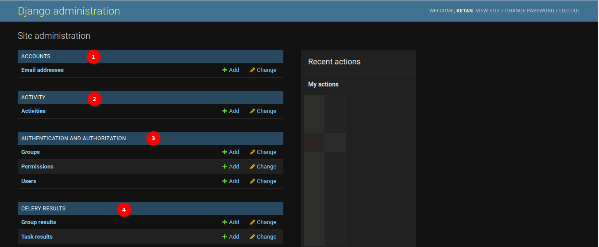

# Django Admin Page Documentation

The Django Admin is the central hub to create, read, update, or delete SAWPS data. Only users with staff status (i.e. administrators) can enter the administration page.

## Heading to Django Admin

1. Click on the profile icon, then click **Django Admin**.

## Django Admin Layout

The Welcome page will be the first thing that administrators see. It typically displays a welcome message and provides an overview of the available actions and options within the administration panel.

In the top right corner of the administration panel, administrators will find a section that usually displays their username. In this section, administrators have the following options:

1. **Welcome**: Displays welcome with the administrator's name.

2. **View Site**: Clicking on this option will take administrators to the `SAWPS` website.

3. **Change Password**: Clicking on this option allows administrators to change their administration password. Administrators will be prompted to provide their current password and then set a new one.

    

    1. **1. Old Password**: In this field, administrators should provide the current password associated with their account. This is a mandatory field.

    2. **2. New Password**: In this field, administrators should enter the new password they want to set for their account. The password should meet the following criteria:

       - The password can't be too similar to other personal information.
       - The password must contain at least 12 characters.
       - The password can't be a commonly used password.
       - The password can't be entirely numeric.
       - The password should include the following:
           - Numeric character
           - Uppercase letter
           - Special character ( @ # % ; )
       - Ensure that the new password adheres to these requirements.

    3. **3. New Password Confirmation**: Re-enter the new password in this field to confirm it. It should match the password entered in the `New Password` field.

    4. **4. Change My Password Button**: Once administrators have filled in the required information, they can click the `CHANGE MY PASSWORD` button to submit the form. If all the input is valid and the new password meets the criteria, the password for their account will be updated.

    After successfully changing the password, the administrator will receive a confirmation message indicating that the password has been updated.

4. **Log Out**: Clicking on this option will log the administrator out of the administration panel and return them to the login page.

    

    1. **1. Log in again**: Clicking this option will open the login page.

5. **Recent Actions**: The `Recent Actions` section is located on the right side of the administration panel and provides a list of recent actions that have been performed within the administration interface. These actions may include additions, deletions, or changes to data in the project. Clicking on any of the available links will take an administrator to the details of the recent action.

6. **Site Administration**: This section provides links to various models and apps registered with the administration panel. It serves as the primary navigation point for managing a project's data. Clicking on any of the available links will take an administrator to the respective model's management page.

7. **Add**: This button is used to create a new item for the associated model. Clicking on the `Add` link will open a form where administrators can enter the details of the new record.

8. **Change**: This button is used to edit an existing item from the list. When administrators click the `Change` button, they will be redirected to a page where they can view all the associated data for that model and select the data to change.

## Django Admin Tables

1. **ACCOUNTS**: The administrators can use this section to perform operations related to accounts.

    - **Email Addresses**: The `Email addresses` table is designed for storing and managing the email addresses associated with user accounts. This table provides administrators with the capability to perform various operations, including adding, deleting, updating, and viewing user email addresses.

2. **ACTIVITY**: The administrators can use this section to perform operations related to activities.

    - **Activities**: The `Activity` table is designed to capture and track various activities related to the management and conservation of wildlife or specific areas. This table provides administrators with the capability to perform various operations, including adding, deleting, updating, and viewing activities.
        - **Add**: Click [here](django-add-data.md) to view how to add a new activity.
        - **Edit**: Click [here](django-change-data.md) to view how to edit an activity.

3. **AUTHENTICATION AND AUTHORISATION**: The administrators can use this section to perform operations related to authentication and authorisation.

    - **Groups**: The `Groups` table is designed to organise and categorise users into distinct groups or roles within a web application. This table serves as a fundamental component of the application's access control and permission management system. It provides administrators with the capability to perform various operations, including creating, modifying, and viewing user groups.
        - **Add**: Click [here](django-add-data.md) to view how to add a new group.
        - **Edit**: Click [here](django-change-data.md) to view how to edit a group.

    - **Permissions**: The `Permissions` table is a core element of a web application's access control and authorisation system. It is designed to manage and regulate the rights and privileges of users within the application, allowing administrators to create, modify, and oversee user permissions.

    - **Users**: The `Users` table is a foundational component of a web application, designed to represent and manage individual user accounts. This table plays a central role in user authentication, identity management, and access control. It empowers administrators to perform a range of essential operations, including user creation, modification, and access management.
        - **Add**: Click [here](django-add-data.md) to view how to add a new user.
        - **Edit**: Click [here](django-change-data.md) to view how to edit a user.

4. **CELERY RESULTS**: The administrators can use this section to perform operations related to celery.

    - **Group Results**: In the `Group result` table, administrators can click on a specific group to see details about its tasks and their outcomes. This is useful for tracking the progress of related tasks and ensuring they were executed successfully. This table provides administrators with the capability to perform various operations, including adding, deleting, updating, and viewing group results.

    - **Task Results**: In the `Task result` table, administrators can view the status and outcomes of individual tasks. This is particularly valuable for diagnosing issues with specific tasks and understanding how the application is handling asynchronous processes. This table provides administrators with the capability to perform various operations, including adding, deleting, updating, and viewing task results.

5. **DOCUMENTATION CENTRE**: The administrators can use this section to perform operations related to documentation. The `Documentation Centre` is a vital tool for administrators to streamline the process of providing users with access to relevant documentation, guides, and help resources. It offers a structured approach to managing and presenting documentation, enhancing the user experience and support for SAWPS.

    - **Blocks**: In the `Blocks` table, administrators can specify a relative URL that links to the documentation base URL. This URL is used to auto-fetch content, allowing administrators to seamlessly integrate the documentation with SAWPS. This table provides administrators with the capability to perform various operations, including adding, deleting, updating, and viewing blocks.

    - **Pages**: In the `Pages` table, administrators can specify the page with a relative URL that links to the documentation base URL. This table provides administrators with the capability to perform various operations, including adding, deleting, updating, and viewing pages.

    - **Preferences**: In the `Preferences` table, administrators can set the documentation base URL. This is the foundation of the documentation centre and should be carefully defined to ensure accurate integration. This table provides administrators with the capability to perform various operations, including adding, deleting, updating, and viewing preferences.

6. **EASY AUDIT APPLICATION**: The administrators can use this section to perform operations related to the easy audit application. An `Easy Audit Application` is a tool that helps administrators monitor and maintain an audit trail of changes and user activity within the application, providing transparency, accountability, and security.

    - **CRUD events**: In the `CRUD events` table, administrators can track CRUD events to maintain data integrity, improve accountability, and ensure compliance with regulatory requirements. An audit log of these events helps administrators to keep a record of data changes, and understand who made the changes, and when they occurred. This table provides administrators with the capability to perform various operations, including purging, deleting, updating, and viewing CRUD events.

    - **Login events**: In the `Login events` table, administrators can monitor login events which is critical for maintaining the security of SAWPS and keeping track of who is accessing the system. It helps in identifying suspicious or unauthorised activities, improving accountability, and enhancing the overall security posture of the application. This table provides administrators with the capability to perform various operations, including purging, deleting, updating, and viewing login events.

    - **Request events**: In the `Request events` table, administrators can monitor request events which is crucial for understanding user interactions, diagnosing issues, improving system performance, and ensuring data security. It can provide valuable insights into how SAWPS is being used and help in troubleshooting problems. This table provides administrators with the capability to perform various operations, including purging, deleting, updating, and viewing request events.

7. **FRONTEND**: The administrators can use this section to perform operations related to the SAWPS front end.

    - **Boundary files**: In the `Boundary files` table, administrators can define geographical boundaries, regions, or areas. This table provides administrators with the capability to perform various operations, including adding, deleting, updating, and viewing boundary files.

    - **Boundary search requests**: In the `Boundary search requests` table, administrators can manage boundary search requests, as it ensures that users can access accurate geographical data and perform spatial queries effectively. This table provides administrators with the capability to perform various operations, including adding, deleting, updating, and viewing boundary search requests.

    - **Context layer legends**: The `Context layer legends` table is used for storing the context layer legends records. This table provides administrators with the capability to perform various operations, including adding, deleting, updating, and viewing context layer legends.

    - **Context layer tiling tasks**: The `Context layer tiling tasks` table is used for storing context layer tiling tasks records. This table provides administrators with the capability to perform various operations, including adding, deleting, updating, and viewing context layer tiling tasks.

    - **Context layers**: The `Context layers` table is used for storing the context layers records. Context layers are fundamental components of SAWPS, offering diverse geospatial data to users. The administrators can manage these layers to ensure that users can access the most relevant and up-to-date spatial information, thereby improving decision-making and enhancing the user experience. This table provides administrators with the capability to perform various operations, including adding, deleting, updating, and viewing context layers.

    - **Draft species uploads**: The `Draft species uploads` table is used for storing the draft species uploads records. This table provides administrators with the capability to perform various operations, including adding, deleting, updating, and viewing draft species uploads.

    - **Layers**: The `Layers` table is used for storing the layers records. The administrators can modify individual layers within the application, which includes defining their display properties, filter settings, and their relationships with context layers. This table provides administrators with the capability to perform various operations, including adding, deleting, updating, and viewing layers.

    - **Map sessions**: The `Map sessions` table is used for storing the map session records. The administrators can monitor and configure these sessions. This table provides administrators with the capability to perform various operations, including adding, deleting, updating, and viewing map sessions.

    - **Spatial data**: The `Spatial data` table is used for storing the spatial data records. This table provides administrators with the capability to perform various operations, including adding, deleting, updating, and viewing spatial data.

    - **Statistical models**: The `Statistical models` table is used for storing the statistical model records. This table provides administrators with the capability to perform various operations, including adding, deleting, updating, and viewing statistical models.

8. **NOTIFICATION**: The administrators can use this section to perform operations related to reminders.

    - **Reminders**: The `Reminders` table is used for storing the reminder records. This table provides administrators with the capability to perform various operations, including adding, deleting, updating, and viewing reminders.

9. **OCCURRENCE**: The administrators can use this section to perform operations related to occurrences.

    - **Survey methods**: The `Survey methods` table is used for storing the survey methods records. In the field of wildlife and environmental studies, survey methods are essential for systematically collecting data about the occurrence and distribution of various species and ecosystems. These methods are carefully designed to provide accurate information for research, conservation, and management purposes. This table provides administrators with the capability to perform various operations, including adding, deleting, updating, and viewing survey methods.

10. **OTP STATIC**: The administrators can use this section to perform operations related to static OTP (one-time pin) devices.

    - **Static devices**: The `Static devices` table is used for storing the static devices records. This table provides administrators with the capability to perform various operations, including adding, deleting, updating, and viewing static devices.

11. **OTP TOTP**: The administrators can use this section to perform operations related to OTP TOTP (time-based one-time pin) devices.

    - **TOTP devices**: The `TOTP devices` table is used for storing the TOTP devices records. This table provides administrators with the capability to perform various operations, including adding, deleting, updating, and viewing TOTP devices.
        - **Add**: Click on the [add](django-add-data.md) to view how to add a new TOTP device.
        - **Edit**: Click on the [edit](django-change-data.md) to view how to edit a TOTP device.

12. **PERIODIC TASKS**: The administrators can use this section to perform operations related to periodic tasks.

    - **Clocked**: The `Clocked` table is used for storing the clocked records. This table provides administrators with the capability to perform various operations, including adding, deleting, updating, and viewing clocked objects.

    - **Crontabs**: The `Crontabs` table is used for storing the crontabs records. The administrators can use the crontab table to schedule and automate periodic tasks within the application. Crontab allows administrators to specify precise times and dates for task execution. This table provides administrators with the capability to perform various operations, including adding, deleting, updating, and viewing crontabs.

    - **Intervals**: The `Intervals` table is used for storing the interval records. The administrators can use intervals to determine how often a task runs and the number of periods to wait before the task runs again. This table provides administrators with the capability to perform various operations, including adding, deleting, updating, and viewing intervals.

    - **Periodic tasks**: The `Periodic tasks` table is used for storing the periodic tasks records. The administrators can use the periodic tasks table to automate recurring operations within the application. This functionality allows administrators to configure and schedule tasks to run at specific intervals, saving time and ensuring consistency. This table provides administrators with the capability to perform various operations, including adding, deleting, updating, and viewing periodic tasks.

    - **Solar events**: The `Solar events` table is used for storing the solar events records. The administrators can use the solar events table to schedule tasks based on solar events, such as sunrise or sunset, at specific geographic locations. Solar events are essential for tasks that need to be synchronised with daylight or specific astronomical occurrences. This table provides administrators with the capability to perform various operations, including adding, deleting, updating, and viewing solar events.

13. **POPULATION DATA**: The administrators can use this section to perform operations related to species populations.

    - **Annual Populations**: The `Annual Populations` table is used for storing the annual population records. The administrators can manage population data for owned species in the SAWPS. This table provides administrators with the capability to perform various operations, including adding, deleting, updating, and viewing annual populations.

    - **Open Close System**: The `Open Close System` table is used for storing the open-close systems records. This table provides administrators with the capability to perform various operations, including adding, deleting, updating, and viewing open-close systems.

    - **Population Estimate Categories**: The `Population Estimate Categories` table is used for storing the population estimate categories records. Population estimate categories help clarify the methods used to estimate species populations, providing valuable context and transparency. They allow administrators to categorise and describe the reliability and accuracy of population estimates. This table provides administrators with the capability to perform various operations, including adding, deleting, updating, and viewing population estimate categories.

    - **Population Status**: The `Population Status` table is used for storing the population status records. The administrators can use the population status table to select and change the population status of species within the application. This table allows administrators to categorising species as either resident or migratory. This table provides administrators with the capability to perform various operations, including adding, deleting, updating, and viewing population status.

    - **Population count per activities**: The `Population count per activities` table is used for storing the population count per activities records. The administrators can use the population count per activity table to select and change population counts for specific activities associated with species. This table allows administrators to track and manage population counts in various activities. This table provides administrators with the capability to perform various operations, including adding, deleting, updating, and viewing population counts per activity.

    - **Sampling Effort Coverages**: The `Sampling Effort Coverages` table is used for storing the sampling effort coverages records. The administrators can use the sampling effort coverage table to select and change the coverage level of sampling effort in surveys and data collection. This table allows administrators to categorising the extent and distribution of sample units within a reserve or area. This table provides administrators with the capability to perform various operations, including adding, deleting, updating, and viewing sampling effort coverages.

14. **PROPERTY**: The administrators can use this section to perform operations related to properties.

    - **Parcel Types**: The `Parcel Types` table is used for storing the parcel types records. The administrators can use the parcel types table to select and change the type of parcels within the SAWPS. This table allows administrators to categorising parcels as either rural or urban, based on their characteristics. This table provides administrators with the capability to perform various operations, including adding, deleting, updating, and viewing parcel types.

    - **Parcels**: The `Parcels` table is used for storing the parcel records. The administrators can use the parcels table to select and change parcel details within the SAWPS. This table allows administrators to manage and update parcel information. This table provides administrators with the capability to perform various operations, including adding, deleting, updating, and viewing parcels.

    - **Properties**: The `Properties` table is used for storing the properties records. The administrators can use the property table to select and change property details within the SAWPS. This table allows administrators to manage and update property information, including property name, short code, organisation, property size, and province. This table provides administrators with the capability to perform various operations, including adding, deleting, updating, and viewing properties.

    - **Property types**: The `Property types` table is used for storing the property types records. The administrators can use the property type table to select and change property type details within the SAWPS. This table allows administrators to categorising properties based on their type, such as community, provincial, national, state, private, or a combination of state and private. This table provides administrators with the capability to perform various operations, including adding, deleting, updating, and viewing property types.

    - **Provinces**: The `Provinces` table is used for storing the provinces' records. The administrators can use the province table to select and change province details within the SAWPS. This table allows administrators to manage and update province information, including province names. This table provides administrators with the capability to perform various operations, including adding, deleting, updating, and viewing provinces.

15. **REDIRECTS**: The administrators can use this section to perform operations related to redirects.

    - **Redirects**: The `Provinces` table is used for storing the redirects records. The administrators can use the redirect table to set up URL redirections within the SAWPS site. This table allows administrators to direct users from one URL to another, either within the same domain or to an external website. This table provides administrators with the capability to perform various operations, including adding, deleting, updating, and viewing redirects.

16. **REGULATORY PERMIT**: The administrators can use this section to perform operations related to regulatory permits.

    - **Data use permissions**: The `Data use permissions` table is used for storing the data use permissions records. The administrators can use the data use permission table to select and change permission settings related to data usage within the SAWPS. This table allows administrators to configure data access and usage policies. This table provides administrators with the capability to perform various operations, including adding, deleting, updating, and viewing data use permissions.

17. **SITES**: The administrators can use this section to perform operations related to sites.

    - **Sites**: The `Sites` table is used for storing the site records. The administrators can use the sites table to select and change site details within the SAWPS. This table allows administrators to manage and update site information, including the domain name and display name. This table provides administrators with the capability to perform various operations, including adding, deleting, updating, and viewing sites.

18. **SOCIAL ACCOUNTS**: The administrators can use this section to perform operations related to social accounts.

    - **Social accounts**: The `Social accounts` table is used for storing the social accounts records. The administrators can use the social account table to add and manage social media account connections for users within the SAWPS. This table allows administrators to integrate social media logins and enhance the user experience.  This table provides administrators with the capability to perform various operations, including adding, deleting, updating, and viewing social accounts.

    - **Social application tokens**: The `Social application tokens` table is used for storing the social application tokens records. The administrators can use the social account table to add and manage social media account connections for users within the SAWPS. This table allows administrators to integrate social media logins and enhance the user experience. This table provides administrators with the capability to perform various operations, including adding, deleting, updating, and viewing social application tokens.

    - **Social applications**: The `Social applications` table is used for storing the social applications records. The administrators can use the social application table to integrate and manage social media applications within the application. This table allows administrators to social media integration, such as login via social platforms. This table provides administrators with the capability to perform various operations, including adding, deleting, updating, and viewing social applications.

19. **SPECIES**: The administrators can use this section to perform operations related to species.

    - **Owned Species**: The `Owned Species` table is used for storing the owned species records. This table provides administrators with the capability to perform various operations, including adding, deleting, updating, and viewing owned species.

    - **Taxa**: The `Taxa` table is used for storing the taxon(species) records. This table provides administrators with the capability to perform various operations, including adding, deleting, updating, and viewing taxon(species).

    - **Taxon Ranks**: The `Taxon Ranks` table is used for storing the taxon rank records. This table provides administrators with the capability to perform various operations, including adding, deleting, updating, and viewing taxon ranks.

20. **STAKEHOLDER**: The administrators can use this section to perform operations related to stakeholders.

    - **Login Status**: The `Login status` table is used for storing the login status records. The administrators can use the login status table to define and manage different login states within the SAWPS. This can help track and manage user's login activities. This table provides administrators with the capability to perform various operations, including adding, deleting, updating, and viewing login status.

    - **Organisation Representatives**: The `Organisation representatives` table is used for storing the organisation representative's records. The administrators can use the organisation representative table to designate and manage individuals who represent specific organisations within the SAWPS. This helps establish connections and responsibilities within the system. This table provides administrators with the capability to perform various operations, including adding, deleting, updating, and viewing organisation representatives.

    - **Organisation users**: The `Organisation users` table is used for storing the organisation users records. The administrators can use the organisation user table to associate and manage users with specific organisations within the SAWPS. This helps define user roles and responsibilities within the context of their organisations. This table provides administrators with the capability to perform various operations, including adding, deleting, updating, and viewing organisation users.

    - **Organisation Invites**: The `Organisation Invites` table is used for storing the organisation invite records. The administrators can use the organisation invites table to invite individuals to join specific organisations within the application. This is a helpful way to extend invitations to users and control their roles within the organisation. This table provides administrators with the capability to perform various operations, including adding, deleting, updating, and viewing organisation invites.

    - **Organisations**: The `Organisations` table is used for storing the organisation's records. The administrators can use the organisation table to create and manage organisations within the SAWPS. Organisations help structure and organise user roles and responsibilities. This table provides administrators with the capability to perform various operations, including adding, deleting, updating, and viewing organisations.

    - **Reminders**: The `Reminders` table is used for storing the reminder records. The administrators can use the reminders table to create and manage reminders within the SAWPS. Reminders help users keep track of important tasks and deadlines. This table provides administrators with the capability to perform various operations, including adding, deleting, updating, and viewing reminders.

    - **Titles**: The `Titles` table is used for storing the titles records. The administrators can use the titles table to manage and add titles that can be associated with user profiles within the SAWPS. This table provides administrators with the capability to perform various operations, including adding, deleting, updating, and viewing titles.

    - **User roles**: The `User roles` table is used for storing the user roles records. User roles define the permissions and access levels for different users within the SAWPS. By adding user roles, administrators can control what users can and cannot do in the system. This table provides administrators with the capability to perform various operations, including adding, deleting, updating, and viewing user roles.

* For more information on the detailed documentation for the tables, click [here](django-table.md).

* For more information on how to add new data, click [here](django-add-data.md).

* For more information on how to edit data, click [here](django-change-data.md).
