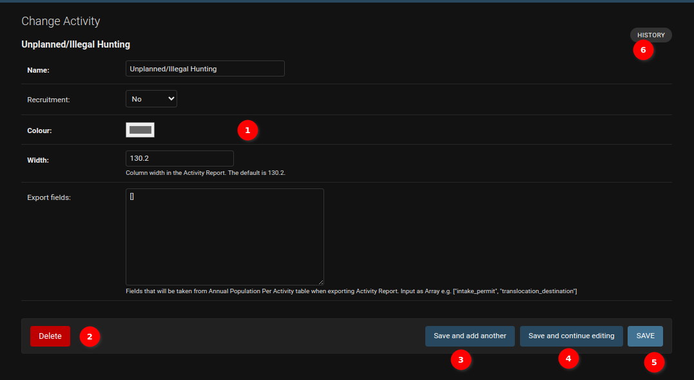
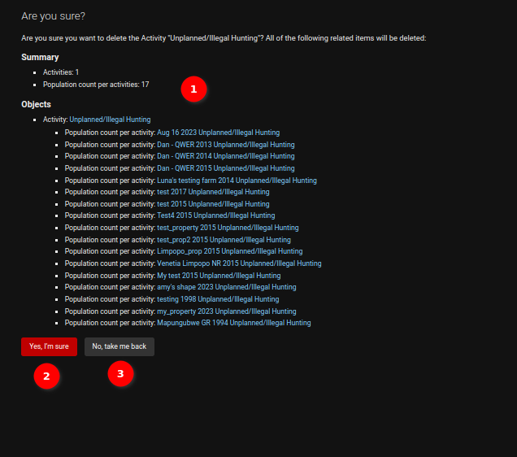
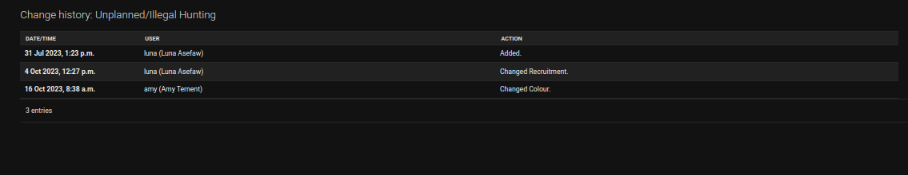
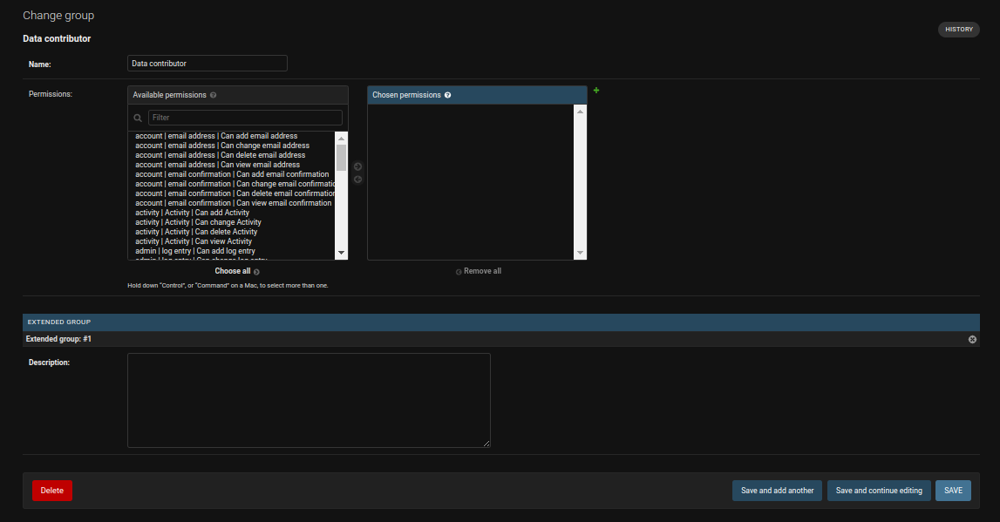

# Django Admin Form

## Activity

1. **Form fields**: Form where we can input values for our record.

2. **Delete button**: Delete currently opened record. It will take you to confirmation page.

    

    1. **Detail**: Detail about the object.

    2. **Yes, I'm sure**: Button for confirm deletion of object.

    3. **No, take me back**: Button to cancel deletion of the object.

3. **Save and add another**: Save current record, then redirect to a new page to add a new record.

4. **Save and continue editing**: Save current record while still showing current record.

5. **Save**: Save current record, then redirect to Django Admin Table/record list.

6. **History**: Button to see actions applied to current record.

    

## Group

Admin can update the field of the object by changing the value of the fields. Eg change the permisions of the group and update the description of the group.

The other options(`History`, `Delete`, `Save and add another`, `Save and continue editing`, `Save`) work same as they are working for the other objects.
