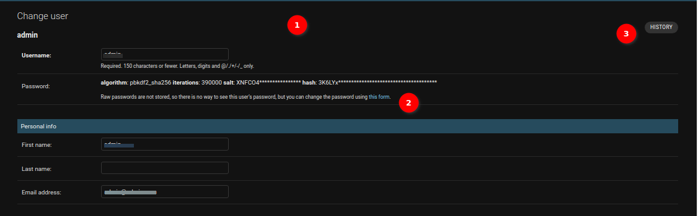
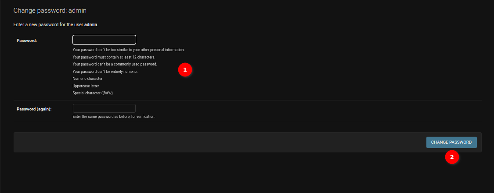
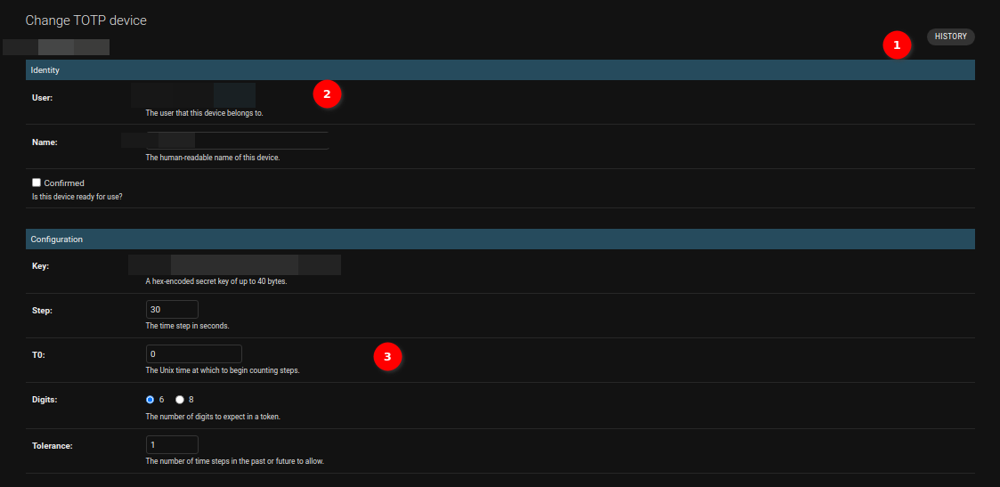
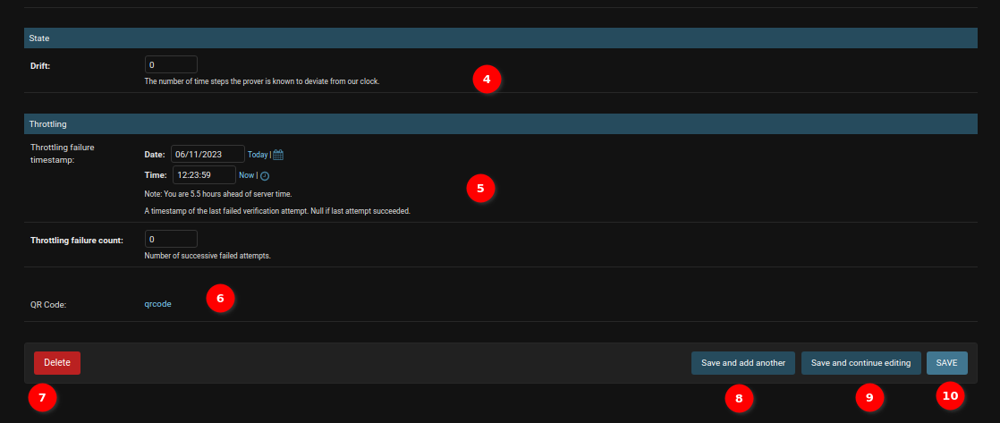

# Django Admin Form

## Activity

1. **Form fields**: Form where administrators can input values for their record.

2. **Delete button**: Delete currently opened record. It will take administrators to a confirmation page.

    

    1. **Detail**: Details about the object.

    2. **Yes, I'm sure**: Button for confirming the deletion of the object.

    3. **No, take me back**: Button to cancel the deletion of the object.

3. **Save and add another**: Save the current record and then be redirected to a new page to add a new record.

4. **Save and continue editing**: Save the current record while still showing the current record.

5. **Save**: Save the current record and then get redirected to the Django Admin Table/record list.

6. **History**: Button to see actions applied to the current record.

    

## Group

Administrators can update the field of the object by changing the value of the fields. E.g. change the permissions of the group and update the description of the group.

The other options (`History`, `Delete`, `Save and add another`, `Save and continue editing`, `Save`) work same for other objects as they do in this example.

## Change User

1. **History**: Button to view actions applied to the current record.

2. **Change Password**: The administrators can change the user's password by clicking on `this form` link. A popup will open to change the user's password.

    - 

    1. **Change Password Form**: Form to change the user's password.

    2. **Change Password Button**: The administrators can change the user's password by clicking on the `CHANGE PASSWORD` button.

### Change User Permission

1.  **Checkbox**: The administrators can grant permissions to a user by checking the checkbox.

2.  **Arrows**: The administrators can assign or unassign a group to the user by selecting and using these arrows.

3. **Choose All**: The administrators can assign all available groups to the user.

4. **Remove All**: The administrators can unassign all groups from the user.

5. **Permissions**: The administrators can assign or unassign permissions to the user using this table.

6. **Search Permissions**: The administrators can search for permissions using the search functionality.

### Change Dates And User Info

1. **Dates**: The administrators can edit the last login date-time and date joined date-time of a user from this section.

2. **User**: The administrators can edit the user's details.

3. **Delete**: The administrators can delete the user by clicking on this button. The popup will open for the confirmation to delete the user.

3. **Save and add another**: Save the current record, then redirect to a new page to add a new record.

4. **Save and continue editing**: Save the current record while still showing the current record.

5. **Save**: Save the current record, then redirect to the Django Admin Table/record list.

## Change TOTP Device

1. **History**: The button to see actions applied to the current record.

2. **Identity**: The administrator can edit the user, name and confirmed status for the TOTP device. Click on the user name of the user allows the administrator to view the details of that user.

3. **Configuration**: The administrator can edit the configuration of the TOTP device by using this form.

4. **State**: The administrator can edit the state of the TOTP device by using this form.

5. **Throttling**: The administrator can edit the throttling of the TOTP device by using this form.

6. **QRCode**: The administrator can view the qrcode by clicking on the `qrcode` link.

7. **Delete**: The administrator can delete the TOTP device by clicking on the `Delete` button.

8. **Save and add another**: Save the current record, then redirect to a new page to add a new record.

9. **Save and continue editing**: Save the current record while still showing the current record.

10. **Save**: Save the current record, then redirect to the Django Admin Table or record list.
