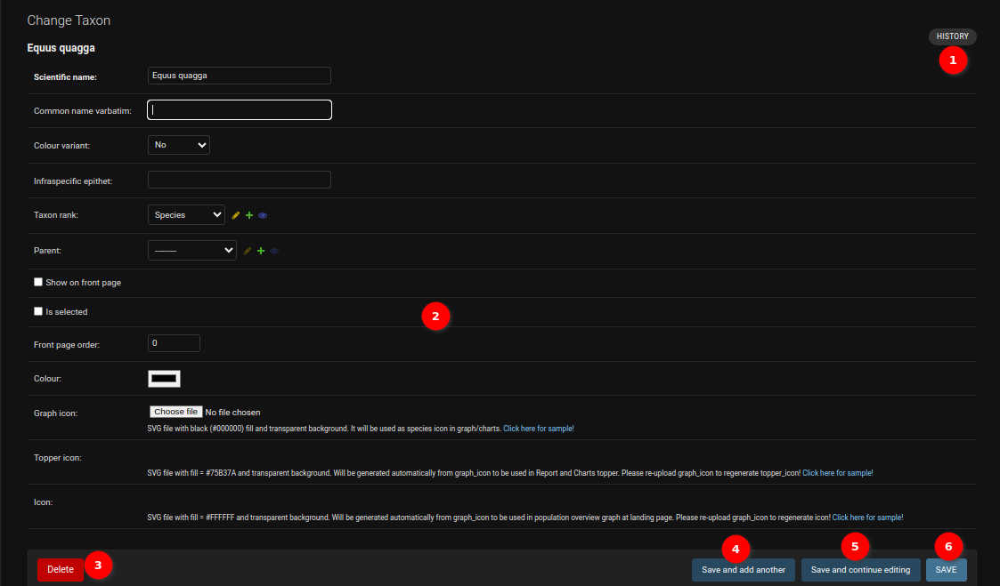
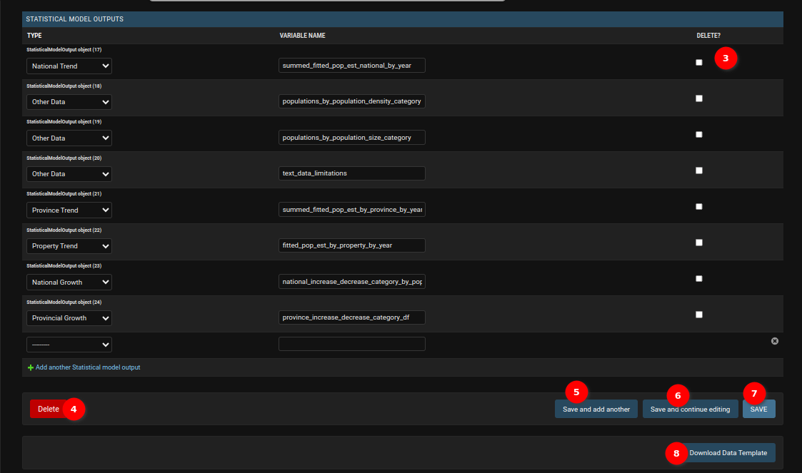
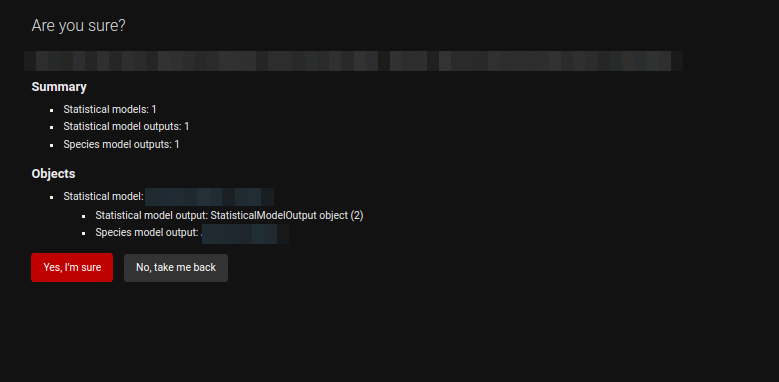
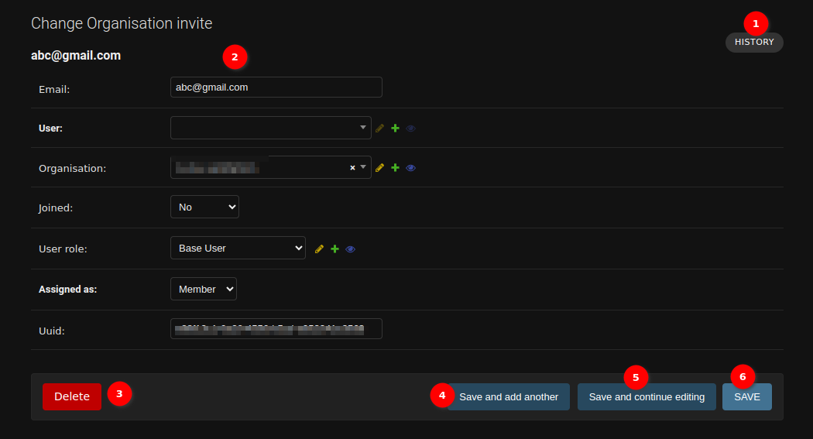
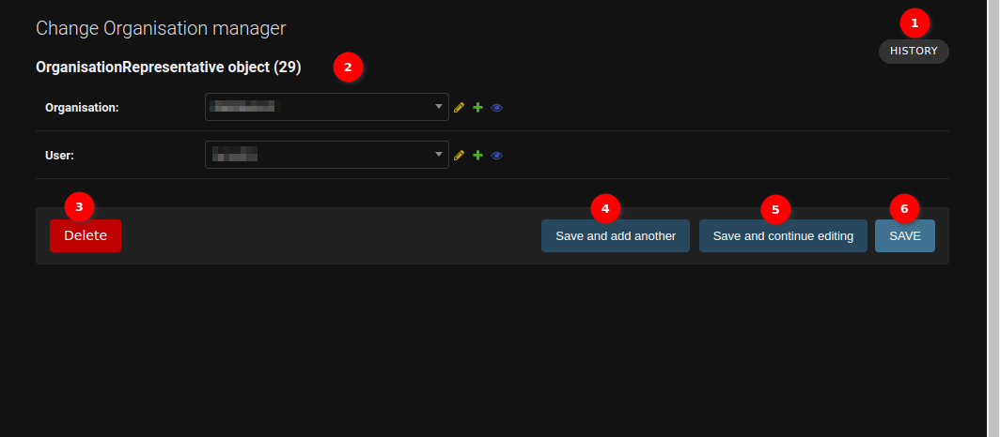

# Django Admin Form

## Activity

1. **Form fields**: Form where administrators can input values for their record.

2. **Delete button**: Delete currently opened record. It will take administrators to a confirmation page.

    

    1. **Detail**: Details about the object.

    2. **Yes, I'm sure**: Button for confirming the deletion of the object.

    3. **No, take me back**: Button to cancel the deletion of the object.

3. **Save and add another**: Save the current record and then be redirected to a new page to add a new record.

4. **Save and continue editing**: Save the current record while still showing the current record.

5. **Save**: Save the current record and then get redirected to the Django Admin Table/record list.

6. **History**: Button to see actions applied to the current record.

    

## Group

Administrators can update the field of the object by changing the value of the fields. E.g. change the permissions of the group and update the description of the group.

The other options (`History`, `Delete`, `Save and add another`, `Save and continue editing`, `Save`) work same for other objects as they do in this example.

## Change User

1. **History**: Button to view actions applied to the current record.

2. **Change Password**: The administrators can change the user's password by clicking on `this form` link. A popup will open to change the user's password.

    - 

    1. **Change Password Form**: Form to change the user's password.

    2. **Change Password Button**: The administrators can change the user's password by clicking on the `CHANGE PASSWORD` button.

### Change User Permission

1.  **Checkbox**: The administrators can grant permissions to a user by checking the checkbox.

2.  **Arrows**: The administrators can assign or unassign a group to the user by selecting and using these arrows.

3. **Choose All**: The administrators can assign all available groups to the user.

4. **Remove All**: The administrators can unassign all groups from the user.

5. **Permissions**: The administrators can assign or unassign permissions to the user using this table.

6. **Search Permissions**: The administrators can search for permissions using the search functionality.

### Change Dates And User Info

1. **Dates**: The administrators can edit the last login date-time and date joined date-time of a user from this section.

2. **User**: The administrators can edit the user's details.

3. **Delete**: The administrators can delete the user by clicking on this button. The popup will open for the confirmation to delete the user.

3. **Save and add another**: Save the current record, then redirect to a new page to add a new record.

4. **Save and continue editing**: Save the current record while still showing the current record.

5. **Save**: Save the current record, then redirect to the Django Admin Table/record list.

## Change TOTP Device

1. **History**: The button to see actions applied to the current record.

2. **Identity**: The administrator can edit the user, name and confirmed status for the TOTP device. Click on the user name of the user allows the administrator to view the details of that user.

3. **Configuration**: The administrator can edit the configuration of the TOTP device by using this form.

4. **State**: The administrator can edit the state of the TOTP device by using this form.

5. **Throttling**: The administrator can edit the throttling of the TOTP device by using this form.

6. **QRCode**: The administrator can view the qrcode by clicking on the `qrcode` link.

7. **Delete**: The administrator can delete the TOTP device by clicking on the `Delete` button.

8. **Save and add another**: Save the current record, then redirect to a new page to add a new record.

9. **Save and continue editing**: Save the current record while still showing the current record.

10. **Save**: Save the current record, then redirect to the Django Admin Table or record list.

## Change Taxon

1. **History**: Button to view actions applied to the current record.

2. **Form Fields**: Administrators can edit all taxon details, including scientific name, common name, color variant, infraspecific epithet, taxon rank, parent taxon, visibility settings, and taxon color. Additionally, administrators can edit the icons by modifying the graph icon, and the topper icon and icon will be generated automatically based on the graph icon.

3. **Delete**: The administrators can delete the taxon by clicking on this button. The popup will open to confirm the deletion of the taxon.

3. **Save and add another**: Save the current record, then redirect to a new page to add a new record.

4. **Save and continue editing**: Save the current record while still showing the current record.

5. **Save**: Save the current record, then redirect to the Django Admin Table/record list.

## Change Statistical Model

1. **History**: Button to view actions applied to the current record.

2. **Form Fields**: Statisticians have the ability to update the values of various fields within the form. However, it's important to note that the "Taxon" field is not editable. If a statistician wishes to change the taxon associated with a statistical model, they need to create a new statistical model specifically for the desired taxon. This restriction ensures data integrity and alignment with the taxonomic hierarchy, requiring a distinct model for each taxon to accurately capture and represent statistical nuances unique to that taxon.

3. **Delete Checkbox**: Check mark the checkbox to delete the associated statistical output type.

4. **Delete**: The administrator can delete the statistical model by clicking on the `Delete` button. It will ask for confirmation to delete the statistical model object.

    

5. **Save and Add Another**: This option saves the current statical record and redirects administrators to a new page to add another statistical record.

6. **Save and Continue Editing**: Choosing this option saves the current statistical record while still displaying the current record for further editing.

7. **Save**: This option saves the current statistical record and redirects administrators to the Django Admin Table/record list.

8. **Data Download Template**: Click on the `Data Download Template` button, to download the CSV file.

## Change Organisation Invites Record

1. **History**: Button to view actions applied to the current record.

2. **Form Fields**: Administrators can edit organisation invite details, including email, user, organisation, joined, user role, assigned as and UUID.

3. **Delete**: The administrators can delete the organisation invite by clicking on this button. The popup will open to confirm the deletion of the organisation invite.

4. **Save and add another**: Save the current record, then redirect to a new page to add a new record.

5. **Save and continue editing**: Save the current record while still showing the current record.

6. **Save**: Save the current record, then redirect to the Django Admin Table/record list.

## Change Organisation Manager Record

1. **History**: Button to view actions applied to the current record.

2. **Form Fields**: Administrators can edit organisation manager details, including organisation and user.

3. **Delete**: The administrators can delete the organisation manager by clicking on this button. The popup will open to confirm the deletion of the organisation manager.

4. **Save and add another**: Save the current record, then redirect to a new page to add a new record.

5. **Save and continue editing**: Save the current record while still showing the current record.

6. **Save**: Save the current record, then redirect to the Django Admin Table/record list.
