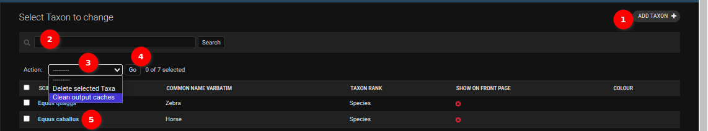

# Django Tables

## Activities Table

1. **Add button**: Clicking on this button will allow administrators to add a new record to the table. Clicking [here](django-add-data.md) will redirect users to the add data record documentation.

2. **Search**: Feature to allow for searching of a specific object in the table using keywords.

3. **Toggle select records**: Checkbox to select/deselect records.

4. **Action**: Administrators can choose the action from this dropdown and then perform it on a selected object.

5. **Go**: Clicking on this button will allow administrators to perform the selected option on the selected object.

6. **Objects**: Available objects containing records. Administrators can see the details of the object by clicking on the link (i.e. the object name).

## Group Table

This table is used to store existing user groups, that will affect the available options in the [Report](../../user/manual/explore/reports.md) and
available charts in the [Charts](../../user/manual/explore/charts.md).

Administrators can assign a user to groups in the User Table.

1. **Toggle sorting**: Clicking on this icon will allow administrators to toggle the displayed order of the data.

2. **Add Group**: Clicking on the `ADD GROUP` button will allow administrators to add a new group. Click [here](django-add-data.md) to see detailed documentation about adding a new group.

3. **Edit Record**: Clicking on the object will allow administrators to change/edit a particular record. Click [here](django-change-data.md) to see detailed documentation about editing a group.

Administrators can also configure what charts are available to each group, by adding the necessary permission to each group.

## User Table

The user table within the Django Admin interface allows administrators to manage user-related tasks efficiently.

1. **Add User**: Clicking on the `ADD USER` button allows administrators to add a new user. Click on [add user](django-add-data.md) to see detailed documentation on adding a new user.

2. **Filter**: Available filters to filter the records of the user table.

    - 

    1. **Clear All Filters**: Clicking on the `clear all filters` allows administrators to clear all the filters.

    2. **Filter Field**: The names of the filter field and attributes for filtering the records.

3. **Search Functionality**: The administrators can search the records using the search functionality.

4. **User Table**: The user table with records.

5. **Edit User**: Clicking on the object allows the administrators to change or edit a particular record. Click [here](django-change-data.md) to view detailed documentation on editing a user.

## TOTP (Time-based One-Time Passwords) Device

This table is used for storing, generating, and deleting the TOTP device.

1.  **TOTP Table**: The table displays the record for the TOTP device.

2.  **QRCode**: The administrator can view the QRCode of the TOTP device by clicking on the `qrcode` link.

    - 
    1. **QRCode**: Displays QRCode.
    2. **URI**: URI(Uniform Resource Identifier) for configuring TOTP.

3. **Add TOTP Device**: The administrator can add a TOTP device by clicking on the `ADD TOTP DEVICE` button. Click on the [add TOTP device](./django-add-data.md) to view detailed documentation about adding a new TOTP device.

4. **Edit TOTP Device**: The administrator can edit the TOTP device for that particular object by clicking on the object. Click on the [here](./django-change-data.md) to view detailed documentation about editing a TOTP device.

## Taxon Table

The Taxon table within the Django Admin interface provides administrators with the tools to manage taxonomic information efficiently.

1. **Add Taxon**: Clicking on the `ADD TAXON` button enables administrators to add a new taxon. To learn more about adding a new taxon, refer to the detailed documentation on [adding a taxon](django-add-data.md).

2. **Search Functionality**: Administrators can utilise the search functionality to find specific taxonomic records.

3. **Actions Dropdown**: The `Actions` dropdown provides the following options for managing taxonomic records:

    - **Delete Selected Taxa**: This action allows administrators to delete the selected taxonomic records in bulk.

    - **Clear Output Cache**: This action enables administrators to clear the output cache associated with the taxonomic records.

4. **Go Button**: The administrators can execute the selected action by clicking this button.

5. **Edit Taxon**: Clicking on a specific taxon entry enables administrators to modify or edit the corresponding record. For detailed instructions on editing a taxon, refer to the documentation on [editing a taxon](django-change-data.md).

## Statistical Table

The Statistical table within the Django Admin interface equips administrators with powerful tools to efficiently manage statistical models.

1. **Add Statistical Model**: Initiate the addition of a new statistical model by clicking the `ADD STATISTICAL MODEL` button. Detailed instructions on adding a new statistical model can be found in the documentation on [adding a statistical model](./django-add-data.md).

2. **Search Functionality**: Utilise the search functionality to efficiently locate specific statistical model records.

3. **Actions Dropdown**: The Actions dropdown provides the following options for managing statistical models:

    - **Delete Selected Statistical Models**: Administrators can efficiently delete multiple selected statistical model records in bulk.

    - **Restart Plumber Process**: This action facilitates the restart of the plumber process associated with the statistical models, ensuring updated and accurate results.

4. **Go Button**: Execute the selected action by clicking the `Go` button.

5. **Edit Statistical Model**: Modify or edit a specific statistical model entry by clicking on it. Refer to the documentation on [editing a statistical model](./django-change-data.md) for detailed instructions.

Efficiently manage your statistical models with the comprehensive functionalities provided by the Statistical table in the Django Admin interface.

## Species Model Outputs Table

The Species model outputs in the Django Admin interface provide administrators with comprehensive tools for managing taxonomic information efficiently. Below is an overview of key functionalities within the Species model. The Species table, presented in a structured format, displays essential information about each taxonomic entry, facilitating a quick overview of the available data.

1. **ADD SPECIES MODEL OUTPUT**: The process of adding Species Model Outputs is straightforward and does not require direct intervention from a statistician. The records within the Species Model Outputs table are automatically generated by the system, ensuring accuracy and consistency.

2. **Filter**: Available filters to filter the records of the species model output table.

    

3. **Search Functionality**: Administrators can utilise the search functionality to find specific species model output records.

4. **Actions Dropdown**: In the Species Model Outputs table, the Actions dropdown offers the following essential options for efficient management of species-related data:

    - **Delete Selected Species Outputs**: This action empowers administrators to delete multiple selected species output records in bulk. It provides a streamlined solution for maintaining a clean and updated dataset.

    - **Trigger Generate Model Output**: The `Trigger Generate Model Output` option initiates the system process to generate model outputs for the selected species entries.

5. **Go Button**: The administrators can execute the selected action by clicking this button.

6. **Edit Species Model Output**: The `Edit Species Model Output` functionality is not applicable to the Species Model Outputs table as it is automatically generated by the system and is not intended for manual modification. The records within this table dynamically reflect the most up-to-date taxonomic information and model outputs.

## Organisation Invites Table

The Organisation invites table within the Django Admin interface provides administrators with the tools to invite users to the organisation.

1. **Add Organisation Invites**: Clicking on the `ADD ORGANISATION INVITE` button enables administrators to add a new organisation invite. To learn more about adding a new organisation invite, refer to the detailed documentation on [adding a new organisation invite](django-add-data.md#add-organisation-invites-table).

2. **Search Functionality**: Administrators can utilise the search functionality to find specific invite records.

3. **Actions Dropdown**: The `Actions` dropdown provides the following options for managing organisation invite records:

    - **Delete selected Organisation invites**: This action allows administrators to delete the selected organisation invites records individually or in bulk.

4. **Go Button**: The administrators can execute the selected action by clicking this button.

5. **Filter**: Available filters to filter the records of the organisation invites table.

    

6. **Edit Organisation Invites**: Clicking on a specific organisation invite entry enables administrators to modify or edit the corresponding record. For detailed instructions on editing a organisation invite, refer to the documentation on [editing a organisation invite](django-change-data.md#change-organisation-invite-record).
