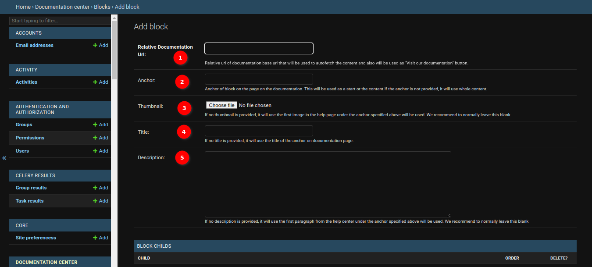

# Context help

This section describes how the context help system works.

## Overview

The context help system provides an integration between the web application and the documentation.

The following concepts are used:

- **Site:** This is the area for globally setting options relating to the context help system.

- **Blocks:** These are small components displayed as blocks 1️⃣ in the context help panel. Each block links to a section in the help documentation. If you would like to view the full documentation site you can click on 2️⃣ `Visit our Documentation`.

- **Pages:** These are context help panels that are each linked to a particular URL in the application.

- **Page Blocks:** These are links between pages and their constituent blocks. Each page can have many blocks and each block can be used in many pages.

## Triggering context help

There are two ways to trigger context help:

1. Click on the 1️⃣ green question mark icon available at the top right corner. This will be visible only on the `EXPLORE` and the `DATA UPLOAD`

2. From the top nav bar, click on the 1️⃣ `Help` to view the context help options.

## Managing context help

We manage the context help system from django admin. You need to be a staff user to do this and have been granted read/write/update permissions on the documentation center related tables. First open your user menu 1️⃣ and then the Django Admin area 2️⃣.

Next we can drill into the documentation center to see only the relevant admin activities 1️⃣.

## Site preferences

Our first activity is to edit the site preferences 1️⃣.

Here our goal is to set the documentation base url for the context help system 1️⃣. Use the URL for your documentation project i.e. https://kartoza.github.io/sawps/

## Managing Pages

Next we need to create pages for each application end point where we want to include context sensitive help. First select pages 1️⃣ from the documentation center menu:

Now you can edit an existing page 1️⃣ or add a new one 2️⃣:

The page properties you can set are going to determine how the context help panel appears in the application when triggering the help panel 1️⃣:

Here is a detailed breakdown of the options:

1️⃣ **Name:** A symbolic name for you to easily recognise what the context help is about

2️⃣ **Relative page url:** This is the relative path to our application page (see underline in image above) e.g. /admin/importer/

3️⃣ **Url:** This is where the documentation is, relative to the documentation base URL. For example if your docs base URL is at: https://kartoza.github.io/sawps/ your help context document relative URL is /administrator/guide/. This will trigger the content panel link 3️⃣ above to point to this page.

4️⃣ **Title:** This will be displayed as 1️⃣ above in the context help panel.

5️⃣ **Intro:** This will be shown as lead-in text for the context help panel. See 2️⃣ above.

On the page form you can also manage the blocks that appear in the context help. You can select the available block from the 1️⃣ dropdown if the block is not already created you can create it by clicking on the 2️⃣ `plus` icon. To create a new block component for a page, use 3️⃣  `Add another Page block` link, and then go and choose or create the actual block content. To set the order in which the block appears in the help panel use 4️⃣. For ordering, lower number blocks will be listed before higher number blocks. It is up to you to ensure that each number used for ordering is unique.

The block will appear in the order we set.

## Managing blocks

You can view and manage existing blocks from the documentation center 1️⃣ or add a new block 2️⃣. We first create a block then go back to the page to add it to the page.

We can also create a new block and can edit the existing blocks from here. Click on the 1️⃣ `ADD BLOCK` button to create the all-new block. You can edit the existing block by clicking on the 2️⃣ name of the particular block.

Let's create a new block.

- **Relative Documentation Url:** 1️⃣ (based on the documentation site wide base url preference) to the documentation page

- **Anchor** 2️⃣ - this is optional and should point to a heading/subheading within the page if populated.

- **Title 3️⃣** - title for the block. This is automatically filled in from the page unless you specify an override title. Normally you would leave this blank.

- **Thumbnail 4️⃣** for the block. This is automatically linked to the first image below the anchor in the help document. Usually, you would leave this blank.

- **Description 5️⃣** for the block. This will be automatically populated from the first paragraph in the linked help documentation.

You can also add the child block by choosing from the 1️⃣ dropdown or by creating a new one by clicking on the 2️⃣ `plus` icon. The order number should be unique to show in proper order.

Let's edit the existing block. Click on the name of the block you want to edit, upon clicking you will be redirected to the change block page where you can edit the block according to the requirements. Once you have done with the editing click on the save to save the changes.

## Page Blocks

Generally we will not directly use the PageBlocks management area - use the Page manager to add and remove blocks from your page.

## Conclusion and notes

The system for context help has been designed in a generic way. That means that you can use any web site where you can reference content with page links and anchors.

⛔️ One word of caution. Do not use a web site as your documentation source if you do not control that site. The content from the help site is pulled directly into your application, which could put you in a compromising position if the content is not 'on message' for your organisation.
