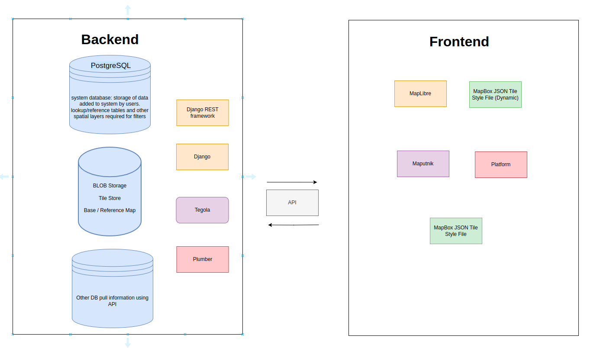

# System architecture

In this section, we outline the system architecture using ER Diagrams, Software Component Diagrams etc. and key libraries / frameworks used in this project.

## Frameworks used

The following is a list, with brief descriptions, of the key components used in creating this platform. Please refer to their individual documentation for in-depth technical information.

| Logo | Name | Notes |
|------------|---------|----------------|
|{: style="height:30px"} | [Django](https://djangoproject.com) | Django makes it easier to build better web apps more quickly and with less code. |
|{: style="height:30px"} | [ReactJS](https://react.dev/) | React lets you build user interfaces out of individual pieces called components. Create your own React components like `Thumbnail`, `LikeButton`, and `Video`. Then combine them into entire screens, pages, and apps.|
| {: style="height:30px"}  |  [Docker](https://docker.com) | Accelerate how you build, share, and run applications. Docker helps developers build, share, and run applications anywhere — without tedious environment configuration or management. |
| {: style="height:30px"}  | [Django Rest Framework](https://www.django-rest-framework.org/) | Django REST framework is a powerful and flexible toolkit for building Web APIs. |
| {: style="height:30px"}   | [MapLibre](https://maplibre.org/)  | Open-source mapping libraries for web and mobile app developers. |
| {: style="height:30px"}   | [PostGIS](https://postgis.net/) | PostGIS extends the capabilities of the PostgreSQL relational database by adding support storing, indexing and querying geographic data. |
| {: style="height:30px"}   | [PostgreSQL](https://www.postgresql.org/) | PostgreSQL is a powerful, open source object-relational database system with over 35 years of active development that has earned it a strong reputation for reliability, feature robustness, and performance.  |
| {: style="height:30px"}  | [Tegola](https://tegola.io/) | An open source vector tile server written in Go, Tegola takes geospatial data and slices it into vector tiles that can be efficiently delivered to any client. |
| {: style="height:30px"}  | [Mapbox](https://www.mapbox.com/) | Mapbox is a mapping and location cloud platform for developers |
| {: style="height:30px"}  | [Maputnik](https://maputnik.github.io/) | Maputnik is a free and open source visual editor for the Mapbox GL style specification. |
| {: style="height:30px"}  | [Plumber](https://www.rplumber.io/) | The plumber package allows you to create APIs from your R code. |
| {: style="height:30px"}  | [Jenkins](https://www.jenkins.io/) | It is used to continually create and test software projects, making it easier for developers and DevOps engineers to integrate changes to the project and for consumers to get a new build. |
| {: style="height:30px"} | [Argo](https://www.argodevops.co.uk/) | Argo Events is an event-driven workflow automation framework and dependency manager that helps you manage Kubernetes resources, Argo Workflows, and serverless workloads on events from a variety of source. |

## High-level system architecture

This is the high-level system architecture relating to the interaction between the applications.

This is an overview of the interaction between the backend and frontend.

This is the high level overview of the DevOps implementation.

## Data model

The project's ERD can be found [here](https://drive.google.com/file/d/1O92w2zwbKm_SARXnXIljHbX-rQPmFiXM/view)

Click [SchemaSpy Documentation](https://sawps-data-model.vercel.app/) for the full documentation of the data model.
