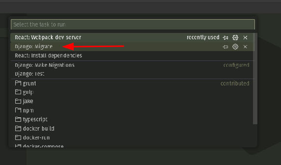
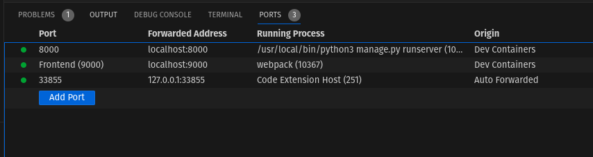
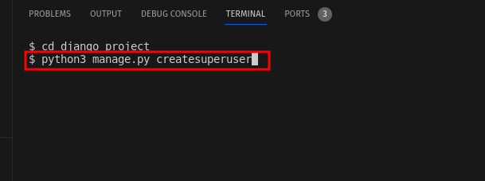

## Setting up a dev env

Please follow the Kartoza [coding standards](https://kartoza.github.io/TheKartozaHandbook/development/conventions/coding_standards/#compliance).

### 🏃‍♂️ How To Run Project with Visual Studio Code

Copy and customize environnment file: Create a copy of the ```deployment/.template.env``` file and name it ```deployment/.env```. Update the ```deployment/.env``` file with your project-specific settings.


Ensure Dev Containers extension is installed


Build and open project in devcontainer: press ```Cmd+Shift+P``` (macOS) or ```Ctrl+Shift+P``` (Windows/Linux) to open the Command Palette. Type ```Dev Containers: Rebuild and Reopen in Container``` and select it to reopen the folder inside the devcontainer.


Change the permissions of the django_project folder:

```
chmod -R a+rw django_project
```

Install dependencies inside the container: Press ```Cmd+Shift+P``` (macOS) or ```Ctrl+Shift+P``` (Windows/Linux), type ```Tasks: Run Tasks``` and select it. Choose ```React: Install dependencies``` to install the necessary dependencies.


Run the migrations inside the container: Press ```Cmd+Shift+P``` (macOS) or ```Ctrl+Shift+P``` (Windows/Linux), type ```Tasks: Run Tasks``` and select it. Choose ```Django: Migrate```.




#### 👩‍💻 Open the developer site

Run the project inside the container: Press ```Cmd+Shift+D``` (macOS) or ```Ctrl+Shift+D``` (Windows/Linux), choose ```Django+React``` in the RUN AND DEBUG dropdown.


Review the list of forwarded ports from the container to your local host:




Open your web browser and go to localhost:8000 to view the running application.

#### 👩‍🏭 Create a super user



#### 💽 Restoring layer schema for map

The full dump file for layer schema is ~5.3GB, meanwhile compact dump file is only 24MB.

[Download Full Dump File for Layer.](https://drive.google.com/file/d/1-6y5tuMNc2sQ1G3qjyntL4PDV6ubCnbc/view?usp=sharing)

[Download Compact Dump File for Layer.](https://drive.google.com/file/d/1Q0WhUP74MCoC_JcD4qMK1Egs575xrhqQ/view?usp=sharing)

Preview for compact dump file:


Copy the dump file to db container. Then run pg_restore from inside db container to restore the dump file.

```
docker cp sanbi_layer_db_compact.dump deployment-db-1:/home/sanbi_layer_db_compact.dump
docker exec -it deployment-db-1 /bin/bash
cd /home
pg_restore -h 127.0.0.1 -U docker -d django -n layer sanbi_layer_db_compact.dump
```
