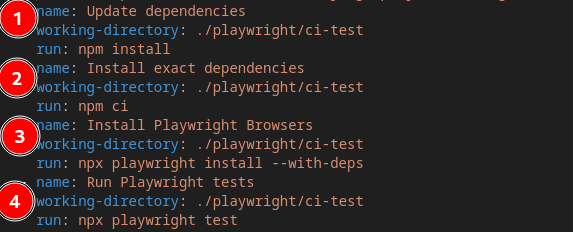

# Testing

It is the act of examining software behaviour.

## Setting up a testing environment

Please follow the Kartoza [coding standards](https://kartoza.github.io/TheKartozaHandbook/development/conventions/coding_standards/#compliance).

### Testing prerequisites

In this project setup, we perform end-to-end testing.

The primary framework used is [playwright](https://playwright.dev/).

### Setting up playwright

To install `playwright` ensure you have [Node.js](https://nodejs.org/en) installed.

Once `Node.js` is installed, use `npm` JavaScript package manager to install `playwright`.

```bash
$ npm init playwright@latest
```

**Note:**

- By default it uses TypeScript(`*.ts`).

This command will install all the required browsers and other dependencies. The [directory structure](https://playwright.dev/docs/intro#whats-installed) will be as follows:

```bash
playwright.config.ts
package.json
package-lock.json
tests/
  example.spec.ts
tests-examples/
  demo-todo-app.spec.ts
```

### Running tests

By default, tests will run on three browsers in headless mode.

```bash
$ npx playwright test
```

To run it in UI mode, one can add `--ui` tag at the end.

```bash
$ npx playwright test --ui
```

### Test reports

To generate test reports:

```bash
$ npx playwright show-report
```

### Continuous intergration github actions

Use of [continuous integration and playwright](https://playwright.dev/docs/ci-intro).

The CI  for this project is present in the directory `.github/workflows` in the `build-and-test.yml` file.

The action builds and tests for and push or a pull request is made into the main repository.


It uses the `template.test.env` file to set up the environment. Which is copied into a new file `.env` while setting up the containers.


Testing the django endpoint:


Running coverage tests:


On setting up and testing using playwright:



1. Updates dependencies: Installs various dependencies required
2. Installs exact dependencies for `ci`, continuous integration.
3. Installs the playwright browsers and its packages.
4. Runs the playwright tests

Reports: It will generate a report as HTML document and it will be retained for 30 days if it is present in that directory


The report can be downloaded and shared.
