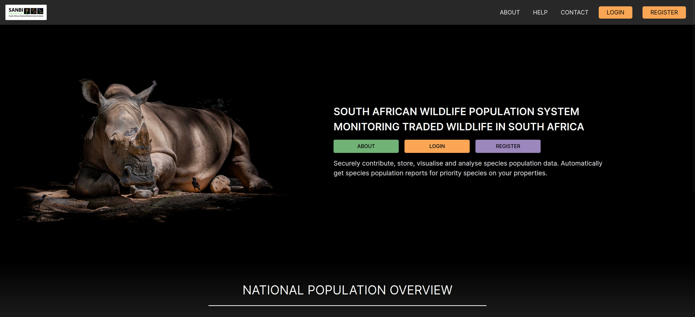
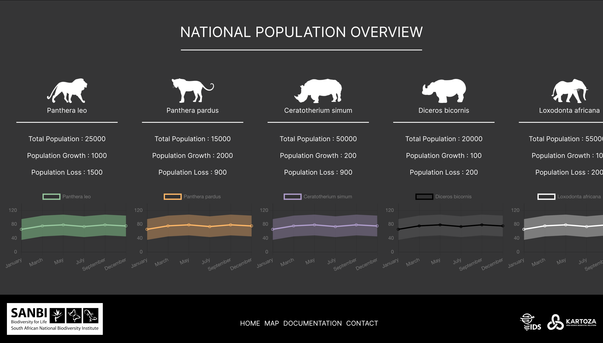
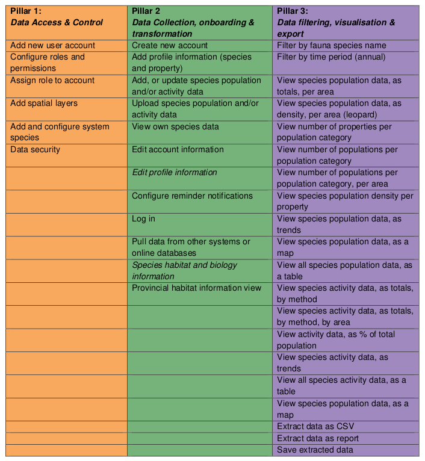

# SANBI WPS

Welcome to SANBI WPS. The SANBI Wildlife Protection System is a platform to track the population levels of endangered wildlife.

## Introduction to and AIM of the SAWPS

Welcome to the SAWPS platform Documentation site. SAWPS is a Global Environment Facility (GEF)-funded project. SAWPS is a coordinated system of wildlife trade monitoring with centralised/shared information for priority species (rhino, lion,
leopard, cheetah, and elephant). The system will eventually be able to house information for other species as well. Currently, permits for legal trade, information about illegal trade seizures, and other law enforcement processes, and provincial-level monitoring data for key species (e.g., population counts and population information such as births, deaths, translocations, etc.) are captured at a provincial and sometimes national level. In addition, private wildlife owners maintain their own information systems about wildlife on their land, and some non-governmental organisations maintain their own information systems for specific species, SAWPS is expected to provide valuable data and information on a national level about the impacts of legal and illegal trade in the species and the current status of the distribution and abundance of the species. The data will then be interrogated and analysed by users of the system to inform national and international permitting and listing or reporting processes (e.g., the Threatened or Protected Species list under NEMBA, the CITES listings, hunting quotas, etc.).

The aim of SAWPS is to have a system for centralised population-level monitoring of traded wildlife where information from provinces and private landowners is made available to key users (primarily to the Scientific Authority and other relevant decision makers) under strict access and security controls.

## SANBI the Scientific authority

SANBI is the body mandated by the National Environmental Management Biodiversity Act of 2004 (No. 10 of 2004) to champion the exploration, conservation, sustainable use, appreciation, and enjoyment of South Africa’s exceptionally rich biodiversity for all South Africans. This includes giving effect to international agreements, and cooperative governance arrangements directed at ensuring the country’s rich and varied biodiversity is conserved for future generations. SANBI also manages the technical unit for the Scientific Authority of South Africa (SAoSA).

The SANBI technical unit, which provides advice and analysis on various species, recognises that is consumes a significant amount of its time and effort trying to obtain data from a variety of sector stakeholders – which could be better spent on more strategic, value-adding activities, and that it would be more efficient if they could access the required data from a central location. This has led SANBI to initiate the SAWPS project to develop a national digital platform for population-level monitoring of traded wildlife as part of its responsibility for Component 1 of the Global Environmental Facility-funded project titled ‘Strengthening institutions, information management and monitoring to reduce the rate of illegal wildlife trade in South Africa.

### Scope of Project

The focus of the project is therefore on monitoring population levels for charismatic species such as the lion, elephant, leopard, and rhino. The system is designed with scalability in mind such that alter iterations will be able to cater for data pertaining to other fauna and flora species as and when these become required. Part of this is to create a robust, information rich platform for visualisation of data at the level of administrative units.

### Overview to the SAWPS platform functionality

#### Contributing

We would love to collaborate with you! But first, please read our [contributor guidelines](./about/contributing.md) which describe how to report
issues, plan and contribute feature additions etc.

#### Code of Conduct

Our community in this project is aligned with our [Code of Conduct](about/code-of-conduct.md) - please be sure to read and abide by that
document in all interactions with out community.

#### Diversity Statement

This project welcomes and encourages participation by everyone.

No matter how you identify yourself or how others perceive you: we welcome you.
We welcome contributions from everyone as long as they interact constructively
with our community.

While much of the work for our project is technical in nature, we value and
encourage contributions from those with expertise in other areas, and welcome
them into our community.

#### Project Partners

The work is funded by the [South African National Biodiversity Institute](https://www.sanbi.org/)

This project is implemented by [Kartoza](https://kartoza.com/) under contract to [IDS](https://ids-cc.co.za/).

| | **Project Badges** | |
| ----------------------- | ----------------------- | ----------------------- |
|  |  |  |
|  |  |  |
