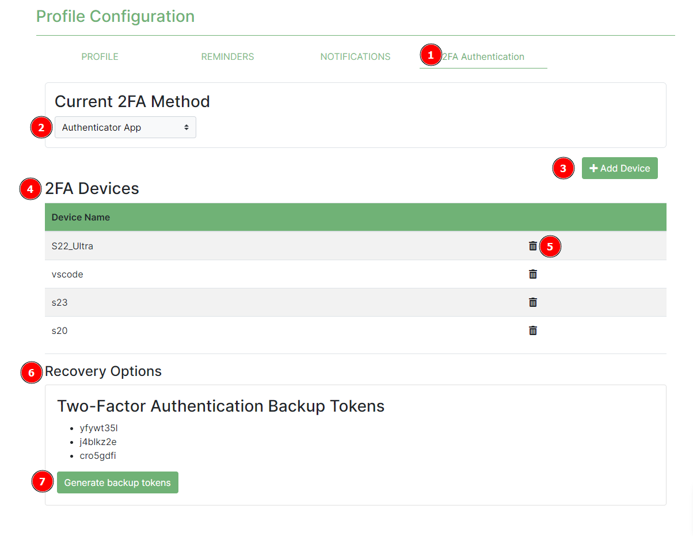
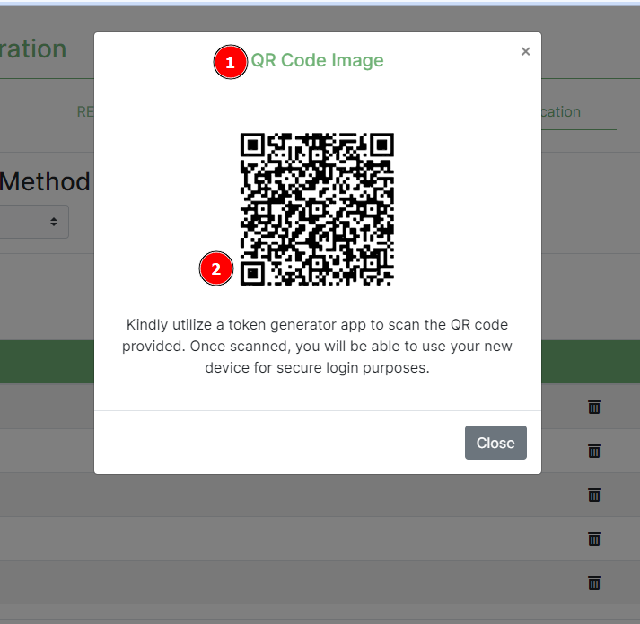

# Two Factor Authentication Settings
<!-- This will be instructions for actions like updating user two factor authentication settings, generating backup tokens, add and deleting 2fa devices-->

## Description
The Two factor authentication page handles the user’s two factor authentication settings.

These include:
*	Backup tokens
*	Two factor authentication devices

## 1 2FA Tab
Navigate to the two factor authentication tab under the profile page.
## 2 Current 2FA Method
Shows the current 2fa method the user uses to log on to the platform.
## 3 Add Device
Clicking this button will evoke a pop modal requiring the user to enter the new device details before saving.

*   i. __1 Device Name__: Label indicating the value that is required in the field below it.
*   ii. __2 Add button__: When clicked will save the new device and return a QR Code Image.

*   i. __1 QR Image Code__: Label indicating the success result when the device is added.
*   ii. __2 QR Code__: The user should scan this QR code with the authenticator app of their choice on their new device.

## 4 2FA Devices
This is the table that shows the current 2FA devices the user uses to log on to the platform.
## 5 Delete Icon
Clicking this will evoke a pop up modal prompting the user if they're sure they want to remove the device before proceeding to removing it.

*   ii __1 Cancel__: will prevent the device from being removed. This is incase the user isn't sure or clicked the icon by accident.
*   i. __2 Delete button__: will remove the device from the platform therefore the user will no longer be able to login using that device.

## 6 Recovery Options
Under this header, lists the backup tokens the user can use to log on to the platform incase they have lost their device.
## 7 Generate Backup Token
The user has the ability to refresh their backup tokens as well as create new ones when they've just registered onto the platform.
