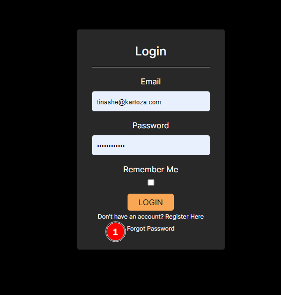

# Forgot Password Feature
<!-- These are instructions the user should take when they wish to reset their password -->

## Description
When the user has forgotten their password, they can use this feature to reset it.
The steps involve:
*	Providing the correct email for the user account.
*	Clicking on the reset password link provided in their email.
*	Resetting their password on the platform.
*	Logging in with their new password.

## 1 Forgot Password Link
When clicked navigates the password reset page.

*   __1 Reset Password Label__ 
*   __2 Email Field__: the user should enter their email address into this field.
*   __3 Reset Password button__: when clicked sends the reset password email and notifies the user.

*   __1 The message__: contains instructions the user should follow in order to be able to reset their password.
*   __2 Go back link__: when clicked returns the user to the login page.

*   __Email__: has further instructions on completing the reset password process.
*   __Register button__: When the user clicks the register link, they will be redirected to the platform to complete resetting their password.

*   __1 New Password field__: the user should enter their new password into this field.
*   __2 Allowable Password characteristics__: the new password for the user should include the characteristics described.
*   __3 New password confirmation field__: the user should re enter their password to make sure they didn’t make a mistake.
*   __4 Reset password button__: when clicked sets the password the user provided as the new password for logging in and also shows a success message.

*   I. __Password reset success__: the user receives a success message when the reset is completed without any errors.
