# Working with the data upload

The data upload function allows users to fill in an online form or upload a CSV file to the SAWPS platform to further enrich their data.

> Note: Users must first download a template from the platform, which they populate with their own data.

## How do I upload data to a new property?

Click on the `UPLOAD DATA` button in the navigation bar. This will redirect you to an interactive map which will allow you to `CREATE A NEW PROPERTY` by clicking on 1️⃣ the button with the same name. This will redirect you to `STEP 1`.

### Step 1

In this step/tab, you should enter the information for your property (such as Property Name, whether the property is an Open/Closed System and the Property Type) and once you have entered all of the relevant information you should click on 1️⃣ `SAVE PROPERTY INFORMATION` button. This will redirect you to `STEP 2`.

### Step 2

In this step/tab, zoom into the location of your property on the map and then decide whether you would like to 1️⃣ [select the boundary](#select-parcel-polygons) from the existing parcel polygons, 2️⃣ [digitise your boundary](#digitise-property), or 3️⃣ [upload a supported vector file(s)](#upload-property) of your property.

#### Select parcel polygons

Once you click on the `SELECT` button, it will change to say 1️⃣ `CANCEL`, the other two options will be greyed out and the map will highlight orange.

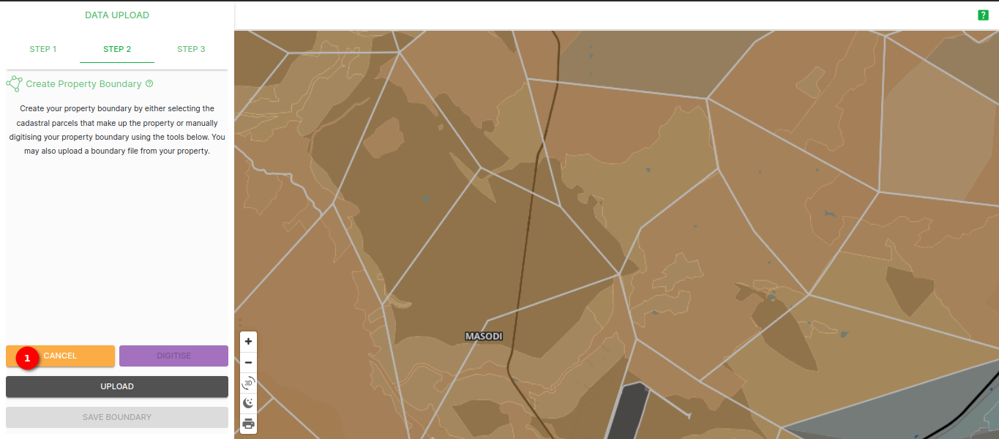

You can then select your property boundary from the existing parcel polygons. Your selected polygons will be outlined in red.

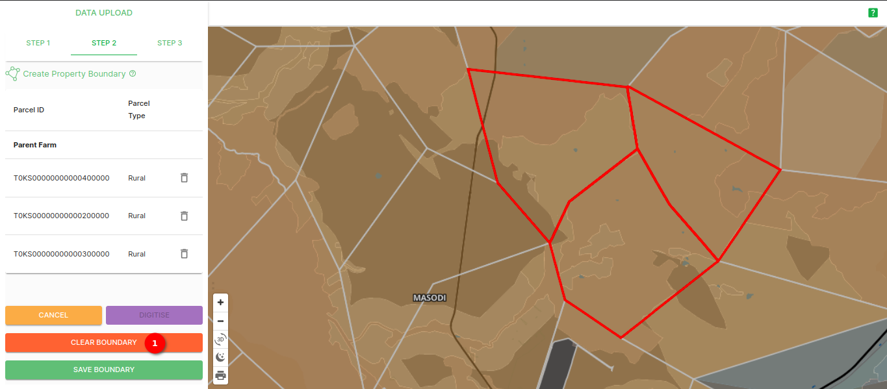

Once you have selected your property boundary, you can then move on to [saving Your Property Boundary](#save-boundary).
The selected parcel 1️⃣ id's will be displayed on the left side. Once you select the boundary, the `UPLOAD` button will change to say 2️⃣ `CLEAR BOUNDARY` you can clear all the selected boundaries by clicking on this button.

#### Digitise property

Once you have clicked on the `DIGITISE` button, the other two buttons will be greyed out and you will be able to select 1️⃣ the polygon tool from the toolbar that appears. If you hover your mouse over the buttons there is a popup that appears with the name of the tool.

Once you have digitised your property boundary polygon, right-click on your mouse and then click on 1️⃣ the `Save` button.

The platform will then process the geometry you have input.

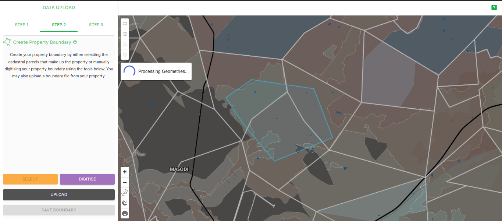

Once it has processed the geometry, it will zoom into the bounding box of the polygon you have digitised and will also highlight any parcels that overlap your digitised boundary.

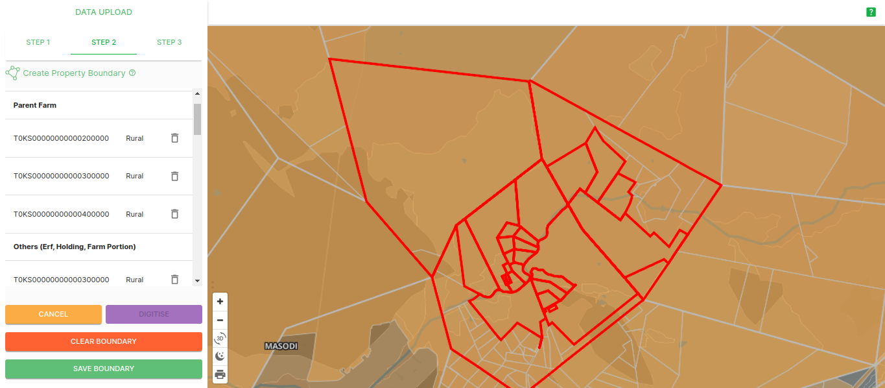

Once you have finished digitising your property boundary, you can then move on to [saving Your Property Boundary](#save-boundary).

#### Upload property

Once you have clicked on the `UPLOAD` button, an Upload popup window will appear where you can upload a supported vector file of your property. You can drag and drop the file(s) or `Browse` on your computer for the correct file(s), once you have uploaded your file(s) it will appear on the popup in the 1️⃣ *Uploaded Files* section.

Make sure you zipped your shapefiles directly, **NOT** the directory containing the shapefiles. Otherwise, the shapefiles inside the zip file will not be detected (e.g. the zip folder will contain a `.cpg`, `.dbf`, a `.prj`, a `.shp`, and a `.shx` file).

> **Disclaimer:** If you upload any geometry type that is not polygon, or multi-polygon, (e.g. line, multi-line, etc.) the site will process for a while and then return an error message. Ensure your data is a polygon, or multi-polygon, and not another geometry type.

Once you have uploaded your file(s), click on `UPLOAD FILES`, the platform will then process your file(s).

A progress bar will appear at the top of the popup window indicating the percentage that your upload is processed.

Once your file(s) have been processed (i.e. when the progress bar reaches `100%`), the platform will display a message (either success, failure, or warning) and you can click on 1️⃣ the `CLOSE` button.

##### Upload Message Types

1. **Success Message:** If you have uploaded data that is in the correct CRS (EPSG:4326), is of the polygon/multi-polygon geometry type, and doesn't overlap another user's properties then you will see a success message at the top of the upload popup window.
    

2. **Warning Message:** If you upload data that can be processed but overlaps/contains parcels that have previously been used by another user, then you will receive a warning message.
    

3. **Failure Message:** If you upload data with an incorrect CRS, an incorrect geometry type, or another issue, you will receive an error message.
    Incorrect CRS:
    

    Incorrect Geometry type:
    

Once you close the popup window, the platform will redirect you to the map and show the outline of your property boundary, and you can fine tune your property using the panel on the left of the screen.

Once you are satisfied with your property boundary, you can then move on to [saving Your Property Boundary](#save-boundary).

#### Save Boundary

Removing a property can be done by clicking on the ‘dustbin’ icon, and once you are satisfied with your property boundary, click on 1️⃣ the `SAVE BOUNDARY` button. This will redirect you to `STEP 3`.

> Note: this example used a selected property boundary

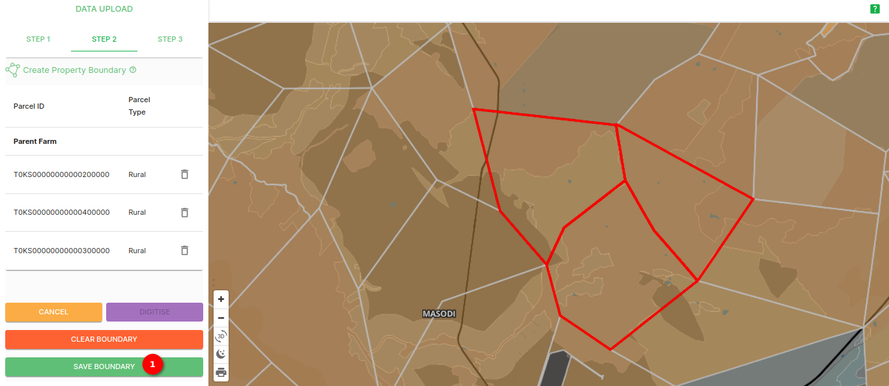

### Step 3

In this step/tab, you can update the Species Population Data by using 1️⃣ the `ONLINE FORM` or 2️⃣ download the template and then upload it using the `UPLOAD DATA` button. You can also manage the property boundary using 3️⃣ the `UPDATE PROPERTY BOUNDARY` button, which will redirect you to [`STEP 2`](#step-2) where you can edit the property boundary. The property information is also viewable.

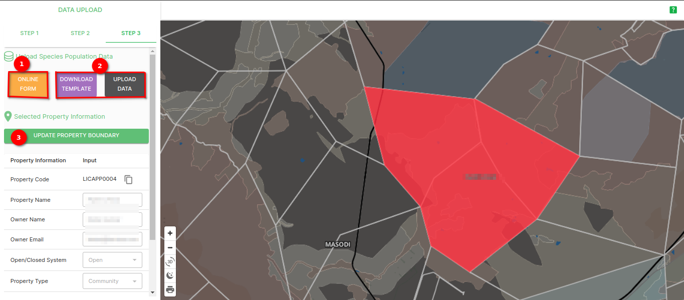

#### The Online Form

If you choose to use the `ONLINE FORM` and click on the button of the same name, the site will redirect you to the first part online form (the **SPECIES DETAIL** page). On this page, you are required to fill in every field that has an asterisk (little star '*') next to the field title, as these are mandatory. Once you have filled in the required fields, you can click on 1️⃣ `Next` to move on to the next page (the **ACTIVITY DETAIL** page). If you wish to leave and come back to the form later one, you can click on 2️⃣ `SAVE DRAFT`.

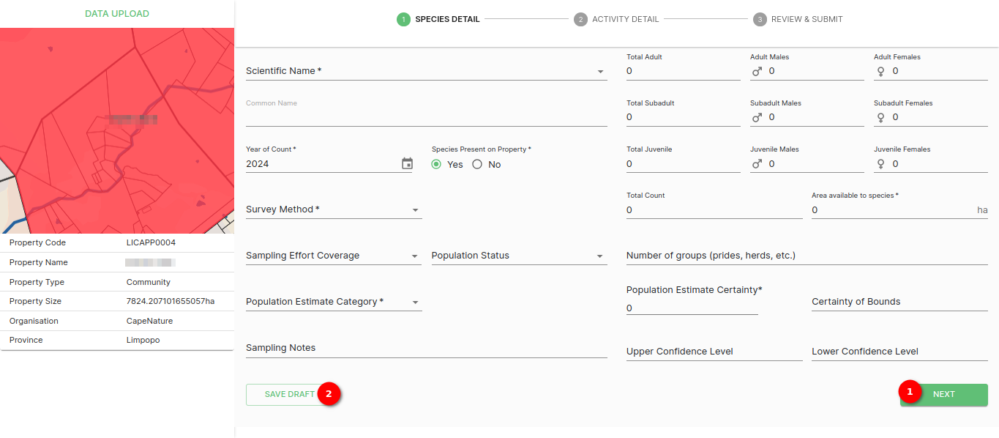

On the **ACTIVITY DETAIL** page, you can add details regarding **Introduction/Reintroduction** and/or **Off-take** of individuals on the property. Once you have filled out the **Introduction/Reintroduction** section you can click on 1️⃣ the `+ ADD` button, and/or once you have filled in the **Off-take** section you can click on 2️⃣ the `+ ADD` button.

After adding a new event, you can click on 3️⃣ the `NEXT` button. If you would like to change the species on your property you can click 4️⃣ the `BACK` button, or if you wish to leave and come back to the form later one, you can click on 5️⃣ `SAVE DRAFT`. Again, you are required to fill in every field that has an asterisk (little star '*') next to the field title, as these are mandatory. If you don't have an event to add you can just click on 3️⃣ the `NEXT` button.

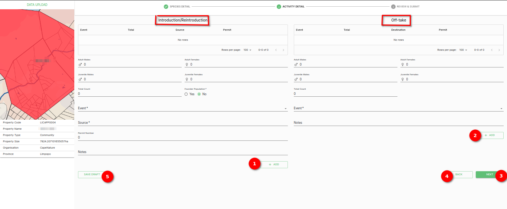

Clicking `NEXT` redirects you to the **REVIEW & SUBMIT** page of the online form where you can confirm the information you have entered regarding your property. If you are content with the data associated with your project, you can click on 1️⃣ the `SUBMIT` button. If you would like to change the activity details for your property you can click 2️⃣ the `BACK` button, or if you wish to leave and come back to the form later one, you can click on 3️⃣ `SAVE DRAFT`.

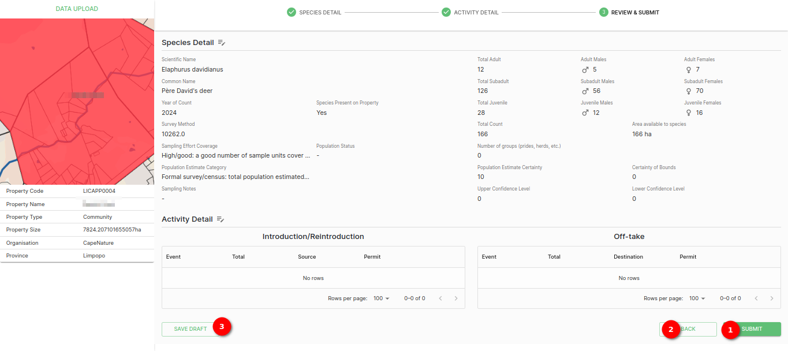

Once you have clicked on `SUBMIT` a popup will appear letting you know your data has been uploaded successfully. You can then click on the `OK` button to close the form and get redirected back to the **REPORTS** page.

#### Upload Data using the template

If you would like to download the data template to then upload it, you can click on 1️⃣ the `DOWNLOAD TEMPLATE` button. This will download the template to your computer as an Excel file (a .xlsx file). The 2️⃣ **Property Code** available here will be used in the spreadsheet.

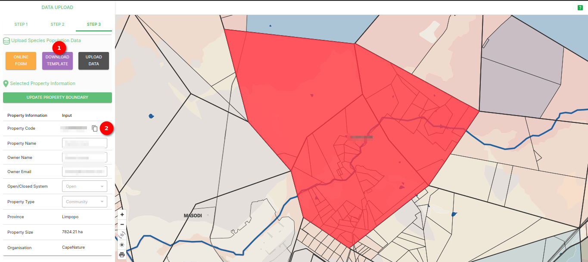

When you first open the file, the **`MASTER`** sheet will be displayed. This page is an upload ‘blue-print’ explaining how to input data into the spreadsheet. The key explains the difference between compulsory fields (green), non-compulsory fields (yellow) and automatically calculated fields (grey). It is *critical* to refer to this page when inputting your data to avoid errors.

Navigate to 1️⃣ the `Dataset_pilot` sheet, and start imputing your species data. Keep in mind the compulsory fields as specified in 2️⃣ the `Master` sheet and the **Property Code** for your specific property that can be found on the site, as shown previously.

Once you have adequately filled in the spreadsheet, you can then click on 1️⃣ the `UPLOAD DATA` button. This will open a popup where you can drag and drop the file(s) or `Browse` on your computer for the correct file(s), once you have uploaded your file(s) it will appear on the popup in the 2️⃣ *Uploaded Files* section. You can then click on 3️⃣ the `UPLOAD FILE` button.

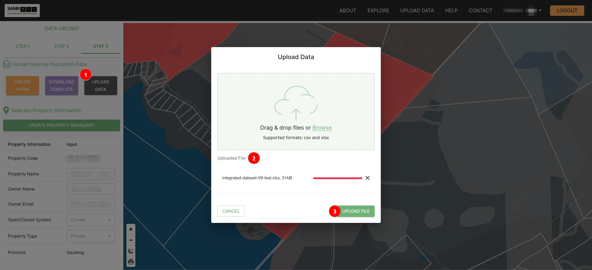

The platform will then process your file.

Once the platform has processed your uploaded data, a success message will be displayed and you can then click on the `CLOSE` button on the popup.

The data has now been uploaded and is associated with your property

##### What happens if there are issues with my upload?

If there is an issue with your uploaded data the site will return a warning or a CSV file with information about the issue with your data. These are explained below:

###### Uploading duplicate data

If you attempt to upload data that is populated with previously uploaded data, the site will successfully upload the data but will return a warning saying that the row(s) already exist in the database.

###### Compulsory fields not filled in

If you attempt to upload data that is missing one (or many) compulsory field(s), the site will not allow for the upload and will then return an error message. If you click on 1️⃣ the `ERROR FILE` button, an error CSV file will be downloaded to your computer.

If you open the error CSV file, the first column in the file will contain a message regarding the error the platform has encountered (this example didn't input the scientific name). You need to correct the issue in the file you want to upload.

Once you have fixed the error in the file you want to upload, click on 1️⃣ the `X` button to remove the upload with an error and then 2️⃣ upload the corrected file.

###### The Property code provided does not match the selected property

If you try to upload data that has a project code that does not match with the property code of the property you are trying to upload data to, the platform will not allow the upload to happen and will then return an error message. If you click on 1️⃣ the `ERROR FILE` button, an error CSV file will be downloaded to your computer.

If you open the error CSV file, the first column in the file will contain a message explaining what you need to change your property code to, to be correct.

Once you have fixed the error in the file you want to upload, click on 1️⃣ the `X` button to remove the upload with an error and then 2️⃣ upload the corrected file.

This Section Will Be Updated.

###### Empty sheet uploaded

If you try to upload an empty data file, the site will return an error message. Fill in all the mandatory fields in the file and try uploading again.

## How do I upload to, or manage, an existing property?

Click on the `UPLOAD DATA` button in the navigation bar. This will redirect you to an interactive map which will prompt you to 1️⃣ enter the ‘search area’ you are interested or 2️⃣ ‘select property’ that you are interested in.

You will be redirected to `Step 3`, where the interactive map will now highlight the property boundary. You can update the Species Population Data by using 1️⃣ the `ONLINE FORM` or 2️⃣ download the template and then upload it using the `UPLOAD DATA` button. You can also manage the property boundary using 3️⃣ the `UPDATE PROPERTY BOUNDARY` button, which will redirect you to `STEP 2` where you can edit the property boundary. The property information is also viewable.

If you would like to edit the property's information, click on `STEP 1` and edit the fields as needed. When you are done, click on 1️⃣ the `SAVE PROPERTY INFORMATION` button.

If you would like to edit the property's boundary information, click on `STEP 2` and edit the boundaries as needed. When you are done, click on 1️⃣ the `SAVE BOUNDARY` button.

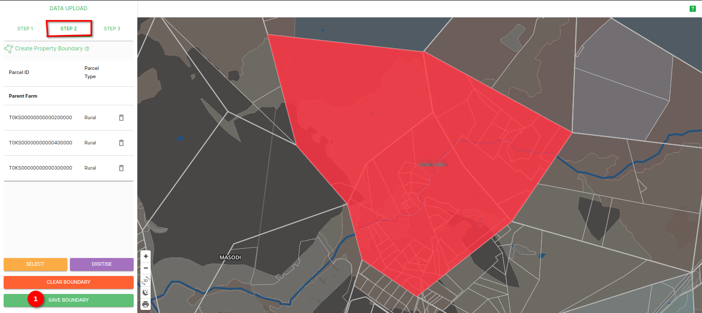
