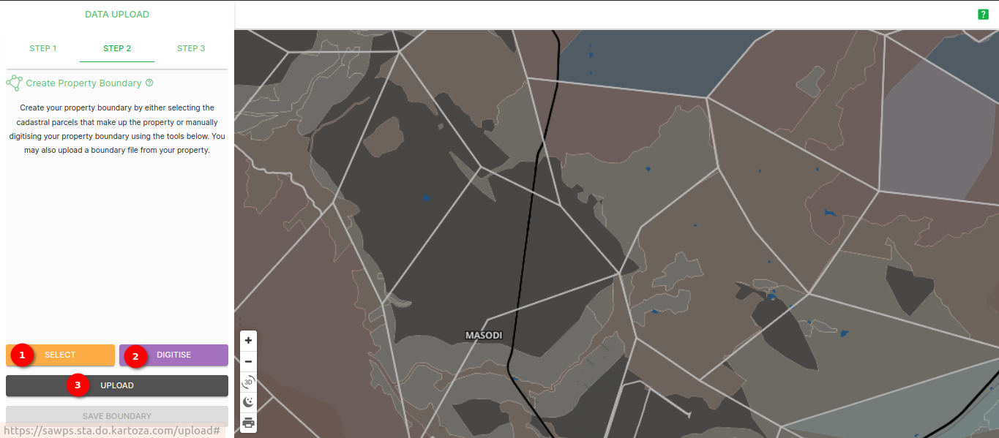
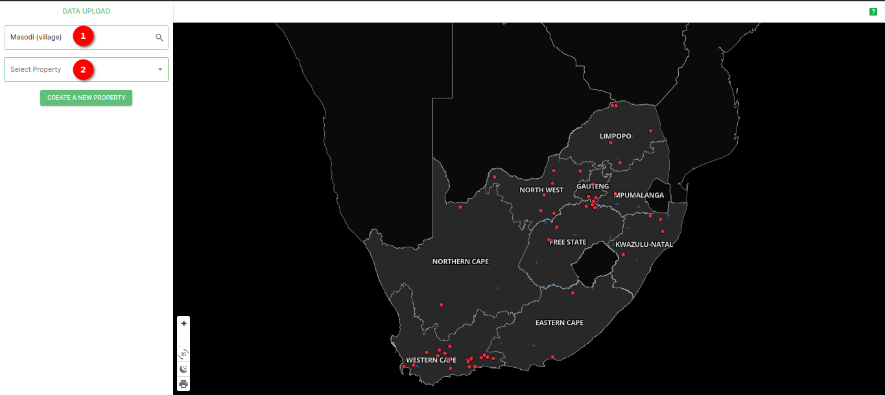
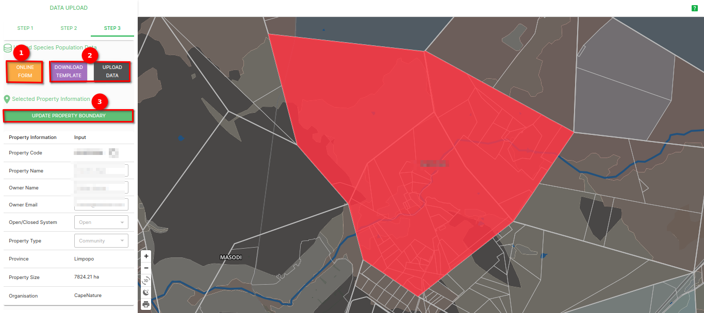

# Working with the data upload

The data upload function allows users to fill in an online form or upload a CSV file to the SAWPS platform to further enrich their data.

> Note: Users must first download a template from the platform, which they populate with their own data.

## How do I upload data to a new property?

Click on the `UPLOAD DATA` button in the navigation bar. This will redirect you to an interactive map which will allow you to `CREATE A NEW PROPERTY` by clicking on 1️⃣ the button with the same name. This will redirect you to `STEP 1`.

### Step 1

In this step/tab, you should enter the information for your property (such as Property Name, Property Type, and Property Province) and once you have entered all of the relevant information you should click on 1️⃣ `SAVE PROPERTY INFORMATION` button. This will redirect you to `STEP 2`.

### Step 2

In this step/tab, zoom into the location of your property on the map and then decide whether you would like to 1️⃣ [select the boundary](#select-parcel-polygons) from the existing parcel polygons, 2️⃣ [digitise your own boundary](#digitise-property), or 3️⃣ [upload a supported vector file(s)](#upload-property) of your property.

#### Select parcel polygons

Once you click on the `SELECT` button, it will change to say 1️⃣ `CANCEL`, the other two options will be greyed out and the map will highlight orange.

You can then select your property boundary from the existing parcel polygons. Your selected polygons will be outlined in red.

Once you have selected your property boundary, you can then move onto [saving Your Property](#save-property).

#### Digitise property

Once you have clicked on the `DIGITISE` button, the other two buttons will be greyed out and you will be able to select 1️⃣ the polygon tool from the tool bar that appears. If you hover your mouse over the buttons there is a popup that appears with the name of the tool.

Once you have digitised your property boundary polygon, right-click on your mouse and then click on 1️⃣ the `Save` button.

The platform will then process the geometry you have input.

Once it has processed the geometry, it will zoom into the bounding box of the polygon you have digitised and will also highlight any parcels that overlap your digitised boundary.

Once you have finished digitising your property boundary, you can then move onto [saving Your Property](#save-property).

#### Upload property

Once you have clicked on the `UPLOAD` button, an Upload popup window will appear where you can upload a supported vector file of your property. You can drag and drop the file(s) or `Browse` on your computer for the correct file(s), once you have uploaded your file(s) it will appear on the popup in the 1️⃣ *Uploaded Files* section. 

Make sure you zipped your shapefiles directly, **NOT** the directory containing the shapefiles. Otherwise, the shapefiles inside the zip file will not be detected.

Once you have uploaded your file(s), click on `UPLOAD FILES`, the platform will then process your file(s).

Once your file(s) have been processed, the platform will redirect you to the map and show the outline of your property boundary, and you can fine tune your property using the panel on the left of the screen.

Once you are satisfied with your property boundary, you can then move onto [saving Your Property](#save-property).

#### Save property

Once you are satisfied with your property boundary, click on 1️⃣ the `SAVE BOUNDARY` button. This will redirect you to `STEP 3`.

> Note: this example used a selected property boundary

### Step 3

In this step/tab, you can update the Species Population Data by using 1️⃣ the `ONLINE FORM` or 2️⃣ download the template and then upload it using the `UPLOAD DATA` button. You can also manage the property boundary using 3️⃣ the `UPDATE PROPERTY BOUNDARY` button, which will redirect you to [`STEP 2`](#step-2) where you can edit the property boundary. The property information is also viewable.

#### The Online Form

If you choose to use the `ONLINE FORM` and click on the button of the same name, the site will redirect you to the first part online form (the **SPECIES DETAIL** page). On this page you are required to fill in every field that has an asterisk (little star '*') next to the field title. Once you have filled in the required fields, you can click on 1️⃣ `Next` to move onto the next page (the **ACTIVITY DETAIL** page). If you wish to leave and come back to the form later one, you can click on 2️⃣ `SAVE DRAFT`.

On the **ACTIVITY DETAIL** page, you can add details regarding **Introduction/Reintroduction** and/or **Off-take** of individuals on the property. Once you have filled out the **Introduction/Reintroduction** section you can click on 1️⃣ the `+ ADD` button, and/or once you have filled in the **Off-take** section you can click on 2️⃣ the `+ ADD` button.

After adding a new event, you can click on 3️⃣ the `NEXT` button. If you would like to change the species on your property you can click 4️⃣ the `BACK` button, or if you wish to leave and come back to the form later one, you can click on 5️⃣ `SAVE DRAFT`.

Clicking `NEXT` redirects you to the **REVIEW & SUBMIT** page of the online form where you can confirm the information you have entered regarding your property. If you are content with the data associated with your project, you can click on 1️⃣ the `SUBMIT` button. If you would like to change the activity details for your property you can click 2️⃣ the `BACK` button, or if you wish to leave and come back to the form later one, you can click on 3️⃣ `SAVE DRAFT`.

Once you have clicked on `SUBMIT` a popup will appear letting you know your data has been uploaded successfully. You can then click on the `OK` button to close the form and get redirected back to the **REPORTS** page.

#### Upload Data

If you would like to download the data template to then upload it, you can click on 1️⃣ the `DOWNLOAD TEMPLATE` button. This will download the template to your computer as an excel file (a .xlsx file).

Open the file and navigate to 1️⃣ the `Dataset_pilot` sheet, and then fill in the compulsory fields as specified in 2️⃣ the `Master` sheet.

Once you have adequately filled in the spreadsheet, you can then click on 1️⃣ the `UPLOAD DATA` button. This will open a popup where you can drag and drop the file(s) or `Browse` on your computer for the correct file(s), once you have uploaded your file(s) it will appear on the popup in the 2️⃣ *Uploaded Files* section. You can then click on 3️⃣ the `UPLOAD FILE` button.

The platform will then process your file.

<!-- Will continue this when the functionality is available -->

## How do I upload to, or manage, an existing property?

Click on the `UPLOAD DATA` button in the navigation bar. This will redirect you to an interactive map which will prompt you to 1️⃣ enter the ‘search area’ you are interested or 2️⃣ ‘select property’ that you are interested in.

You will be redirected to `Step 3`, where you can update the Species Population Data by using 1️⃣ the `ONLINE FORM` or 2️⃣ download the template and then upload it using the `UPLOAD DATA` button. You can also manage the property boundary using 3️⃣ the `UPDATE PROPERTY BOUNDARY` button, which will redirect you to `STEP 2` where you can edit the property boundary. The property information is also viewable.

If you would like to edit the property's information, click on `STEP 1` and edit the fields as needed. When you are done, click on 1️⃣ the `SAVE PROPERTY INFORMATION` button.

