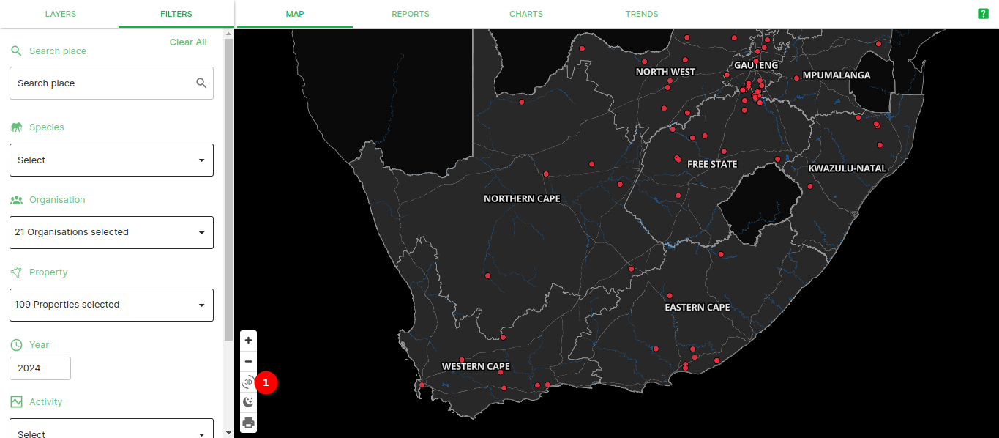
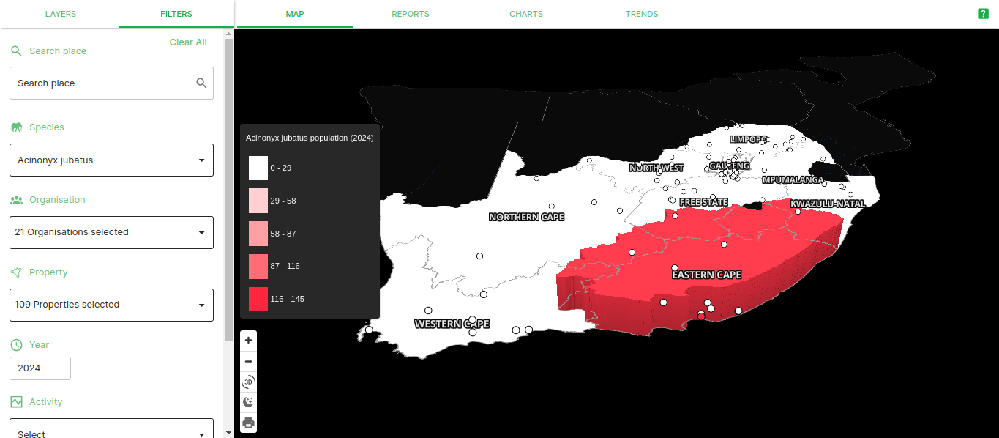
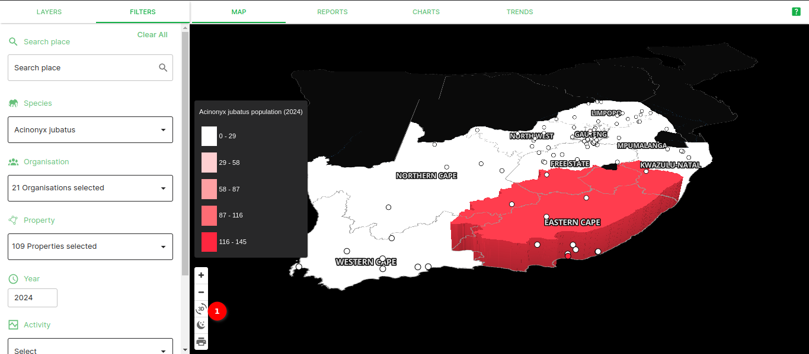
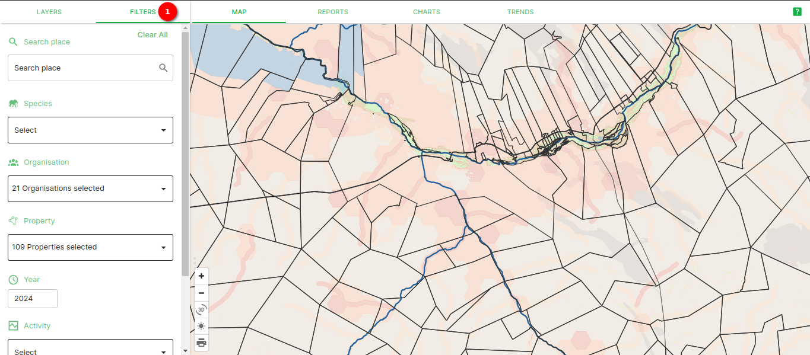
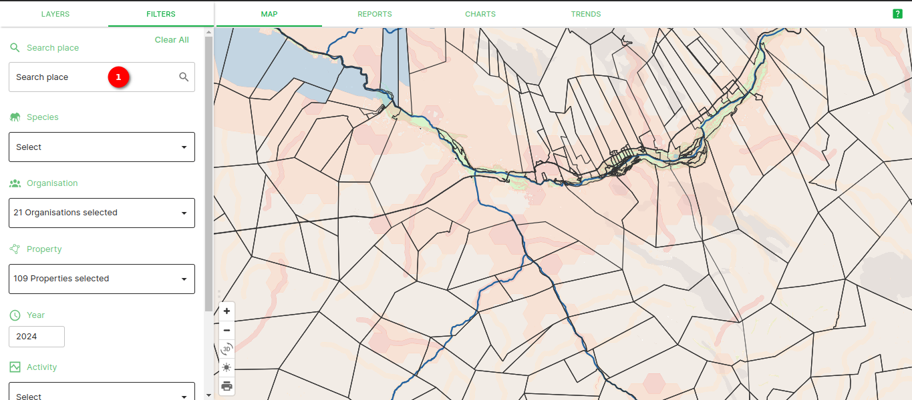
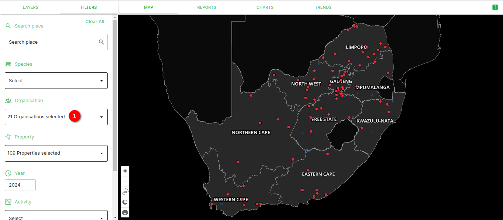
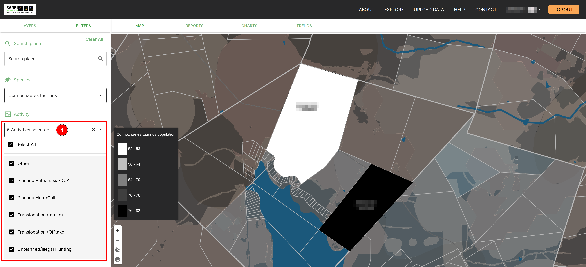

# Explore page

This documentation explains how to use the map on the platform as well as how to use the various other tabs contained within the Explore page. On the landing page, click on the `Explore` button in the navigation bar to be redirected to the explore page.

## Switching between dark and light mode on the map

When you first load the explore page, the map is in light mode. If you wish to change to light mode you can switch by simply clicking on 1️⃣ the `Toggle Dark Mode` button.

This will switch your map from light mode to dark mode.

To switch your map from dark mode to light mode, click on 1️⃣ the `Toggle Light Mode` button.

This will switch your map from dark mode to light mode.

> This guide is done mostly in Dark mode, so the visuals will look slightly different to if you are working in light mode.

## Working with map layers

When you first arrive on the explore page, to the left of the map will be the `FILTERS` panel. Click on the `LAYERS` tab on the panel to switch to the `LAYERS` panel.

From the list of layers, you can enable and disable layers as needed. If a checkbox is empty then the layer is disabled and not visible. If there is a tick in the checkbox then the layer is enabled and visible.

Keep in mind that some layers are only visible between certain zoom levels, like the Protected areas and Cadastral boundaries.

### NGI Aerial Imagery

By default, the NGI Aerial Imagery layer is disabled and when you enable it, it will only appear when you zoom in enough.

## Changing map orientation

When you first view the map, it will be in an overhead 2D view. If you right click and drag your mouse pointer on the map, you can change the view orientation and in turn visualise your data in a 3D manner.

When viewing the data in a 3D view, the different intervals are represented at different heights (i.e. the interval with the highest upper bound would be the tallest column).

If you want to reset the map view back to the standard overhead view, click on 1️⃣ the `Reset bearing to North` button and this will return the map to the 2D overhead view.

## Printing your current map view

The print option on the map allows you to take a screenshot of whatever is present on your map canvas. To save this screenshot, click on the print icon which is located next to the layers panel.

Select your desired page size, orientation, image format and DPI and then click on the `Generate` button.

After clicking the `Generate` button, you will be prompted to save the image to your local machine.

Once the image is saved to you will be able to open it and view it.

## Using the Filters Panel

To apply filters to the data being displayed on your map, open the `FILTERS` panel. In this panel there are a few options of filters that you can apply to your map.

If you know a nearby location to your property, you can use 1️⃣ the `Search Place` field to search for cities, towns, villages, and suburbs (The list of places is from the Surveyor General and some more recent locations may not be searchable). You will need to type at least two characters (letters) before the platform will return a list of search results.

If you know the species you would like to view data for, then you can select the scientific name from 1️⃣ the `Species` dropdown list (this example uses *Connochaetes taurinus*, i.e. the Blue Wildebeest). Once you have selected a species then 2️⃣ the key showing the intervals in population will be displayed on the map, and zooming in on your properties will let you see which interval they fall into based off of their colour.

When you click on 1️⃣ the `Activity` dropdown, you will be able to choose from a list of activities that can occur on properties that are specified during the [data upload process](./data-upload.md), or you can select all of the activities using the `Select All` option. Selecting different combinations of options will change the intervals shown on the interval key.

If you would like to filter data by year, you can adjust either end of 1️⃣ the `Year` slider, or specify the year interval using 2️⃣ the `From` and `To` fields. Adjustments to the year interval will also result in changes on the interval key.

### Applying the Spatial Filters

There are two types of spatial filters on the platform, the `Critical Biodiversity Areas` and the `Ecosystems`. When you apply the spatial filters, whichever of your properties do not intersect the desired sub-section of either of the spatial layers will not be displayed. For example if you choose the *Tsakane Clay Grassland* as the `Ecosystem` filter, then all of your properties that do not overlap that ecosystem type will not appear on the map.

If none of the `Critical Biodiversity Areas` filters are selected, then all of the example properties are displayed.

However, if only the `Critical Biodiversity Area 2` filter is selected, then only one of the example properties is displayed.

If none of the `Critical Biodiversity Areas` filters are selected, but you select an `Ecosystem` filter that your properties do not intersect, then none of your properties will be visible.

Unless you choose an `Ecosystem` filter that intersects your properties.

## Reports

If you would like reports about different species you will need to navigate to the `REPORTS` tab of the `EXPLORE` page. To get there, click on the `EXPLORE` link in the navigation bar and then click on the `REPORTS` tab.

If you navigate directly to the `REPORTS` tab, having not implemented any filters on the map, you will be greeted by a prompt asking you select a species to begin.

If you had already been exploring the map and using a species filter (as shown in [Using the Filters Panel](#using-the-filters-panel)), then you will see all data on the platform associated with that species (from your active organisation). This example chose *Connochaetes taurinus* (i.e. the Blue Wildebeest), but you are free to choose whatever species you would like to get a report for.

Depending on the `Report Type` option(s) selected, the platform will adapt and automatically update the report to contain the other field types in the displayed table.

Depending on the `Activity` type(s) selected, the platform will adapt and automatically update the report to contain the other field types in the displayed table.

Adjusting the year slider the `Year` slider, or the year interval using the `From` and `To` fields, will also cause the platform to adapt and only display fields that are within the specified time frame.

Applying any of, or a combination of, the spatial filters ( `Critical Biodiversity Areas` and/or `Ecosystems`) will cause the platform to only display records that overlap the desired sub-section of either of the spatial layers. For example if you choose the *Critical Biodiversity Area 2* as the `Critical Biodiversity Areas` filter, then a report of all of your properties that overlap that critical biodiversity area type will appear on the tables.

You can customise which columns will be displayed in the report by clicking on 1️⃣ the columns dropdown menu, and then ticking or unticking the various columns you would like to have as part of your report. Keep in mind there are multiple columns so you can scroll up and down on the dropdown menu.

<!-- To Be Updated with new screenshots. -->
Once you have customised the report to your preferred specifications, scroll down on the reports page and click on either 1️⃣ `DOWNLOAD DATA` to then be prompted to download the data currently displayed as either a CSV or an XLSX file, or 2️⃣ `DOWNLOAD DATA REPORT` to download the report as PDF file.

## Charts

To Be Updated.

## Trends

To Be Updated.
