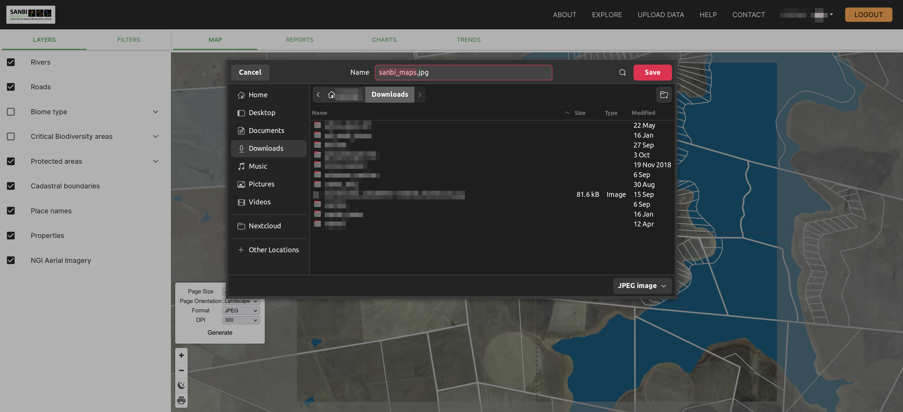

# Explore page

This documentation explains how to use the map on the platform as well as how to use the various other tabs contained within the Explore page.

## Switching between light and dark mode on the map

To switch to dark mode, simply go to your map and click on the little sun icon which is located next to the layers panel.

This will switch your map from light mode to dark mode.

To change your map from dark mode to light mode, simply click on the crescent moon icon located next to the layers panel.

## Creating a new property by selecting parcels

There are various methods of creating a new property on the site. One of them uses a selection tool to allow you, as the user, to select the parcels you want to be a part of the property you are creating.
To create a property using this method, go to ‘Maps’ and select ‘ Data Upload’.

Fill in the ‘Property Information’ form and then click on ‘Save Property Information’. Next, choose the ‘Select’ option and zoom in on the map to where your property is located.

Once you have located your property, select all of the relevant parcels. Once you are happy with your selection, click on the ‘Save Boundary’ button. If you want to deselect what you have selected, click ‘Cancel’ to clear everything and then ‘Select’ to start again or just click on the parcel again to deselect them individually.

## The online form

You will now be directed to Step 3. Select ‘Update Property Boundary’ to go back to Step 2. Select ‘Online Form’ to fill in all of the species and activity detail about the property.

The online form allows you to give Species Detail as well as Activity Detail about each property.

Once you have filled in both sections of the form, you can review them and then submit the form or save the form as a draft and submit it at a later stage.

## Printing your map

The print option on the map allows you to take a screenshot of whatever is present on your map canvas. To save this screenshot, click on the print icon which is located next to the layers panel.

Select your desired page size, orientation, image format and DPI and then click on the ‘Generate’ button.

Once you have selected your image settings, save the image to your local machine.

## Enabling and disabling the aerial imagery

Once you are in the map, you have the option of enabling and disabling ‘NGI Aerial Imagery’. This aerial imagery layer allows you to visualise the map using aerial imagery. By disabling this, the map will no longer have a aerial imagery.

## The Filters Panel

To apply filters to the data being displayed on your map, open the ‘Filters’ panel. This panel is interchangeable with the layers panel.

Here you will be able to filter by species, year and month. There are also spatial filters available in this panel. Here you can filter by population category, protected areas, activity, critical biodiversity areas and ecosystem type.

To use these filters simply check the boxes to enable them and uncheck the boxes to disable them.

The year filter works slightly differently from the rest. Simply drag the dots on the black line to choose which year(s) you want to show data for.

