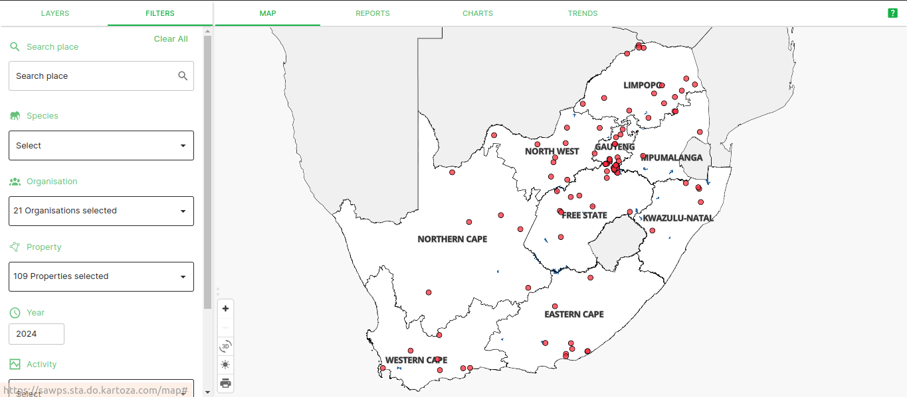
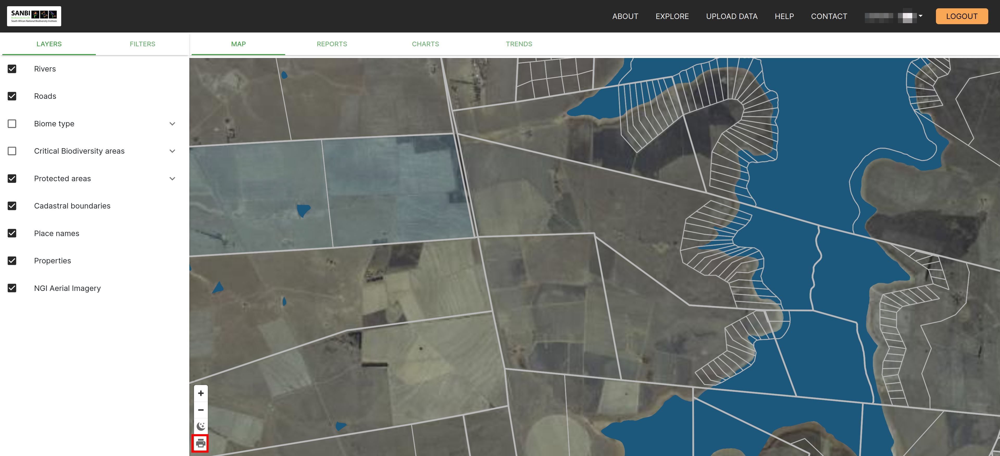
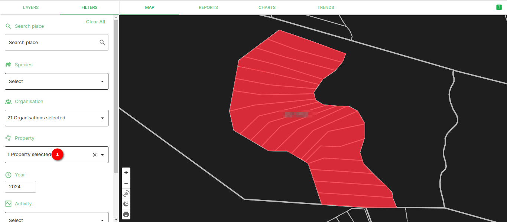
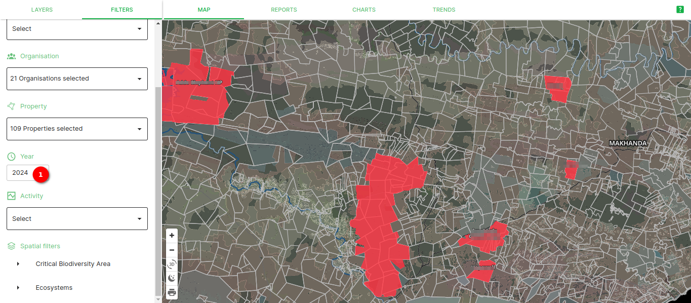
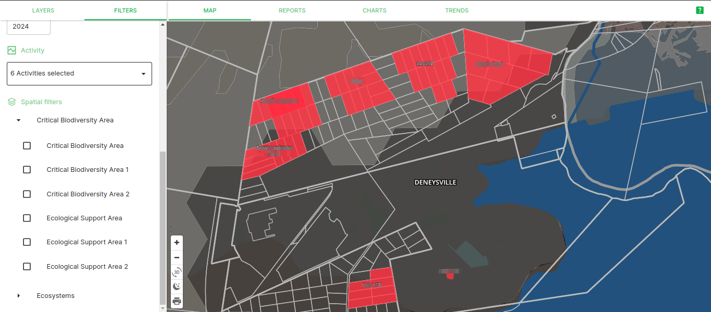
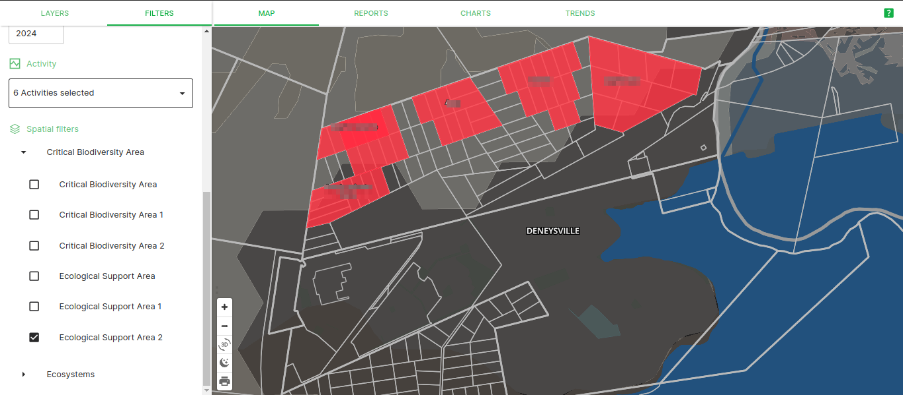

# Explore page

This documentation explains how to use the map on the platform as well as how to use the various other tabs contained within the Explore page. On the landing page, click on the `Explore` button in the navigation bar to be redirected to the explore page.

## Switching between dark and light mode on the map

When you first load the explore page, the map is in dark mode. If you wish to change to light mode you can switch by simply clicking on 1️⃣ the `Toggle Light Mode` button.

This will switch your map from dark mode to light mode.

To switch your map from light mode to dark mode, click on 1️⃣ the `Toggle Dark Mode` button.

This will switch your map from light mode to dark mode.

## Working with map layers

When you first arrive on the explore page, to the left of the map will be the `FILTERS` panel. Click on the `LAYERS` tab on the panel to switch to the `LAYERS` panel.

From the list of layers, you can enable and disable layers as needed. If a checkbox is empty then the layer is disabled and not visible. If there is a tick in the checkbox then the layer is enabled and visible.

Keep in mind that some layers are only visible between certain zoom levels, like the Protected areas and Cadastral boundaries.

### NGI Aerial Imagery

By default, the NGI Aerial Imagery layer is disabled and when you enable it, it will only appear when you zoom in enough.

## Printing your current map view

The print option on the map allows you to take a screenshot of whatever is present on your map canvas. To save this screenshot, click on the print icon which is located next to the layers panel.

Select your desired page size, orientation, image format and DPI and then click on the `Generate` button.

After clicking the `Generate` button, you will be prompted to save the image to your local machine.

Once the image is saved to you will be able to open it and view it.

## Using the Filters Panel

To apply filters to the data being displayed on your map, open the `FILTERS` panel. In this panel there are a few options of filters that you can apply to your map.

If you know a nearby location to your property, you can use 1️⃣ the `Search Place` field to search for cities, towns, villages, and suburbs (The list of places is from the Surveyor General and some more recent locations may not be searchable). You will need to type at least two characters (letters) before the platform will return a list of search results.

If you know the species you would like to view data for, then you can select the scientific name from 1️⃣ the `Species` dropdown list (this example uses *Connochaetes taurinus*, i.e. the Blue Wildebeest). Once you have selected a species then 2️⃣ the key showing the intervals in population will be displayed on the map, and zooming in on your properties will let you see which interval they fall into based off of their colour.

When you click on 1️⃣ the `Activity` dropdown, you will be able to choose from a list of activities that can occur on properties that are specified during the [data upload process](./data-upload.md), or you can select all of the activities using the `Select All` option. Selecting different combinations of options will change the intervals shown on the interval key.

If you would like to filter data by year, you can adjust either end of 1️⃣ the `Year` slider, or specify the year interval using 2️⃣ the `From` and `To` fields. Adjustments to the year interval will also result in changes on the interval key.

### Applying the Spatial Filters

There are two types of spatial filters on the platform, the `Critical Biodiversity Areas` and the `Ecosystems`. When you apply the spatial filters, whichever of your properties do not intersect the desired sub-section of either of the spatial layers will not be displayed. For example if you choose the *Tsakane Clay Grassland* as the `Ecosystem` filter, then all of your properties that do not overlap that ecosystem type will not appear on the map.

If none of the `Critical Biodiversity Areas` filters are selected, then all of the example properties are displayed.

However, if only the `Critical Biodiversity Area 2` filter is selected, then only one of the example properties is displayed.

If none of the `Critical Biodiversity Areas` filters are selected, but you select an `Ecosystem` filter that your properties do not intersect, then none of your properties will be visible.

Unless you choose an `Ecosystem` filter that intersects your properties.

<!-- ## Reports 
To be added -->
