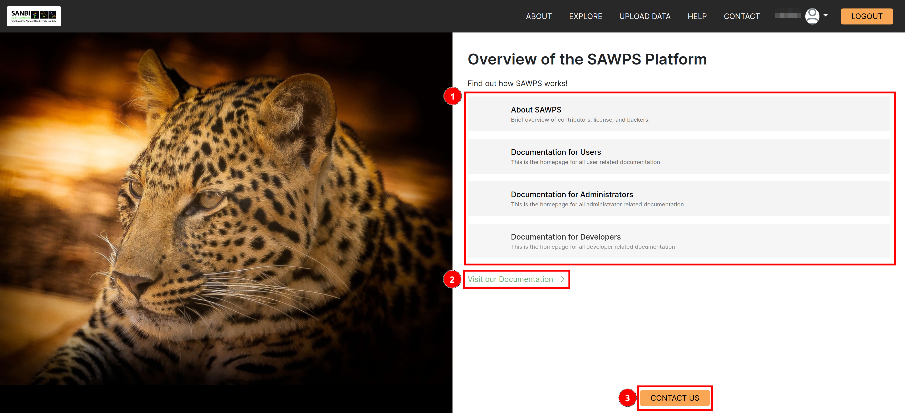
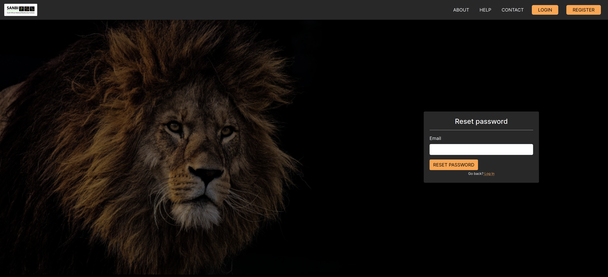
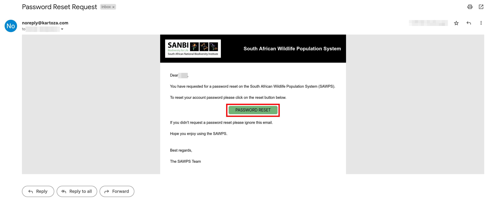

# Help

## What do I do if I need help?

Navigate to the `HELP` button on the home page. This will prompt you to either `GO TO USER GUIDE` where you can find relevant information and commonly asked questions or `CONTACT US` button in which you can log a query to the SAWPS team.

## How do I make contact with the SAWPS team?

Navigate to the `CONTACT` button on the `Home` page (or from the `Help` page) and fill out the prompted information so the team can get back to you.

## What do I do if I forgot my password?

On the `Login` page, click the `Forgot Password` option.

You will be directed to the following page where you can enter the email address associated with your SAWPS account and click the `RESET PASSWORD` button.

Once you have clicked this button an email containing reset instructions will be sent to you and the following screen will be visible.

Once in your emails you can click the `PASSWORD RESET` button and will be redirected to the SAWS portal.

You will now be able to set a new password to access your account.

You will be notified when your password has successfully been reset. You can now login with your new password.

