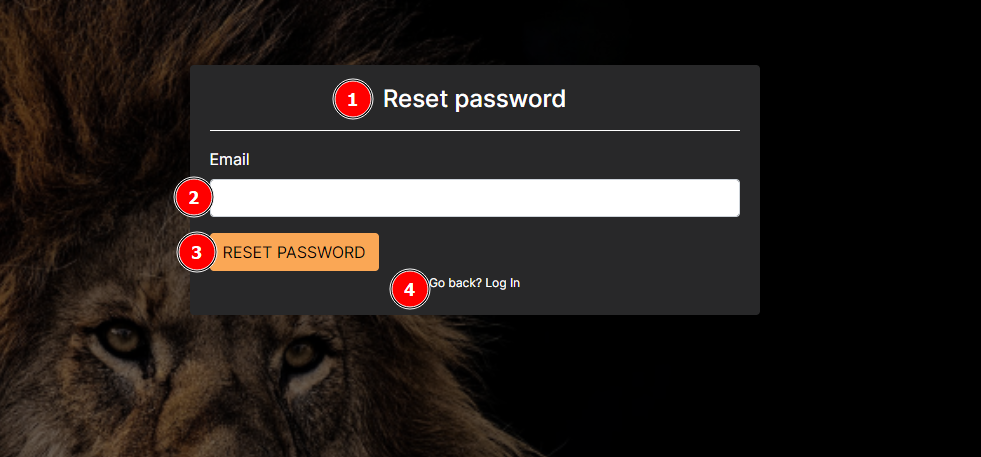

# Help

## What do I do if I need help?

Navigate to the `HELP` button on the home page. This will prompt you to either `GO TO USER GUIDE` where you can find relevant information and commonly asked questions or `CONTACT US` button in which you can log a query to the SAWPS team.

## How do I make contact with the SAWPS team?

Navigate to the `CONTACT` button on the `Home` page (or from the `Help` page) and fill out the prompted information so the team can get back to you.

## What do I do if I forgot my password?

When the user has forgotten their password, they can use this feature to reset it.
The steps involve:

* Providing the correct email for the user account.
* Clicking on the reset password link provided in their email.
* Resetting their password on the platform.
* Logging in with their new password.

When a user clicks on the `Forgot Password` link 1️⃣, they are redirected to the password reset page.

On the password reset page, there is Reset Password Label 1️⃣. A user should enter their email address in the Email Field 2️⃣, and then click the `Reset Password` button 3️⃣ to send the reset password email and notify the user. If a user clicked the `Forgot Password` link by mistake they can click on the `Go back` link 4️⃣.

After a user has clicked on the `Reset Password` button, the page updates to display a message 1️⃣ containing instructions which the user should follow in order to be able to reset their password, and a `Go back` link 2️⃣ which when clicked returns the user to the login page.

A user should receive an email containing further instructions on completing the reset password process and a `Password Reset` button which when clicked will redirect the user to the platform to complete resetting their password.

After a user clicks on the `Reset Password` button in the received email, they are redirected to the reset password page. The user should enter their password into the New Password field 1️⃣ following the criteria set out in the list of *Allowable Password characteristics* 2️⃣. The user should re-enter their password in the `New password confirmation` field 3️⃣, to make sure they didn’t make a mistake. Finally the user should click on the `Reset Password` button 4️⃣ to finish setting the password the user provided as the new password for logging in.

If the password is reset without issues, the user will see a success message.

