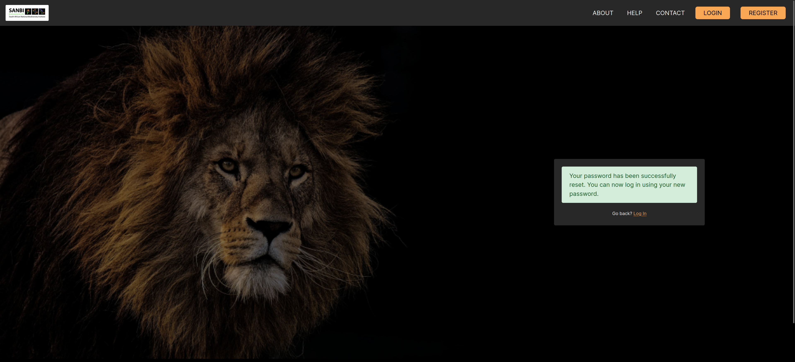

# Help and Contact

The help and contact pages are there to ensure that you, as a user, can be assisted with utilising the platform effectively.

## What do I do if I need help?

Once logged in, navigate to the `HELP` button on the navigation bar. This will redirect you to the help page of the platform. Here you will see 1️⃣ the help desk system that displays some of the documentation. If you would like to view the full documentation site you can click on 2️⃣ `Visit our Documentation` or you can click on 3️⃣ the `CONTACT US` button to be redirected to the `Contact Us` page.

## How do I make contact with the SAWPS team?

Navigate to the `CONTACT` button on the `Home` page (or the `CONTACT US` button from the `Help` page) and fill out the prompted information so the team can get back to you.

## What do I do if I forgot my password?

On the `Login` page, click the `Forgot Password` option.

You will be directed to the following page where you can enter the email address associated with your SAWPS account and click the `RESET PASSWORD` button.

Once you have clicked this button an email containing reset instructions will be sent to you and the following screen will be visible.

Once in your email inbox, open the email and you can click the `PASSWORD RESET` button to be redirected to the SAWPS platform.

After you are redirected to the platform, you will now be able to set a new password to access your account. Once you have entered your new password, click on the `Reset Password` button.

You will be notified when your password has successfully been reset. You can now login with your new password.

