# SAWPS User Guide

## Switching between light and dark mode on the map

To switch to dark mode, simply go to your map and click on the little sun icon which is located next to the layers panel.

This will switch your map from light mode to dark mode.
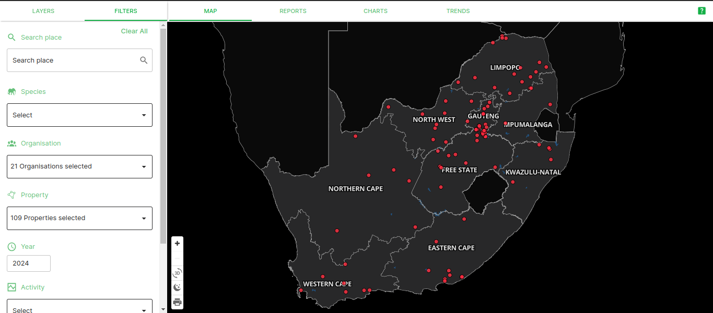

To change your map from dark mode to light mode, simply click on the crescent moon icon located next to the layers panel.
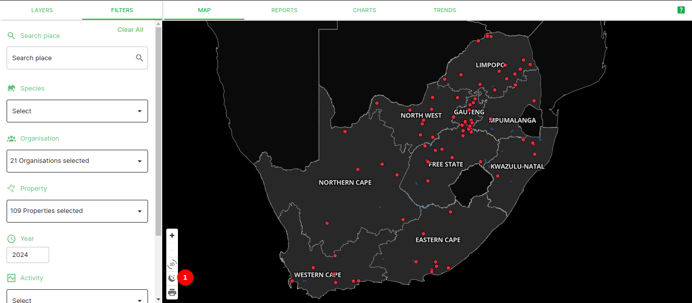

## Creating a new property by selecting parcels

There are various methods of creating a new property on the site. One of them uses a selection tool to allow you, as the user, to select the parcels you want to be a part of the property you are creating.
To create a property using this method, go to ‘Maps’ and select ‘ Data Upload’.

Fill in the ‘Property Information’ form and then click on ‘Save Property Information’. Next, choose the ‘Select’ option and zoom in on the map to where your property is located.

Once you have located your property, select all of the relevant parcels. Once you are happy with your selection, click on the ‘Save Boundary’ button. If you want to deselect what you have selected, click ‘Cancel’ to clear everything and then ‘Select’ to start again or just click on the parcel again to deselect them individually.

## The online form

You will now be directed to Step 3. Select ‘Update Property Boundary’ to go back to Step 2. Select ‘Online Form’ to fill in all of the species and activity detail about the property.

The online form allows you to give Species Detail as well as Activity Detail about each property.

Once you have filled in both sections of the form, you can review them and then submit the form or save the form as a draft and submit it at a later stage.

## Printing your map

The print option on the map allows you to take a screenshot of whatever is present on your map canvas. To save this screenshot, click on the print icon which is located next to the layers panel.

Select your desired page size, orientation, image format and DPI and then click on the ‘Generate’ button.

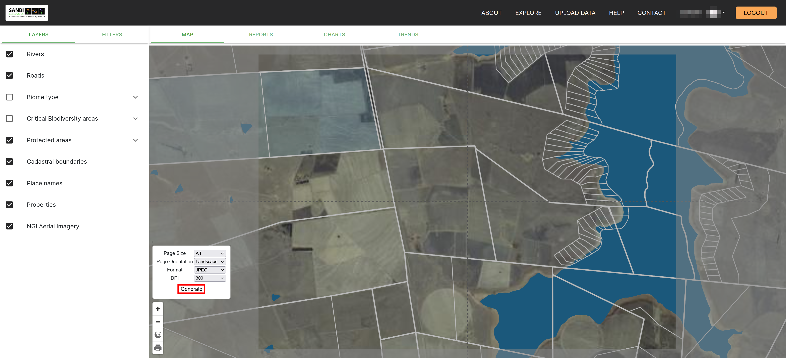

Once you have selected your image settings, save the image to your local machine.

## Enabling and disabling the basemap

Once you are in the map, you have the option of enabling and disabling ‘NGI Aerial Imagery’. This basemap allows you to visualise the map using aerial imagery. By disabling this, the map will no longer have a basemap.

## The Filters Panel

To apply filters to the data being displayed on your map, open the ‘Filters’ panel. This panel is interchangeable with the layers panel.

Here you will be able to filter by species, year and month. There are also spatial filters available in this panel. Here you can filter by population category, protected areas, activity, critical biodiversity areas and ecosystem type.

To use these filters simply check the boxes to enable them and uncheck the boxes to disable them.

The year filter works slightly differently from the rest. Simply drag the dots on the black line to choose which year(s) you want to show data for.

## Uploading data

The data upload function allows users to fill in an online form or upload a CSV file to the SAWPS platform to further enrich their data.

### How to upload CSV data

Users must first download a template from the platform, which they populate with their own data.

#### Step 1

On the **Map** page

To begin, click on `DATA UPLOAD` 1️⃣ then select the property name 2️⃣.

#### Step 2

In this step, you have two choices to use the online form or to upload a CSV.

To upload a CSV, click on `UPLOAD CSV` 1️⃣. A pop-up window 2️⃣ will open, you can then browse and select the CSV file on your computer 3️⃣. To cancel uploading you can click on the `cancel` button 4️⃣.

#### Step 3

After selecting your CSV file, the system will check whether your file complies with the template.

An alert message 1️⃣ is displayed in the case that the file is incorrect. You can close the pop-up by clicking on `Close` 2️⃣.

#### Step 4

Once the system has checked the file you have selected, it will allow you to **UPLOAD FILES** if it's correct.

You can drag and drop files to be uploaded or click on `Browse` 1️⃣ to select files from your file explorer. A chosen file will appear here 2️⃣ when it is being uploaded. You can cancel uploading by clicking on the `cancel` button 3️⃣. Once your files have finished uploading you can click on `Upload Files` 4️⃣ to finish the process.

A success message 1️⃣ is displayed when the download is complete. The file you selected shows here 2️⃣. The pop-up window can be closed by clicking on `Close` 3️⃣.

## Two factor authentication settings
<!-- This will be instructions for actions like updating user two factor authentication settings, generating backup tokens, add and deleting 2fa devices-->

The Two factor authentication page handles the user’s two factor authentication settings. The settings include:

- Backup tokens
- Two factor authentication devices

Navigate to the 2FA tab 1️⃣ under the profile page. This dropdown menu 2️⃣ shows the current 2FA method that the user utilises to log on to the platform. Clicking this button 3️⃣ will open a pop-up window, requiring the user to enter a new device's details before saving. This is the table 4️⃣ that shows the current 2FA devices that the user utilises to log on to the platform. Clicking the `Delete Button` 5️⃣ will open a pop-up window confirming that the user is sure that they want to remove the device before proceeding to removing it. Under the Recovery Options header 6️⃣, there is a list of the backup tokens the user can use to log on to the platform in case they have lost their device. The `Generate backup tokens` button 7️⃣ allows a user to to refresh their backup tokens as well as create new ones when they've just registered onto the platform.

### Adding new device

When a user clicks on `Add Device`, a pop-up window appears. The pop-up contains the Device Name label 1️⃣, which indicates the value that is required in the field below it, and the `Add button` 2️⃣, which when clicked will save the new device.

Once the `Add button` has been clicked, the pop-up will change to display a QR Image Code Label 1️⃣ ,indicating the success result when the device is added, and the QR Code 2️⃣, which the user should scan with the authenticator app of their choice on their new device.

### Deleting a device

The `Cancel` button 1️⃣ will prevent the device from being removed (This is in case the user isn't sure or clicked the icon by accident). The `Delete` button 2️⃣ will remove the device from the platform meaning the user will no longer be able to login using that device.

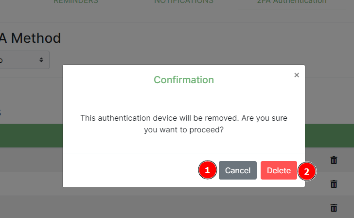

## Forgot password

When the user has forgotten their password, they can use this feature to reset it.
The steps involve:

- Providing the correct email for the user account.
- Clicking on the reset password link provided in their email.
- Resetting their password on the platform.
- Logging in with their new password.

When a user clicks on the `Forgot Password` link 1️⃣, they are redirected to the password reset page.

On the password reset page, there is Reset Password Label 1️⃣. A user should enter their email address in the Email Field 2️⃣, and then click the `Reset Password` button 3️⃣ to send the reset password email and notify the user. If a user clicked the `Forgot Passwword` link by mistake they can click on the `Go back` link 4️⃣.

After a user has clicked on the `Reset Password` button, the page updates to display a message 1️⃣ containing instructions which the user should follow in order to be able to reset their password, and a `Go back` link 2️⃣ which when clicked returns the user to the login page.

A user should receive an email containing further instructions on completing the reset password process and a `Password Reset` button which when clicked will redirect the user to the platform to complete resetting their password.

After a user clicks on the `Reset Password` button in the received email, they are redirected to the reset password page. The user should enter their password into the New Password field 1️⃣ following the criteria set out in the list of *Allowable Password characteristics* 2️⃣. The user should re-enter their password in the `New password confirmation` field 3️⃣, to make sure they didn’t make a mistake. Finally the user should click on the `Reset Password` button 4️⃣ to finish setting the password the user provided as the new password for logging in.

If the password is reset without issues, the user will see a success message.

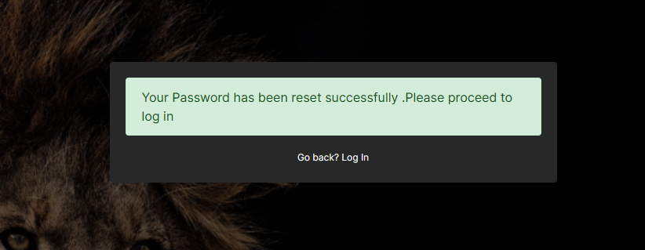

## Notifications

The notifications feature allows for the user to receive push notifications of the reminders they have set via the platform. When a notification comes in, a small bell icon 1️⃣ appears on the user profile icon. A link for notifications 2️⃣ becomes available in profile dropdown menu, this allows for the user to view the notifications from any page on the system. Clicking on the notification will lead the user to the notifications page where they can review more details about the notifications. On the profile pages a small notification badge 3️⃣ appears showing the number of notifications the user has.

Under the profile section, a notifications tab 1️⃣ is available. When the tab is clicked, the notification page appears. On the notifications page, users can search for specific notifications entering keywords for the notification and the title columns into the search box 2️⃣. By clicking on the Filter box 3️⃣, a user can refine the search to only return notifications containing the providing keywords specifically by the filter selected. Clicking on any notification 4️⃣ will cause the pop-up with the notification's information to appear (example of pop-up below). When a user clicks on the `Delete` button 5️⃣, a pop-up appears asking a user to confirm the deletion (example below). The user is able to choose the number of notifications they prefer to see on a page by changing the number here 6️⃣ (The minimum is 5). In the bottom right, a user is able to see the current page they're own and, to navigate to previous and next pages using the navigation links 7️⃣.

Example: **Pop-up with the notification's information**

Example: **Delete notification pop-up**

A user will see a *Delete Confirmation* title 1️⃣ explaining what the pop-up is. On the pop-up, user can decide to click on the `Delete` button 2️⃣ to delete the reminder or click on the `Cancel` button to abort deletion.

> Note: A user can delete their notifications and Organisation Managers can delete organisation notifications.

## Organisation page

Every organisation can manage their organisation members via this page. The organisation page allows for the viewing of organisation members, inviting new members to the organisation (provided the user has the necessary permissions), deleting organisation members (provided the user has the necessary permissions), and searching to see if a member exists within an organisation.

When the user clicks the dropdown icon 1️⃣ next to their username and profile picture, a dropdown menu will appear. If a user clicks on the organisation under current organisation 2️⃣, the page will redirect to that Organisation's page.

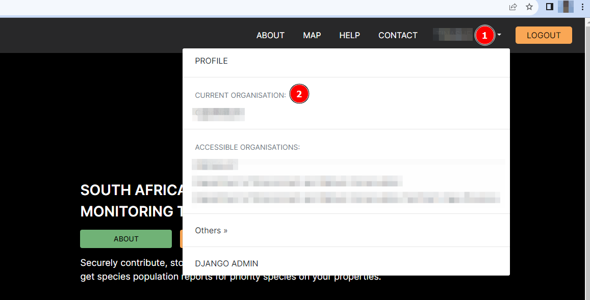

On the Organisation's page a user can see the organisation name 1️⃣ which indicates to the user the current organization they are viewing. To add new members, a user (with necessary permissions) can click on the `Add People` button 2️⃣ which will open a pop-up (example below) where a new member's information can be added. Underneath the Members heading 3️⃣, a user can use the search box 4️⃣ to find specific members within the organisation. Users can decided how many rows per page they would like to see by adjusting the rows per page 5️⃣ (fewer rows displayed can be useful on smaller devices). A user can see which page of members they are on or click on the navigation links 6️⃣ to change between pages. On the Invitations table 7️⃣, a user can see the members that have been invited to the organisation and if the user has a *status* role, they can see if a new user has joined the organisation or not in the status column 8️⃣.

The **Add People** pop-up contains an `Email address` field 1️⃣ that the inviter needs to populate with the email address for the individual they wish to invite to the organization. The inviter also needs to specify if the individual they’re inviting will have a manager or member role within the organization using the `Invite as` field 2️⃣ and to set the new user's permissions using the `Permissions` field 3️⃣. To finalise adding a new member, an inviting user needs to click on the `Invite` button 4️⃣ to send the invitation to the individual being invited to the organisation.

A success message will show if the email has been sent.

In the Invitation Email received by the individual being invited to an organisation, they should click on the `Register` button 1️⃣ to be redirected to the website to complete their registration.

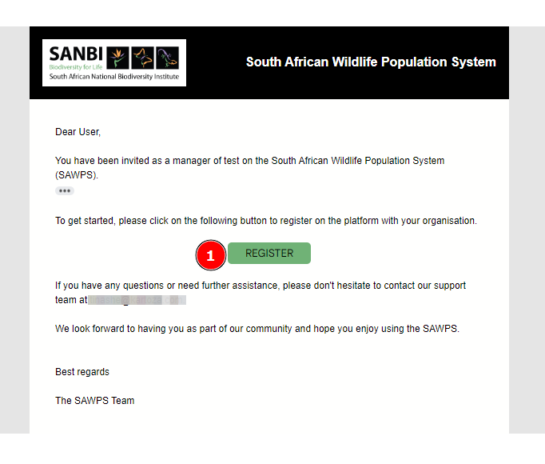

Once redirected to the registration page, the user needs to fill in the form. Once the registration is complete and the user clicks on the `Register` button, they will then be able to login and see their new organisation under accessible organisations.

- If the user is a **new member on platform**, they will be taken through the normal registration and added to the organisation.
- If the user is **already registered on platform**, they will just be registered on to the organisation they're being invited.

## Request organisation feature

When a user on the platform wishes to either have an organisation, or be added to one, they can request for one to be created or to be added to an existing one. The SANBI administrator will review the request and if they approve of it, they will create the organisation for the user, or add them to an existing organisation, and then notify them via email.

To request to be added to an organisation, or have one created, a user needs to click on the profile menu dropdown and then click on the `Request Organisation` button 1️⃣.

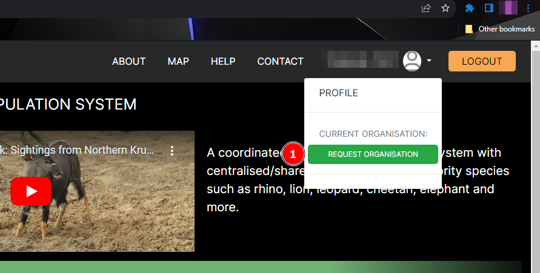

When the `Request Organisation` button is clicked, a pop-up window is will appear. On the pop-up, a user can specify the name/s of the organization they wish to have created in `Organization Name` field 1️⃣ and add message providing a description of the organisation, etc. in the `Message to administrator` field 2️⃣. Once the user has filled in the relevant fields, they can then click on the `Send` button 3️⃣.

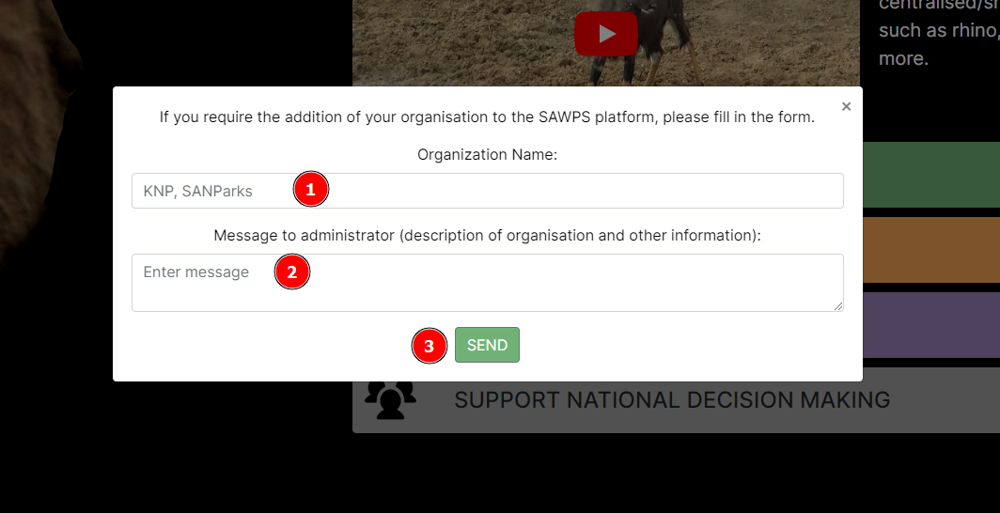

A confirmation will be returned to the user to let them know their invitation has been sent.

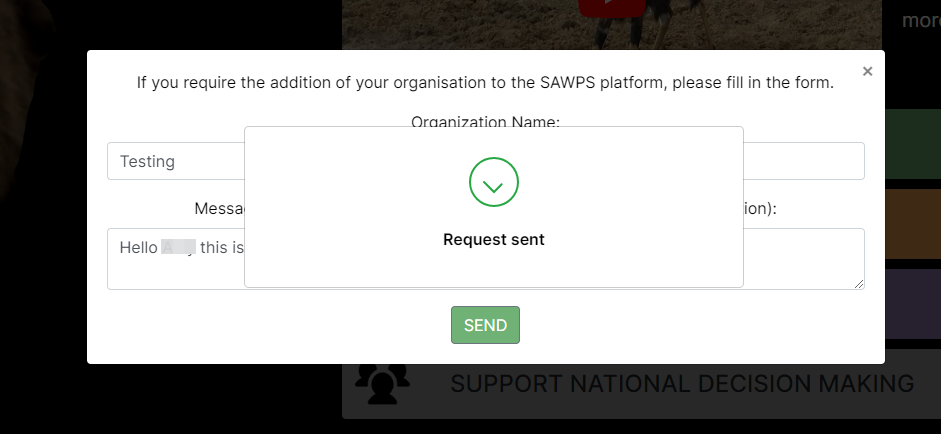

After these steps have been completed, the user will need to wait to receive feedback from the SANBI administrator.

## Reminders page

The Reminders feature has a multiple functions including allowing an organisation to set a reminder for everyone within the organisation, a user to set a personal reminder, a reminder to be edited (to change its state from active, draft and passed or altering other details etc.), a reminder to be deleted, and to send the reminder via email while also notifying the user via the platform.

Other functionalities on the Reminders Page are the ability to search for specific reminders, to filter reminders, and pagination. Organisations can view all reminders set by users who have the permissions to create reminders for all members of that specific organisation. Users are capable of viewing personal reminders.

Under the profile section, there is a reminders tab 1️⃣ which when clicked renders the reminders page. To add a reminder, a user needs to click on the `Add Reminder` button 2️⃣ to open the form (example below) to populate for the reminder they intend to create. A user can type keywords in the search box 3️⃣ to filter the reminder and the title columns. By changing the filter 4️⃣, a user is able to refine the search to only return reminders containing the keywords specifically provided by the filter selected. Clicking on any reminder 5️⃣ will cause a pop-up window (example below) for editing the reminder to appear. When a user clicks on the `Delete` button 6️⃣, the delete reminder pop-up will appear (example below). The user is able to choose the number of notifications they prefer to see on a page by changing the number here 7️⃣ (The minimum is 5). In the bottom right, a user is able to see the current page they're own and, to navigate to previous and next pages using the navigation links 8️⃣.

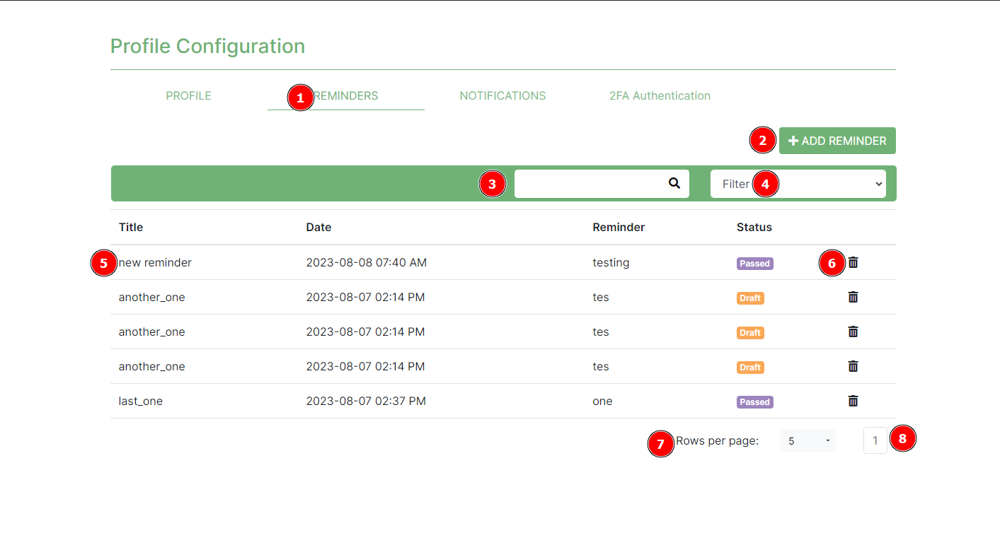

On the **Add Reminder** reminder form the user can see the title 1️⃣. They should set the date and time 2️⃣ that the reminder should appear and then they should provide a description in the reminder field 3️⃣. After adding a description, the user should add the reminder type 4️⃣ and based on their user role within that specific organisation they can specify if the reminder is for all organisation members or it's a personal reminder. Finally the user should click on the `Add` button 5️⃣ to create the reminder.

In the **Edit Reminder** pop-up window the user can change the reminder title 1️⃣ and by changing the date and time 2️⃣ the user can change when the reminder is scheduled. The user can then edit the description in the reminder field 3️⃣ and change the reminder type 4️⃣ and based on their user role within that specific organisation. The user is able to change the reminder status 5️⃣: if it is set to active the reminder is still scheduled, if it is set to draft the reminder is on pause, and if it is set to passed the reminder will be moved to the notifications section but no email will be sent. When a user is finished making changes they can click on the `Save` button 6️⃣ to save the changes made to the reminder.

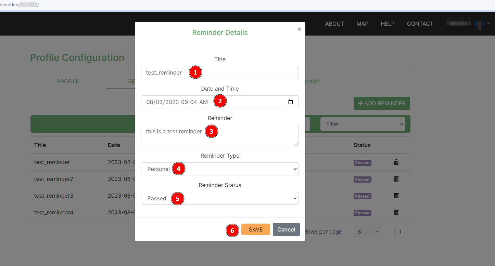

The **Delete Reminder** pop-up is opened when a user clicks on the `Delete` button and prompts the user if they are sure of the actions they wish to take. The user will see the Delete Confirmation title 1️⃣, and then they can choose to click on the `Delete` or `Cancel` buttons 2️⃣ depending on their intentions with the reminder.

- The user can delete their reminders.
- Organisation Managers can delete organisation reminders.
