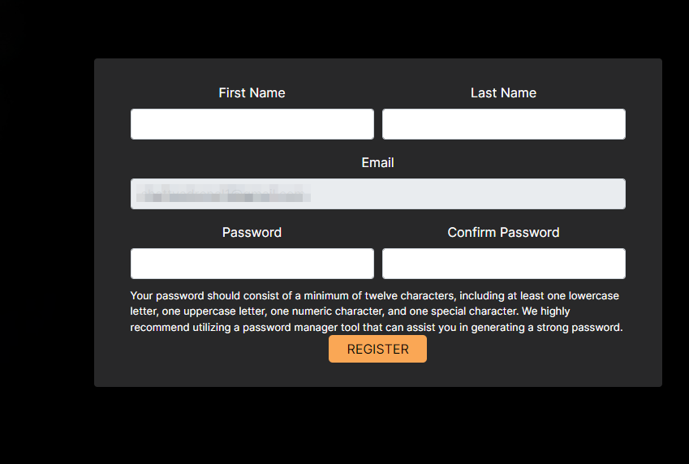

# Organisation page

Every organisation can manage their organisation members via this page. The organisation page allows for the viewing of organisation members, inviting new members to the organisation (provided the user has the necessary permissions), deleting organisation members (provided the user has the necessary permissions), and searching to see if a member exists within an organisation.

When the user clicks the dropdown icon 1️⃣ next to their username and profile picture, a dropdown menu will appear. If a user clicks on the organisation under current organisation 2️⃣, the page will redirect to that Organisation's page.

## Organisation members

On the Organisation's page a user can see 1️⃣ the organisation name which indicates to the user the current organisation they are viewing. To add new members, a user (with necessary permissions) can click on the `Add People` button 2️⃣ which will open a popup (example below) where a new member's information can be added. Underneath the Members heading 3️⃣, a user can use the search box 4️⃣ to find specific members within the organisation. Users can decided how many rows per page they would like to see by adjusting the rows per page 5️⃣ (fewer rows displayed can be useful on smaller devices). A user can see which page of members they are on or click on the navigation links 6️⃣ to change between pages. On the Invitations table 7️⃣, a user can see the members that have been invited to the organisation and if the user has a *status* role, they can see if a new user has joined the organisation or not in the status column 8️⃣.

The **Add People** popup contains an `Email address` field 1️⃣ that the inviter needs to populate with the email address for the individual they wish to invite to the organisation. The inviter also needs to specify if the individual they’re inviting will have a manager or member role within the organisation using the `Invite as` field 2️⃣. To finalise adding a new member, an inviting user needs to click on the `Invite` button 3️⃣ to send the invitation to the individual being invited to the organisation.

A success message will show if the email has been sent.

In the Invitation Email received by the individual being invited to an organisation, they should click on the `Register` button 1️⃣ to be redirected to the website to complete their registration.

Once redirected to the registration page, the user needs to fill in the form. Once the registration is complete and the user clicks on the `Register` button, they will then be able to login and see their new organisation under accessible organisations.

* If the user is a **new member on platform**, they will be taken through the normal registration and added to the organisation.
* If the user is **already registered on platform**, they will just be registered on to the organisation they're being invited.

## Request an organisation

When a user on the platform wishes to either have an organisation, or be added to one, they can request for one to be created or to be added to an existing one. The SANBI administrator will review the request and if they approve of it, they will create the organisation for the user, or add them to an existing organisation, and then notify them via email.

To request to be added to an organisation, or have one created, a user needs to click on the profile menu dropdown and then click on the `Request Organisation` button 1️⃣.

When the `Request Organisation` button is clicked, a popup window is will appear. On the popup, a user can specify the name/s of the organisation they wish to have created in `Organisation Name` field 1️⃣ and add message providing a description of the organisation, etc. in the `Message to administrator` field 2️⃣. Once the user has filled in the relevant fields, they can then click on the `Send` button 3️⃣.

A confirmation will be returned to the user to let them know their invitation has been sent.

After these steps have been completed, the user will need to wait to receive feedback from the SANBI administrator.

## Switch active organisation

If you are part of multiple organisations, you can switch which organisation is your active one. To do so, navigate to 1️⃣ the profile dropdown menu in the navigation bar and then click on 2️⃣ the `My Profile` link to be redirected to your profile.

Once on your profile, navigate to 1️⃣ the organisations tab and then click on 2️⃣ the `SET ACTIVE` button next to whichever organisation you would like to choose as your active organisation (i.e. the organisation that you will upload species data to).

