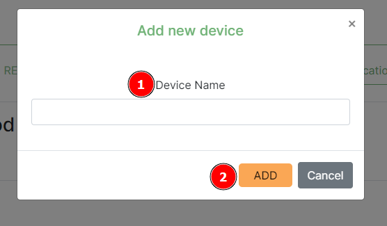

# Profile setup

The documentation herein, describes how to customise your profile as needed and to adjust other profile related settings.

## Getting to the profile page

Click on the profile navigation menu 1️⃣, and then click on `My Profile` 2️⃣ to be redirected to your profile page.

## Reminders page

The Reminders feature has a multiple functions including allowing an organisation to set a reminder for everyone within the organisation, a user to set a personal reminder, a reminder to be edited (to change its state from active, draft and passed or altering other details etc.), a reminder to be deleted, and to send the reminder via email while also notifying the user via the platform.

Other functionalities on the Reminders Page are the ability to search for specific reminders, to filter reminders, and pagination. Organisations can view all reminders set by users who have the permissions to create reminders for all members of that specific organisation. Users are capable of viewing personal reminders.

Under the profile section, there is a reminders tab 1️⃣ which when clicked renders the reminders page. To add a reminder, a user needs to click on the `Add Reminder` button 2️⃣ to open the form (example below) to populate for the reminder they intend to create. A user can type keywords in the search box 3️⃣ to filter the reminder and the title columns. By changing the filter 4️⃣, a user is able to refine the search to only return reminders containing the keywords specifically provided by the filter selected. Clicking on any reminder 5️⃣ will cause a popup window (example below) for editing the reminder to appear. When a user clicks on the `Delete` button 6️⃣, the delete reminder popup will appear (example below). The user is able to choose the number of notifications they prefer to see on a page by changing the number here 7️⃣ (The minimum is 5). In the bottom right, a user is able to see the current page they're own and, to navigate to previous and next pages using the navigation links 8️⃣.

On the **Add Reminder** reminder form the user can see the title 1️⃣. They should set the date and time 2️⃣ that the reminder should appear and then they should provide a description in the reminder field 3️⃣. After adding a description, the user should add the reminder type 4️⃣ and based on their user role within that specific organisation they can specify if the reminder is for all organisation members or it's a personal reminder. Finally the user should click on the `Add` button 5️⃣ to create the reminder.

In the **Edit Reminder** popup window the user can change the reminder title 1️⃣ and by changing the date and time 2️⃣ the user can change when the reminder is scheduled. The user can then edit the description in the reminder field 3️⃣ and change the reminder type 4️⃣ and based on their user role within that specific organisation. The user is able to change the reminder status 5️⃣: if it is set to active the reminder is still scheduled, if it is set to draft the reminder is on pause, and if it is set to passed the reminder will be moved to the notifications section but no email will be sent. When a user is finished making changes they can click on the `Save` button 6️⃣ to save the changes made to the reminder.

The **Delete Reminder** popup is opened when a user clicks on the `Delete` button and prompts the user if they are sure of the actions they wish to take. The user will see the Delete Confirmation title 1️⃣, and then they can choose to click on the `Delete` or `Cancel` buttons 2️⃣ depending on their intentions with the reminder.

* The user can delete their reminders.
* Organisation Managers can delete organisation reminders.

## Notifications

The notifications feature allows for the user to receive push notifications of the reminders they have set via the platform. When a notification comes in, a small bell icon 1️⃣ appears on the user profile icon. A link for notifications 2️⃣ becomes available in profile dropdown menu, this allows for the user to view the notifications from any page on the system. Clicking on the notification will lead the user to the notifications page where they can review more details about the notifications. On the profile pages a small notification badge 3️⃣ appears showing the number of notifications the user has.

Under the profile section, a notifications tab 1️⃣ is available. When the tab is clicked, the notification page appears. On the notifications page, users can search for specific notifications entering keywords for the notification and the title columns into the search box 2️⃣. By clicking on the Filter box 3️⃣, a user can refine the search to only return notifications containing the providing keywords specifically by the filter selected. Clicking on any notification 4️⃣ will cause the popup with the notification's information to appear (example of popup below). When a user clicks on the `Delete` button 5️⃣, a popup appears asking a user to confirm the deletion (example below). The user is able to choose the number of notifications they prefer to see on a page by changing the number here 6️⃣ (The minimum is 5). In the bottom right, a user is able to see the current page they're own and, to navigate to previous and next pages using the navigation links 7️⃣.

Example: **popup with the notification's information**

Example: **Delete notification popup**

A user will see a *Delete Confirmation* title 1️⃣ explaining what the popup is. On the popup, user can decide to click on the `Delete` button 2️⃣ to delete the reminder or click on the `Cancel` button to abort deletion.

> Note: A user can delete their notifications and Organisation Managers can delete organisation notifications.

## Two factor authentication settings

The Two factor authentication page handles the user’s two factor authentication settings. The settings include:

* Backup tokens
* Two factor authentication devices

Navigate to the 2FA tab 1️⃣ under the profile page. This dropdown menu 2️⃣ shows the current 2FA method that the user utilises to log on to the platform. Clicking this button 3️⃣ will open a popup window, requiring the user to enter a new device's details before saving. This is the table 4️⃣ that shows the current 2FA devices that the user utilises to log on to the platform. Clicking the `Delete Button` 5️⃣ will open a popup window confirming that the user is sure that they want to remove the device before proceeding to removing it. Under the Recovery Options header 6️⃣, there is a list of the backup tokens the user can use to log on to the platform in case they have lost their device. The `Generate backup tokens` button 7️⃣ allows a user to to refresh their backup tokens as well as create new ones when they've just registered onto the platform.

### Adding new device

When a user clicks on `Add Device`, a popup window appears. The popup contains the Device Name label 1️⃣, which indicates the value that is required in the field below it, and the `Add button` 2️⃣, which when clicked will save the new device.

Once the `Add button` has been clicked, the popup will change to display a QR Image Code Label 1️⃣ ,indicating the success result when the device is added, and the QR Code 2️⃣, which the user should scan with the authenticator app of their choice on their new device.

### Deleting a device

The `Cancel` button 1️⃣ will prevent the device from being removed (This is in case the user isn't sure or clicked the icon by accident). The `Delete` button 2️⃣ will remove the device from the platform meaning the user will no longer be able to login using that device.

