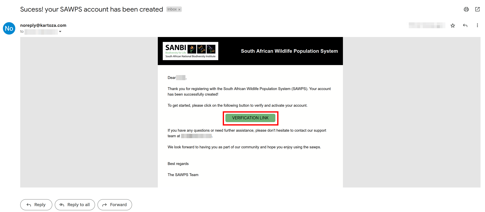
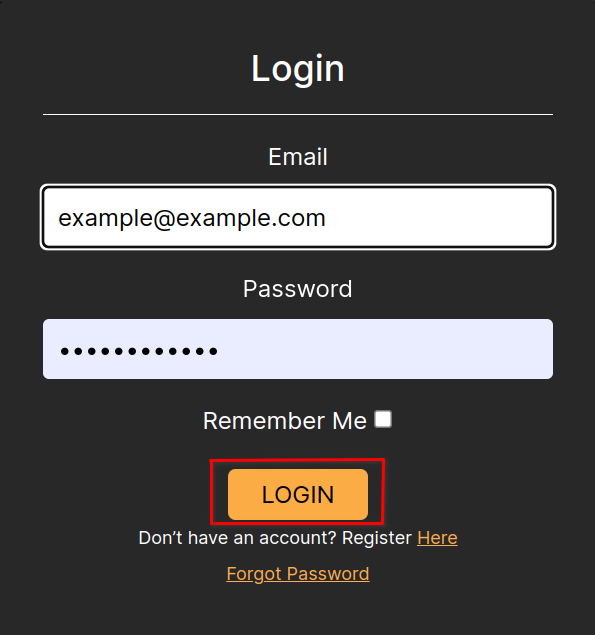

# Registration and Logging In
<!-- How to Register and then Login -->

## How do I register on the site?

Navigate to the `REGISTER` button on the home page and fill in your details in the space provided.

You will be redirected to the registration page where you will be prompted to fill in some information. Namely; your first name, Last name (surname), Email address you'd like associated with your account, and the password you will use to log in to the platform. Once you have filled in all of the information click on the `REGISTER` button at the bottom of the registration window.

A popup will appear letting you know that a verification email will then be sent to the address you have provided.

Login to your email account and click on the green `VERIFICATION LINK` button attached in the mail.

This will redirect you to a profile configuration page.

This step will require you to download and install a token generator, such as the Google Authenticator from the Google Play store. You can install the token generator on your preferred device (ii.e. cellphone, laptop, etc.)

You will use this app to scan the QR code and input the token generated. Keep in mind that for security purposes, you will have 30-60 seconds to type in the generated code before a new one is generated.

Once you type in the OTP (one time pin) successfully, you be logged in and will, once again, be redirected to `Profile Configuration` page. Here you can click on the `GENERATE BACKUP TOKENS` button to generate `Two-Factor Recovery Tokens` for your account.

You can use these in future to login to your profile. Additional devices can also be added as needed.

The next step is to request to be added to the ‘Organisation’ in which you belong. Navigate to the `ORGANISATIONS` tab on the `Profile COnfiguration` page. Then click on the `+REQUEST ORGANISATION` button, this will cause a popup to appear.

In the pop up, you need to fill in the name of the organisation that you would like to be added to (or have created for you) and a message to the administrator with any additional information you think is necessary. Once you have filled in everything, click on the `SEND` button.

This will send your request to the admin team for verification.

## How do I register when added by an Organisation?

Follow the link emailed to you by clicking on the `REGISTER` button. This will redirect you to the SAWPS site.

This will redirect you to the SAWPS site where you can click on the ‘REGISTER’ button and fill in the requested information. After which you should follow the same steps as for [registering](#how-do-i-register-on-the-site)

## How do I login?

Navigate to the home page of the platform and click on either of the two `LOGIN` buttons.

You will then be redirected to the Login page. Fill in the email address you used for registration and your password. Then click on `LOGIN`.

You will then be prompted for your Two-Factor Authentication OTP code. Enter the code from your relevant authenticator app (e.g. Google Authenticator), and click on `AUTHENTICATE`.

You will then be redirected back to the logged in landing page, from there you can navigate around the platform.

## How do I logout?

Click the `LOGOUT` button on the top right of the screen.

