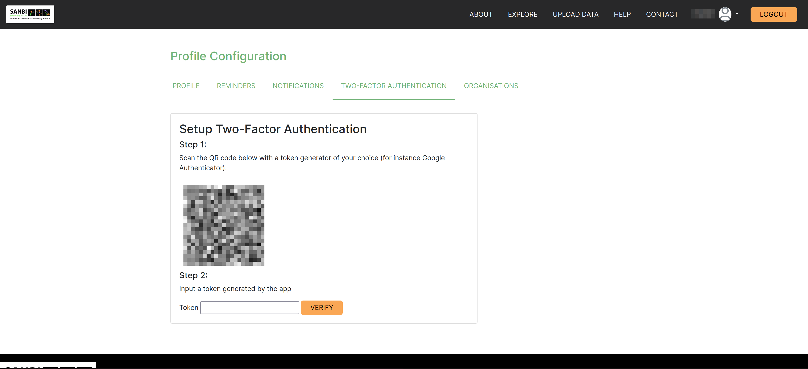
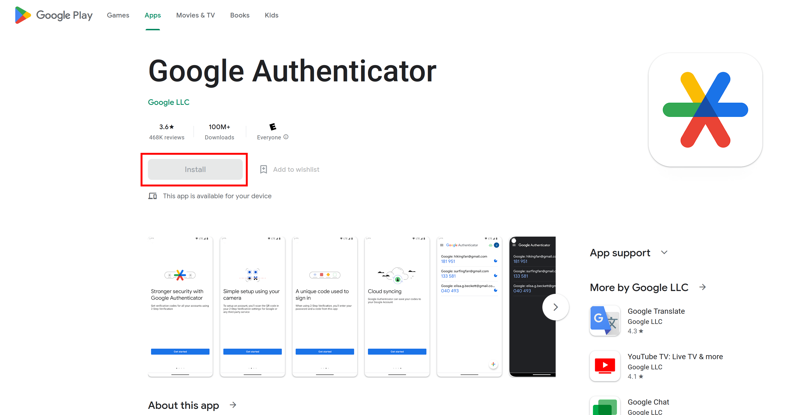
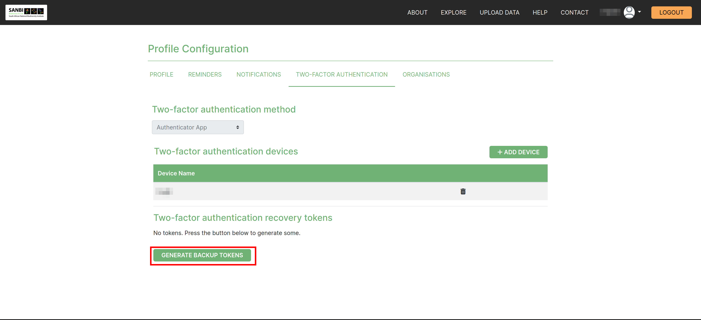

# Registration and Logging In
<!-- How to Register and then Login -->

## How do I register on the site?

Navigate to the `REGISTER` button on the home page and fill in your details in the space provided.

A popup will appear letting you know that a verification email will then be sent to the address you have provided.

Login to your email account and click on the green `VERIFICATION LINK` button attached in the mail.

This will redirect you to a profile configuration page. This step will require you to download and install a token generator such Google Authenticator on the Google Play store.

You will use this app to scan the QR code and input the token generated. Keep in mind for security purposes, you will have 30-60 seconds to type in the generated code before a new one is generated.

Once successfully you have logged in, the `Two-Factor Recovery Tokens` will be generated. You can use these in future to login to your profile. Additional devices can be add as needed as well.

The next step is to request to be added to the ‘Organisation’ in which you belong. This will be sent the admin team for verification.

## How do I register when added by an Organisation?

Follow the link emailed to you by clicking on the `REGISTER` button. This will redirect you to the SAWPS site.

This will redirect you to the SAWPS site where you can click on the ‘REGISTER’ button and fill in the requested information.

## How do I login?

Navigate to the home page of the platform and click on either of the two `LOGIN` buttons.

You will then be redirected to the Login page. Fill in the email address you used for registration and your password. Then click on `LOGIN`.

You will then be prompted for your Two-Factor Authentication OTP code. Enter the code from your relevant authenticator app (e.g. Google Authenticator), and click on `AUTHENTICATE`.

You will then be redirected back to the logged in landing page, from there you can navigate around the platform.

## How do I logout?

Click the ‘Logout’ button on the top right of the screen.

