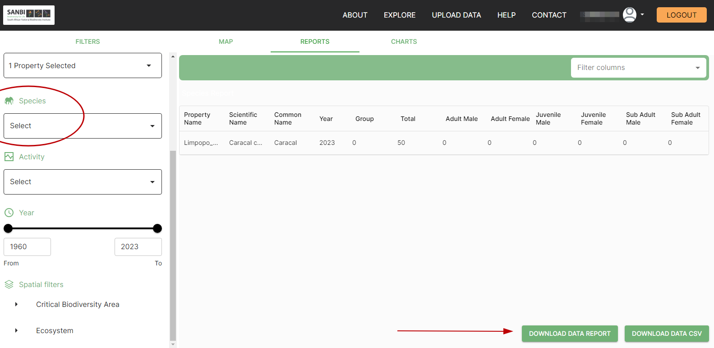
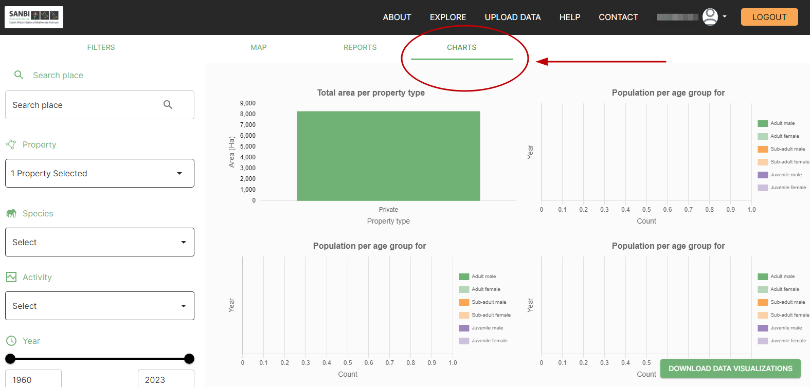

# Viewing Properties

## How do I view my property data on the SAWPS site?

Once the data has been uploaded, you will be able to filter to view ‘species’, ‘activity’, ‘property’ and ‘sampling’ reports. By clicking the ‘DOWNLOAD DATA REPORT’ or ‘DOWNLOAD CSV’ you will be able to download and work with this information in your preferred format.

You will also be able to visualize your data by clicking the ‘CHARTS’ button. This will show you visual representations of the species and farm information entered. These charts can also be downloaded by clicking on the ‘DOWNLOAD DATA VISUALIZATION’ button.

