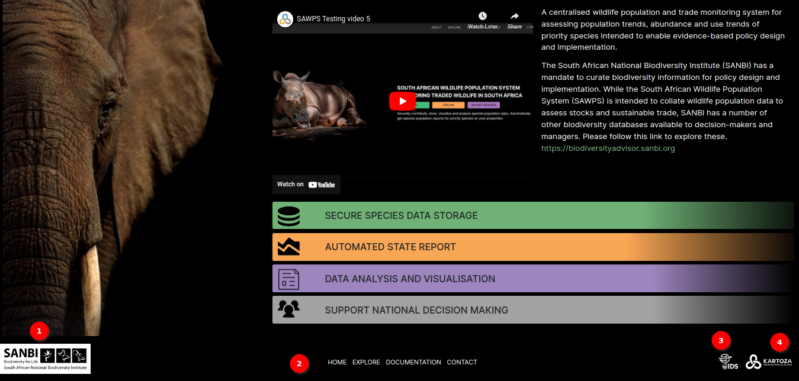
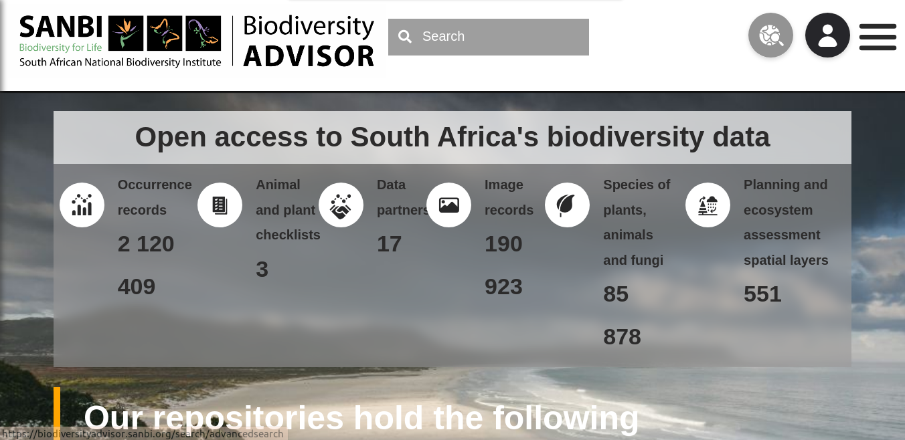
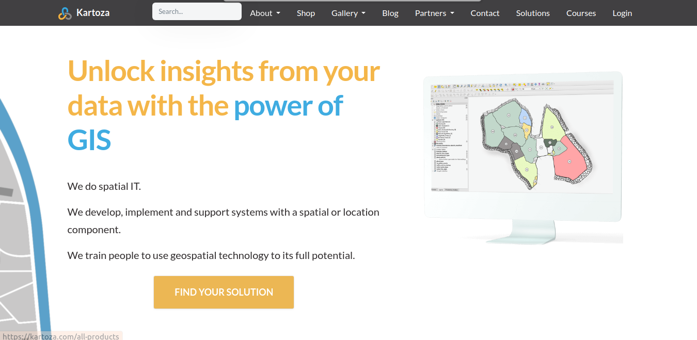

# About SAWPS

Welcome to the about page of the `South African Wildlife Population System (SAWPS)`. This page provides you with essential information about our platform, its purpose, and how to make the most of your experience here.

## About Page

1. **About**: In the navigation bar at the top of the page, you'll find `ABOUT` navigation link to navigate about page.

2. **SAWPS Video Guide**: A quick start video guide to using the `SAWPS` system. This video walks you through the key features and functionalities of our platform, making it easier for you to navigate and utilise the system effectively.

3. **Description**: `SAWPS` system description text.

4. **Biodiversity Advisor**: You can explore the `SANBI Biodiversity Adviser` by following the link.

5. **Site Core Features**: Core features of the site described.

## Additional Resources and Pages

The footer section, located at the bottom of the `About Page`, offers links to additional resources and pages:

1. **SANBI Logo**: By clicking on the `SANBI LOGO` you will navigate to the `SANBI (South African National Biodiversity Institute)` platform. The South African National Biodiversity Institute (SANBI) contributes to South Africa’s sustainable development by facilitating access to biodiversity data, generating information and knowledge, building capacity, providing policy advice, showcasing and conserving biodiversity in its national botanical and zoological gardens.

    ### SANBI

    

2. **Additional Pages**: Usefull Pages links.

    * **Home:** The `HOME` link returns you to the main `Landing Page`, providing an easy way to start your journey within our platform.

    * **Map:** By choosing `MAP,` you can access geographical data visualisation and exploration features within our platform, also you can see the reports for the data.

    * **Documentation:** Click `DOCUMENTATION` to access comprehensive documentation, like this page, which provides detailed information on various aspects of our platform.

    * **Contact:** If you need to get in touch with us for any reason, the `CONTACT` link provides access to our support and communication channels.

3. **IDS Logo**: By clicking on the `IDS LOGO` you will navigate to the `IDS (Information Decision Systems)` platform. Information Decision Systems (IDS) is a progressive Geographical Information Systems, Environmental Consulting and Disaster Management service provider.

    ### IDS

    

4. **KARTOZA Logo**: By clicking on the `KARTOZA LOGO` you will navigate to the `KARTOZA` platform. Kartoza is a South Africa-based Free and Open Source GIS service provider. Kartoza develop and maintain geographic information systems and train teams to use geospatial software to its full potential.

    ### KARTOZA

    

Now that you have a better understanding of SAWPS and its features, it's time to embark on your data exploration journey. Whether you're interested in the latest population trends, contributing your own data, or simply learning more about South Africa's wildlife, SAWPS is here to support you.

Thank you for choosing SAWPS as your platform for exploring and contributing to South African wildlife population data. We're excited to have you on board!
