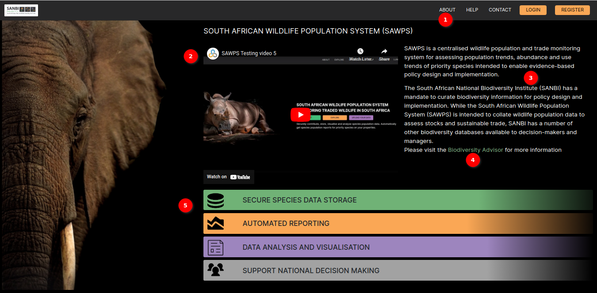

# About SAWPS

Welcome to the about page of the `South African Wildlife Population System (SAWPS)`. This page provides you with essential information about our platform, its purpose, and how to make the most of your experience here.

## About Page

1. **About**: In the navigation bar at the top of the page, you'll find `ABOUT` navigation link to navigate about page.

2. **SAWPS Video Guide**: A quick start video guide to using the `SAWPS` system. This video walks you through the key features and functionalities of our platform, making it easier for you to navigate and utilise the system effectively.

3. **Description**: `SAWPS` system description text.

4. **Biodiversity Advisor**: You can explore the `SANBI Biodiversity Adviser` by following the link.

5. **Site Core Features**: Core features of the site described.

Now that you have a better understanding of SAWPS and its features, it's time to embark on your data exploration journey. Whether you're interested in the latest population trends, contributing your own data, or simply learning more about South Africa's wildlife, SAWPS is here to support you.

Thank you for choosing SAWPS as your platform for exploring and contributing to South African wildlife population data. We're excited to have you on board!
