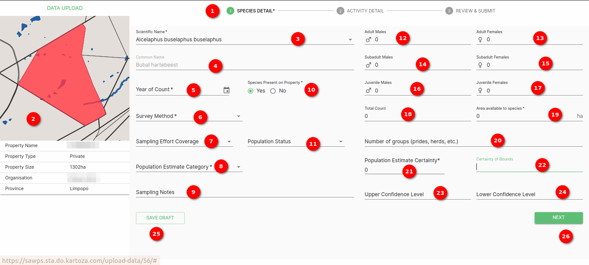
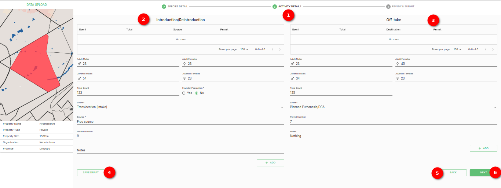
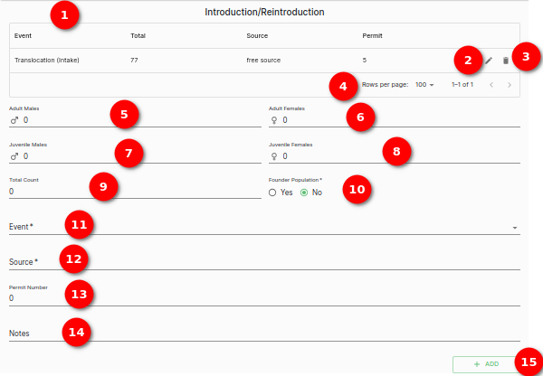
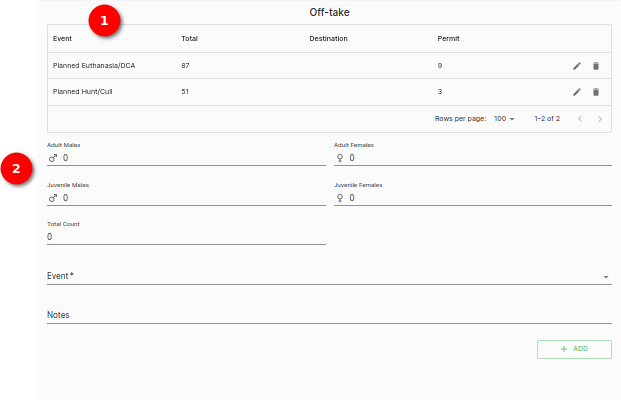
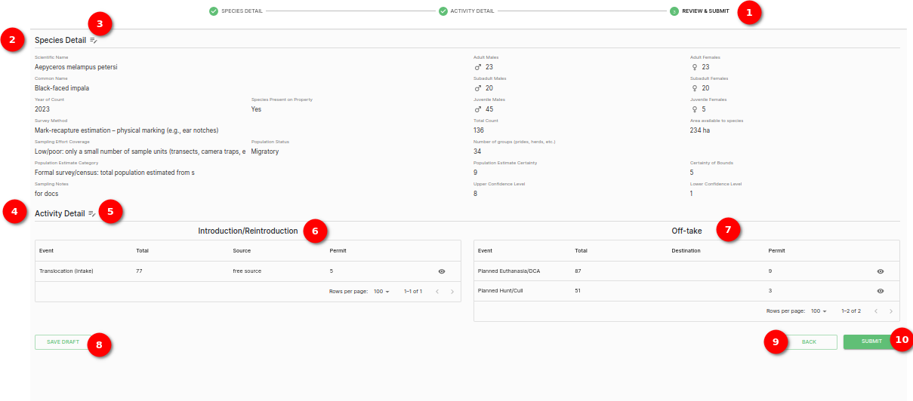

# Data Upload Online Form Documentation

## Online Form Step 1 (Species detail)

### Overview

The data upload online form provides a convenient and structured way to enter species population data for your selected property. This form is designed to capture detailed information about species populations, including scientific names, counts, survey methods, and more. In addition, the form displays an image of the selected property in the top left corner, along with property information.

#### Species detail

1. **Species detail**: First step of data upload online form `SPECIES DETAIL`.

2. **Property detail**: Showing property details along with the image.

3. **Scientific Name**: Select the scientific name of the species from the dropdown menu. This field is mandatory.

4. **Common Name (Prefilled)**: The common name is automatically prefilled based on the scientific name.

5. **Year**: Enter the year of the population count manually or select it from the calendar icon. This field is mandatory.

6. **Survey Method**: Choose the survey method used for data collection from the dropdown menu. This field is mandatory.

7. **Sampling Effort Coverage Dropdown**: Select the level of sampling effort coverage from the dropdown menu.

8. **Population Estimate Category**: Choose the appropriate population estimate category from the dropdown menu. This field is mandatory.

9. **Sampling Notes**: Add any relevant notes or details about the sampling process.

10. **Species Present on Property**: Select either `Yes` or `No` using the radio buttons to indicate whether the species is present on the property.

11. **Population Status**: Specify the population status by selecting an option from the dropdown menu.

12. **Adult Males**: Enter the number of adult males for the species.

13. **Adult Females**: Enter the number of adult females for the species.

14. **Subadult Males**: Enter the number of subadult males for the species.

15. **Subadult Females**: Enter the number of subadult females for the species.

16. **Juvenile Males**: Enter the number of juvenile males for the species.

17. **Juvenile Females**: Enter the number of juvenile females for the species.

18. **Total Count**: The total count will be automatically calculated based on the individual counts entered.

19. **Area Available to Species**: Specify the area available to the species in hectares. This field is mandatory.

20. **Number of Groups (Prides, Herds, etc.)**: Enter the number of groups, prides, herds, or similar groupings.

21. **Population Estimate Certainty**: Select the certainty level of the population estimate from the dropdown menu. This field is mandatory.

22. **Certainty of Bounds**: Provide additional information regarding the certainty of population bounds.

23. **Upper Confidence Level**: Enter the upper confidence level.

24. **Lower Confidence Level**: Enter the lower confidence level.

25. **SAVE DRAFT**: Click this button to save the current form as a draft, allowing you to return to it later and continue data entry.

26. **NEXT**: Click this button to proceed to the next step of the data upload process.

### Summary

The data upload online form streamlines the process of entering detailed species population data for your selected property. Ensure that mandatory fields are filled in and that you have provided accurate information before saving your draft or moving to the next step in the data upload process.

## Online Form Step 2 (Activity detail)

### Overview

The step 2 introduces the `Introduction/Reintroduction` and `Off-take` sections, each with its own table and form. These sections allow you to record important information related to species introduction or reintroduction and off-take data.

#### Activity Detail

1. **Activity Detail**: Second step of data upload online form `ACTIVITY DETAIL`.

2. **Introduction/Reintroduction**: The `Introduction/Reintroduction` section displays the table and form. table for relevant data in a structured tabular format, and  form for entering detailed information related to species introduction or reintroduction.

    **Introduction/Reintroduction Table and Form**

    

    1. **Introduction/Reintroduction Table**: The `Introduction/Reintroduction` table displays relevant data in a structured tabular format, making it easy to review and manage your introduction and reintroduction records.

    2. **Edit Icon**: This icon allows you to edit the data of the row.

    3. **Delete Icon**: This icon allows you to delete the data of the row

    4. **Rows per page**: This is a dropdown for choosing the number of row to display in the table.

    5. **Adult Males**: Enter the count of adult males.

    6. **Adult Females**: Specify the count of adult females.

    7. **Juvenile Males**: Provide the count of juvenile males.

    8. **Juvenile Females**: Record the count of juvenile females.

    9. **Total Count**: The total count field will automatically calculate based on the counts entered for adult males, adult females, juvenile males, and juvenile females.

    10. **Founder Population**: Indicate whether the introduced or reintroduced group is considered a founder population. Use the radio buttons to select `Yes` or `No`. This is mandatory.

    11. **Event**: Select the appropriate event type from the dropdown menu. Choose the event category that best describes the introduction or reintroduction process. This field is mandatory.

    12. **Source**: Describe the source of the introduced or reintroduced population. This field is mandatory.

    13. **Permit Number**: Enter the permit number.

    14. **Notes**: Include any additional notes or comments relevant to the introduction or reintroduction event.

    15. **Add**: Click the `ADD` button to save the information entered into the form. This action will record the introduction or reintroduction event with the specified details.

3. **Off-take**: The `Off-take` section displays the table and form. Table provides a clear overview of your off-take data, and form for input data related to species off-take.

    **Off-take Table and Form**

    

    1. **Off-take Table**: The `Off-take` table displays relevant data in a structured tabular format, making it easy to review and manage your Off-take records.

    2. **Off-take Form**: The `Off-take` is same as the `Introduction/Reintroduction` enter the information related to off-take and add it by clicking on the `ADD` button.

4. **Save Draft**: Use the `SAVE DRAFT` button to save your progress and store the data you've entered in the forms. This allows you to return to your work at a later time.

5. **Back**: The `BACK` button enables you to go back to the previous step if you need to review or edit data from Step 1.

6. **Next**: Click `NEXT` to advance to the next step in the data upload process.

### Summary

Step 2 of the data upload online form  introduces the `Introduction/Reintroduction` and `Off-take` sections, each comprising a table and a form for data entry. These sections are critical for recording and managing information related to species introduction or reintroduction and off-take. The provided navigation buttons, including `SAVE DRAFT`, `BACK`, and `NEXT`, give you control over your data entry process and progression through the data management steps.

## Online Form Step 3 (Review & Submit)

### Overview

Step 3, `Review & Submit`, is the final stage of the data management process, where you have the opportunity to review and confirm the details you've entered. This step provides an overview of species and activity details, as well as introduction/reintroduction and off-take data. It ensures that the information you've provided is accurate and complete before final submission.

#### Review & Submit

1. **Species Detail**: The `Species Detail` section displays a summary of the species-specific information you've entered, providing an overview of species counts and other relevant details.

2. **Edit Note Icon**: For editing the species detail, simply click on the `Edit Note Icon` to access and modify the species-related information.

3. **Activity Detail**: The `Activity Detail` section provides a summary of the activity-related information you've entered, giving you an overview of the activity's attributes and data.

4. **Edit Note Icon**: For editing the activity detail, simply click on the `Edit Note Icon` to access and modify the activity-related information.

5. **Introduction/Reintroduction Table**: The `Introduction/Reintroduction Table` displays a tabular view of data related to species introduction or reintroduction events, including counts and details of the introduction process.

6. **Off-take Table**: The `Off-take Table` provides a tabular view of your off-take data, summarising details related to the removal of species from the property.

7. **Save Draft**: Use the `SAVE DRAFT` button to save your progress and store the data you've entered in the forms. This allows you to return to your work at a later time.

8. **Back**: The `BACK` button enables you to go back to the previous step if you need to review or edit data from Step 1.

9. **Next**: Click `NEXT` to advance to the next step in the data upload process.

### Summary

Step 3, `Review & Submit`, offers a comprehensive overview of your data before final submission. You can review species details, activity details, and introduction/reintroduction and off-take data. The `Edit Note Icons` allow you to make any necessary changes. This step ensures that your data is accurate and complete, providing confidence in your final submission.
