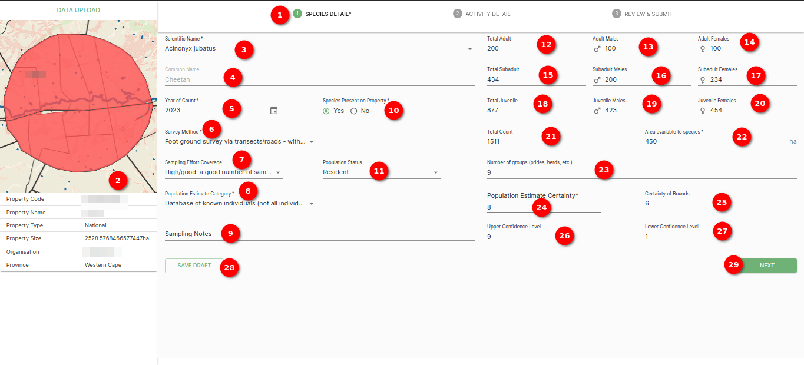

# Data Upload Online Form Documentation

## Overview

The data upload online form provides a convenient and structured way to enter species population data for your selected property. This form is designed to capture detailed information about species populations, including scientific names, counts, survey methods, and more. In addition, the form displays an image of the selected property in the top left corner, along with property information.

### Online form

1. **Species detail**: First step of data upload online form `SPECIES DETAIL`.

2. **Property detail**: Showing property details alog with the image.

3. **Scientific Name**: Select the scientific name of the species from the dropdown menu. This field is mandatory.

4. **Common Name (Prefilled)**: The common name is automatically prefilled based on the scientific name.

5. **Year**: Enter the year of the population count manually or select it from the calendar icon. This field is mandatory.

6. **Survey Method**: Choose the survey method used for data collection from the dropdown menu. This field is mandatory.

7. **Sampling Effort Coverage Dropdown**: Select the level of sampling effort coverage from the dropdown menu.

8. **Population Estimate Category**: Choose the appropriate population estimate category from the dropdown menu. This field is mandatory.

9. **Sampling Notes**: Add any relevant notes or details about the sampling process.

10. **Species Present on Property**: Select either `Yes` or `No` using the radio buttons to indicate whether the species is present on the property.

11. **Population Status**: Specify the population status by selecting an option from the dropdown menu.

12. **Adult Males**: Enter the number of adult males for the species.

13. **Adult Females**: Enter the number of adult females for the species.

14. **Subadult Males**: Enter the number of subadult males for the species.

15. **Subadult Females**: Enter the number of subadult females for the species.

16. **Juvenile Males**: Enter the number of juvenile males for the species.

17. **Juvenile Females**: Enter the number of juvenile females for the species.

18. **Total Count**: The total count will be automatically calculated based on the individual counts entered.

19. **Area Available to Species**: Specify the area available to the species in hectares. This field is mandatory.

20. **Number of Groups (Prides, Herds, etc.)**: Enter the number of groups, prides, herds, or similar groupings.

21. **Population Estimate Certainty**: Select the certainty level of the population estimate from the dropdown menu. This field is mandatory.

22. **Certainty of Bounds**: Provide additional information regarding the certainty of population bounds.

23. **Upper Confidence Level**: Enter the upper confidence level.

24. **Lower Confidence Level**: Enter the lower confidence level.

25. **SAVE DRAFT**: Click this button to save the current form as a draft, allowing you to return to it later and continue data entry.

26. **NEXT**: Click this button to proceed to the next step of the data upload process.

## Summary

The data upload online form streamlines the process of entering detailed species population data for your selected property. Ensure that mandatory fields are filled in and that you have provided accurate information before saving your draft or moving to the next step in the data upload process.
