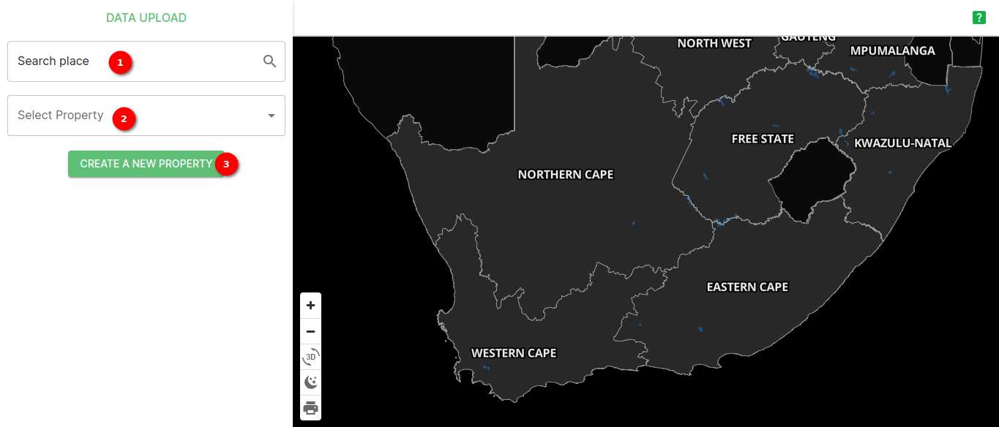
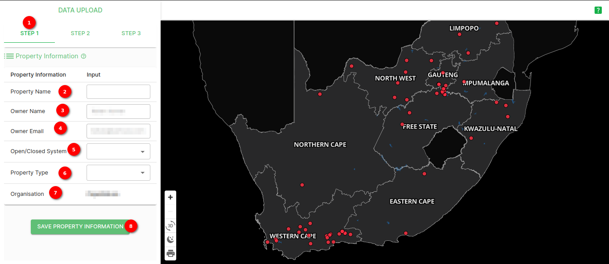
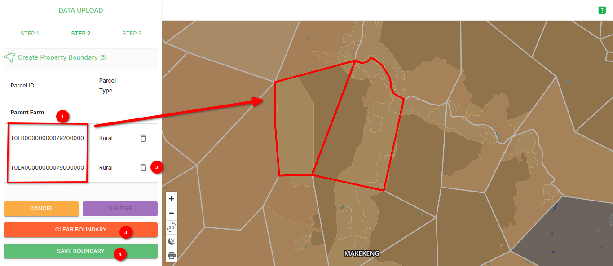
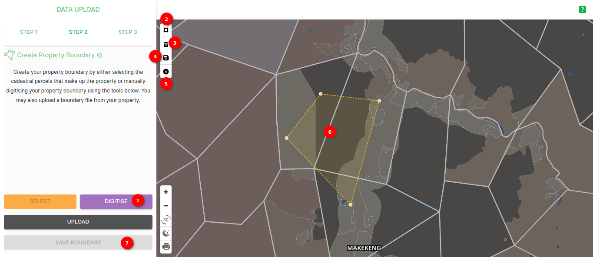
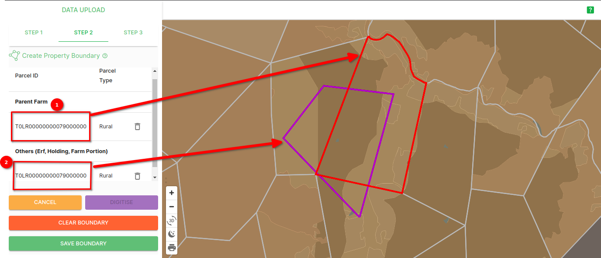
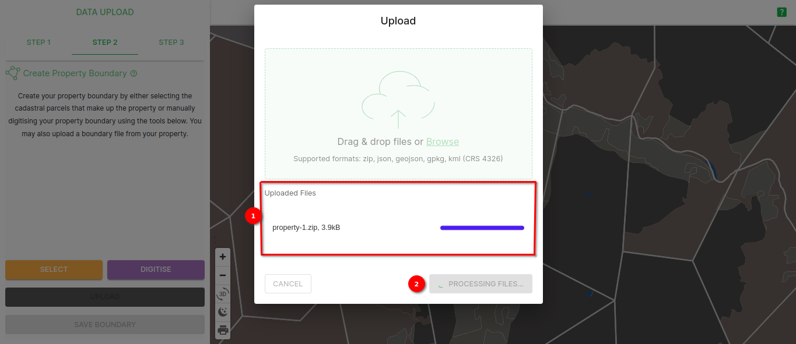
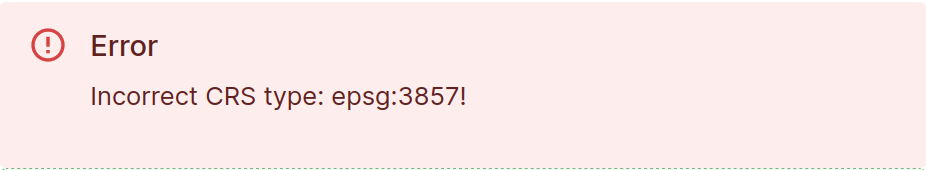
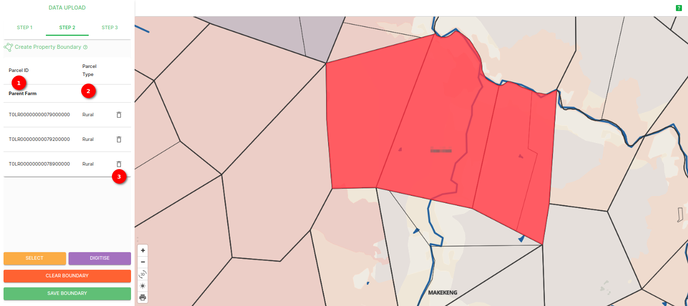
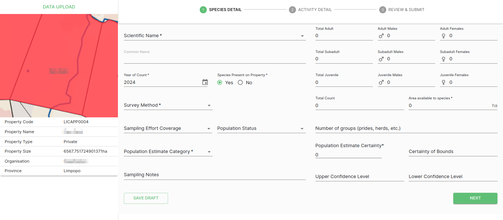
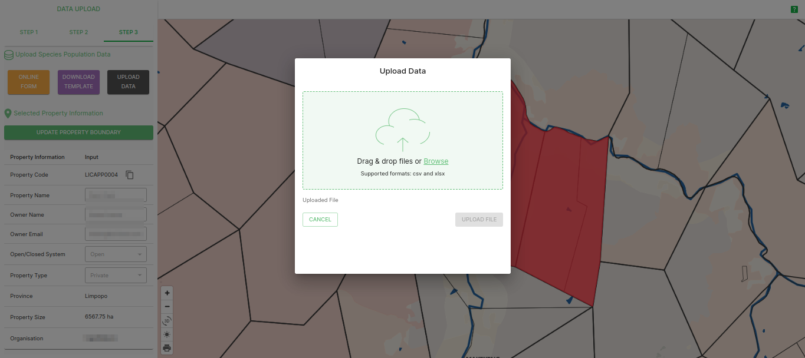

# Data Upload Page Documentation

The Data Upload Page is a key component for managing and uploading user data. This page provides an intuitive interface for adding new data and customising the user's view. It also includes a map with interactive features to help the user visualise spatial data.

> DISCLAIMER: Some of the images in the manual may vary slightly from what you see on the platform due to continuous updates to the platform. On the platform you will see `green question mark`  buttons in the top right corner (underneath the `LOGOUT` button), you can click on these to access the help desk.

## Data upload

1. **Search area**: The central feature of the Data Upload Page is the data search area, where the user can search for specific areas within South Africa This search field allows the user to enter keywords or details related to places within South Africa, or the user's records, to locate specific areas.

2. **Select property**: The Property Selection dropdown is a vital tool for categorising the user's data. Users can choose from existing properties to then associate data with a specific property. This helps organise and categorise users' records effectively.

3. **Create a new property**: If the property that the user wants to associate their data with does not exist in the dropdown, the user can create a new property. Click on the `CREATE A NEW PROPERTY` button to add a new property category. Users will be prompted to enter a name and details for the new property, and it will be added to the dropdown for future use.

## Interactive Map

On the Data Upload Page, the user will find an interactive map that allows the user to visualise spatial data. In the bottom left corner of the map there are buttons that provide several options:

## Map Visualisation

1. **Zoom In**: Click on the plus (+) sign to zoom in on the map for a closer view of specific areas.

2. **Zoom Out**: Click on the minus (-) sign to zoom out and get a broader view of the map.

3. **Dark/Light Mode**: Toggle between a dark and light mode by clicking on the moon and sun icons. This feature provides visual comfort based on the user's preference.

4. **Print**: Click on the print icon to generate a printable version of the map for the user's records or to share with others.

The map enhances the user's ability to work with spatial data and provides valuable insights into the geographical aspects of the user's records.

## Summary

The Data Upload Page is an essential tool for managing the user's data, allowing the user to input new records, categorise them with properties, and visualise spatial data using the interactive map. Whether the user is adding new information or searching for existing records, this page provides a user-friendly experience to help the user effectively handle their data.

## Step 1

The Data Table Page serves as the central hub for viewing and interacting with the user's data. This comprehensive platform offers various features to help the user explore, analyse, and manipulate the user's dataset. To get started, the user will need to upload data, and the first step in this process involves providing property information using the Property Information Form.

### Property Information Form

The Property Information Form is the initial stage of data upload. It's designed to capture essential details about the property being added to the dataset. Here is a breakdown of the form fields:

1. **Step 1**: First step of data upload.

2. **Property Name**: Enter the name of the property in the `Property Name` input field.

3. **Owner Name**: The `Owner Name` field is pre-filled with the default owner name.

4. **Owner Email**: Similar to the owner name, the `Owner Email` field is pre-filled with the default owner email.

5. **Open/Close System**: Select the open or close system for the property from the dropdown menu. This choice reflects the accessibility status of the property.

6. **Property Type**: Choose the property type from the `Property Type` dropdown menu. This classification helps categorize the property.

7. **Province**: Select the province or region where the property is located from the `Province` dropdown. This information is vital for geographic referencing.

8. **Organisation**: The `Organisation` displays the name of the organisation.

9. **SAVE PROPERTY INFORMATION**: Once the user has filled in all the necessary details, they can click the `SAVE PROPERTY INFORMATION` button to store this information and proceed with the data upload process.

The map enhances the user's ability to work with spatial data and provides valuable insights into the geographical aspects of the user's records.

By completing the `Property Information Form`, the user establishes a foundational record for the property in the dataset, which is essential for effective data management and analysis.

This step ensures that the user's data is organised and ready for further processing within the data upload.

## Step 2

The second step of the data upload process on the Data upload involves working with Parcel ID and Parcel Type. This stage is crucial for adding detailed information related to parcels within the property.

### Parcel Details

1. **Step 2**: Step 2 of data upload.

2. **Parcel ID**: The Parcel ID is a unique identifier for each parcel within the property.

3. **Parcel Type**: Parcel Type categorises the parcels based on their purpose or characteristics.

4. **SELECT**: The `SELECT` button allows the user to choose specific parcels from the map.

5. **DIGITISE**: Clicking the `DIGITISE` button initiates the process of mapping parcel boundaries. This step is essential for geospatial data.

6. **UPLOAD**: The `UPLOAD` is used for creating parcel boundaries using the supported formats: zip, json, geojson, gpkg, kml (CRS 4326).

7. **SAVE PROPERTY INFORMATION**: If the user needs to update or modify the property information, the user can click the `SAVE PROPERTY INFORMATION` button to make changes to the property-level information.

Completing Step 2 ensures that the user's dataset is comprehensive and includes detailed information about individual parcels within the property. This data is essential for various analyses and property management tasks.

### Select parcel using select button

1. **Select parcel**: Zoom in the map until parcels are visible, once the user is able to see the parcels they can select parcels.

2. **Cancel**: Users can cancel the selection of the parcel using this button.

3. **Save Boundary**: Click on `SAVE BOUNDARY` button to save the boundaries. After saving the boundary the user will be able to see the selected parcel id and its type.

    

    1. **Parcel ID** The `Parcel ID` displayed in the side panel corresponds to the selected parcel.

### Select parcel using the digitise button

The `DIGITISE` button is a powerful tool that allows the user to digitise parcel boundaries. When the user clicks the `DIGITISE` button, they will see a set of options on the left top of the map, giving the user full control over the digitisation process. These options are essential for mapping out parcel boundaries accurately.

#### Digitisation Options

1. **Digitise**: By clicking on the `DIGITISE`  button, the user will see a set of options on the left top of the map to digitise the boundaries.

2. **Polygon tool**: By clicking on the `Polygon tool Icon` the user can choose a specific area on the map. This selection is used to outline the boundaries of the parcel that the user digitising.

3. **Delete Icon**: The `Delete Icon` is for removing or deleting any selected area that the user no longer needs. This option allows the user to make adjustments as they digitise.

4. **Save Icon**: Click on the `Save Icon` to save the selected area as a digitised parcel boundary. This is a critical step to preserve the boundaries the user has defined.

    

    1. **Parent Parcel ID** The `Parent Parcel ID` displayed in the side panel corresponds to the selected parent parcel.

    2. **Other Parcel ID** The `Other Parcel ID` displayed in the side panel corresponds to the other selected parcel. For example, if the user manually selects a portion of another parcel using digitisation, the parcel ID will also be shown in the side panel.

5. **Cross Icon**: The `Cross Icon` is used to cancel or discard any digitisation progress if the user needs to start over or abandon the current selection.

6. **Digitised parcel**: Digitised parcel is shown.

7. **Save boundary**: After the user has successfully digitised and outlined the parcel boundary using the above options, they can finalise the process by clicking the `SAVE BOUNDARY` button. This saves the digitised boundary and incorporates it into the user's property's data.

By utilising the digitisation options, the user can accurately define parcel boundaries, which is essential for geospatial data and mapping applications. This tool provides the user with the flexibility to create precise boundaries and make adjustments as needed during the digitisation process.

### Upload parcel using the upload data button

The `UPLOAD` button is a pivotal element of the `DATA UPLOAD`, allowing the user to upload essential data for parcel boundaries. By clicking this button, the user initiates the data upload process, which includes defining parcel boundaries and saving them. Here is a step-by-step explanation of this feature:

> **Disclaimer:** If users upload any geometry type that is not polygon, or multi-polygon, (e.g. line, multi-line, etc.) the site will process for a while and then return an error message. Users should ensure that their data is a polygon, or multi-polygon, and not another geometry type.

#### Uploading Data

1. **Upload**: Clicking on the `UPLOAD` button will open a popup window, providing the user with options for uploading data.

The popup window includes the following components:

2. **File Selector:** Clicking on the `Browse` button and allows the user to select the file(s) they want to upload. Supported formats include zip, json, geojson, gpkg, kml (CRS 4326). These files typically contain geospatial data, and the user will use them to define parcel boundaries. Alternatively, users can just drag and drop files from their computer into the green box to begin uploading them.

> Please be aware that our system currently does not support `GeoJSON` upload if users are using Windows. In order to successfully upload their data, we recommend saving it in alternative formats (zip, json, gpkg, kml (CRS 4326)) compatible with our system or, as a workaround, renaming the file extension to .json. We apologise for any inconvenience and appreciate users' understanding as we work to enhance compatibility. If users encounter any issues or have questions, feel free to reach out to our support team.

3. **Uploaded Files:** This shows a list of the user's uploaded file(s).

4. **Upload Files:** After the user has selected the appropriate files, they can click on the `Upload Files` button to begin the data upload process. This action will upload and process the selected data.

5. **Cancel:** If the user decides not to proceed with the data upload, they can click on the `Cancel` button to close the popup window.

##### Processing Uploaded Data

1. **Progress Bar:** This bar displays progress of the processing as a percentage.
2. **Uploaded Files:** This shows a list of the user's uploaded file(s).
3. **Processing Files:** The `UPLOAD FILES` button gets greyed out and displays `PROCESSING FILES` while the files are being processed.

##### Upload Messages

1. **Success Message:** If users have uploaded data that is in the correct CRS (EPSG:4326), is of the polygon/multi-polygon geometry type, and doesn't overlap another user's properties then they will see a success message at the top of the upload popup window.
    

2. **Warning Message:** If users upload data that can be processed but overlaps/contains parcels that have previously been used by another user, then they will receive a warning message.
    

3. **Failure Message:** If users upload data with an incorrect CRS, an incorrect geometry type, or another issue, they will receive an error message.
    Incorrect CRS:
    

    Incorrect Geometry type:
    

The `DATA UPLOAD` feature is crucial for geospatial data and mapping applications, ensuring the users data is accurate and complete.

### After selecting the parcel

1. **Parcel ID**: The Parcel ID is a unique identifier for each parcel within the property.

2. **Parcel Type**: Parcel Type categorises the parcels based on their purpose or characteristics.

3. **Delete icon**: This delete icon allows the user to delete a particular parcel detail.

## Step 3

Step 3 of the data upload process is a crucial phase that allows the user to upload species population data. In this step, the user will find two buttons for uploading their data, along with an option to download a template for the user's convenience. Additionally, there is a button to update property boundaries, which leads the user to Step 2 where they can make property boundary modifications.

### Data Upload step 3

1. **Step 3**: Step 3 of data upload.

2. **Online Form**: Clicking on the `ONLINE FORM` button allows users to access the online data upload form. This option is ideal for manually entering data into a user-friendly interface. Following the provided prompts lets users input species population data.

Click [here](./online-form.md) to see the detailed documentation for the online form.

3. **Download Template**: Clicking on the `DOWNLOAD TEMPLATE` button allows users to obtain a blank template that they can use as a starting point for entering their species population data. This template is designed to assist the user in organising their data correctly.

4. **Upload Template**: Using the `UPLOAD DATA` button lets users upload a pre-prepared template containing species population data. Templates are useful for bulk data uploads or when the user has data formatted in a specific way. Ensure the user's template adheres to the required format and guidelines for a successful upload.

Click [here](./template-upload.md) to see the detailed documentation of the template upload.

5. **Update Property Boundary**: By clicking the `UPDATE PROPERTY BOUNDARY` button, the user will be redirected to Step 2 of the data upload process. In this step, the user can modify property boundaries.

6. **Property Information Display**: A section is provided on this page to display information about the property. This information is for reference and provides details about the property related to the data that the user is uploading.

7. **Selected property**: The property is highlighted on the map to make it easy for the user to pinpoint the area.

## Summary

Step 3 of the data upload process provides multiple options for uploading species population data, allowing flexibility in how the user inputs their information. Users can choose between an online form or uploading a prepared template. Additionally, the availability of a downloadable template simplifies data organisation. If needed, the user can update property boundaries by clicking the dedicated button, which takes the user to Step 2 where they can make the necessary adjustments while visually identifying the selected property on the map.
