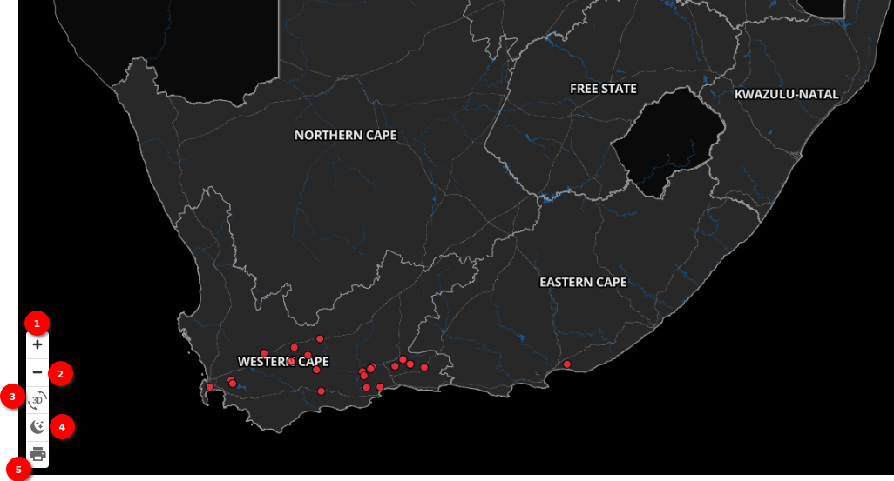
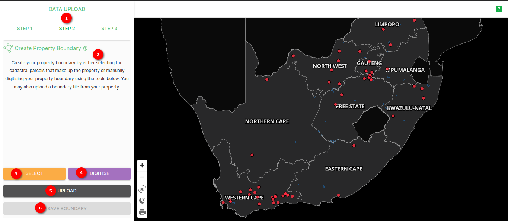
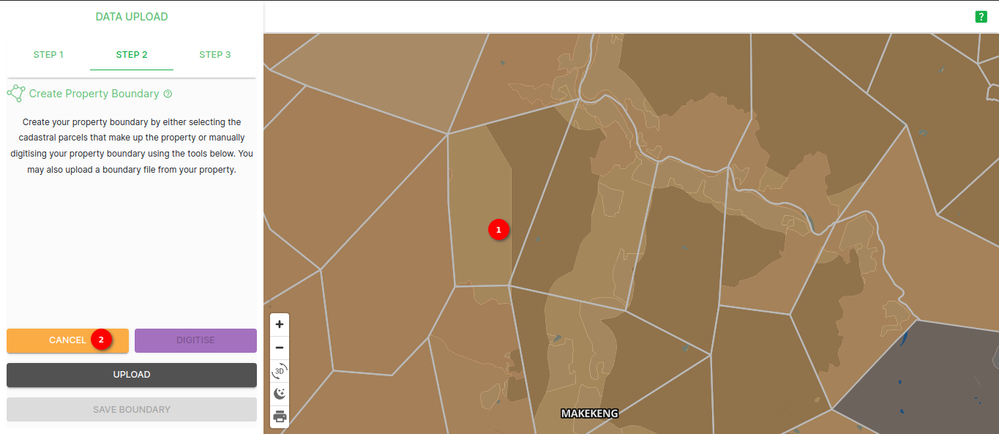
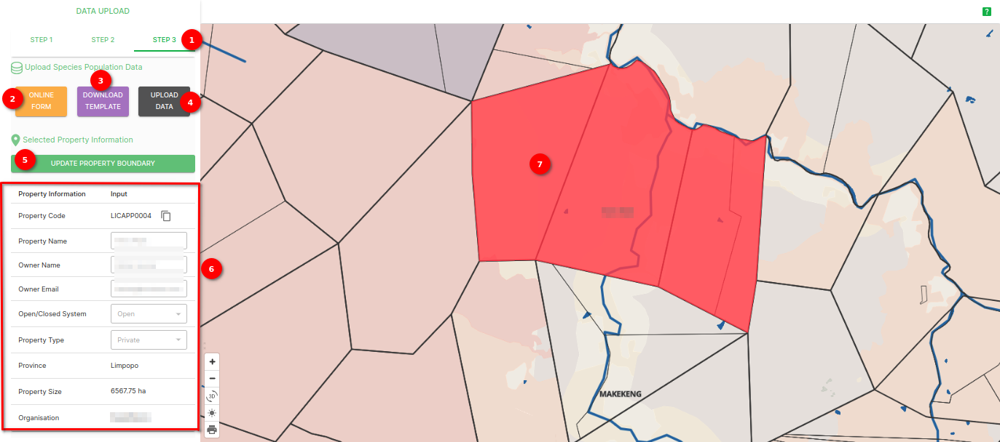

# Data Upload Page Documentation

## Description

The Data Upload Page is a key component for managing and uploading your data. This page provides an intuitive interface for adding new data and customizing your view. It also includes a map with interactive features to help you visualize spatial data.

### Data upload

1. **Search area**: The central feature of the Data Upload Page is the data search area, where you can search for specific areas within your dataset. This search field allows you to enter keywords or details related to your records to locate specific areas.

2. **Select property**: The Property Selection Dropdown is a vital tool for categorizing your data. You can choose from existing property categories to associate your data with a specific property. This helps organize and categorize your records effectively.

3. **Create a new property**: If the property you want to associate your data with doesn't exist in the dropdown, you can create a new property. Click the `CREATE A NEW PROPERTY` button to add a new property category. You'll be prompted to enter a name and details for the new property, and it will be added to the dropdown for future use.

## Interactive Map

In the bottom left corner of the Data Upload Page, you'll find an interactive map that allows you to visualize spatial data. The map provides several options:

### Map Visualisation

1. **Zoom In**: Click the plus (+) sign to zoom in on the map for a closer view of specific areas.

2. **Zoom Out**: Click the minus (-) sign to zoom out and get a broader view of the map.

3. **Dark/Light Mode**: Toggle between a dark and light mode by clicking on the moon and sun icons. This feature provides visual comfort based on your preference.

4. **Print**: Click the print icon to generate a printable version of the map for your records or to share with others.

The map enhances your ability to work with spatial data and provides valuable insights into the geographical aspects of your records.

## Summary

The Data Upload Page is an essential tool for managing your data, allowing you to input new records, categorize them with properties, and visualize spatial data using the interactive map. Whether you're adding new information or searching for existing records, this page provides a user-friendly experience to help you effectively handle your data.

## Step 1

### Description

The Data Table Page serves as the central hub for viewing and interacting with your data. This comprehensive platform offers various features to help you explore, analyze, and manipulate your dataset. To get started, you'll need to upload data, and the first step in this process involves providing property information using the Property Information Form.

### Property Information Form

The Property Information Form is the initial stage of data upload. It's designed to capture essential details about the property being added to the dataset. Here's a breakdown of the form fields:

1. **Step 1**: First step of data upload.

2. **Property Name**: Enter the name of the property in the `Property Name` input field.

3. **Owner Name**: The `Owner Name` field is pre-filled with the default owner name.

4. **Owner Email**: Similar to the owner name, the `Owner Email` field is pre-filled with the default owner email.

5. **Open/Close System**: Select the open or close system for the property from the dropdown menu. This choice reflects the accessibility status of the property.

6. **Property Type**: Choose the property type from the `Property Type` dropdown menu. This classification helps categorize the property.

7. **Province**: Select the province or region where the property is located from the `Province` dropdown. This information is vital for geographic referencing.

8. **Organisation**: The `Organisation` displays the name of the organization.

9. **SAVE PROPERTY INFORMATION**: Once you've filled in all the necessary details, click the `SAVE PROPERTY INFORMATION` button to store this information and proceed with the data upload process.

The map enhances your ability to work with spatial data and provides valuable insights into the geographical aspects of your records.

By completing the `Property Information Form`, you establish a foundational record for the property in the dataset, which is essential for effective data management and analysis.

This step ensures that your data is organized and ready for further processing within the data upload.

## Step 2

### Description

The second step of the data upload process on the Data upload involves working with Parcel ID and Parcel Type. This stage is crucial for adding detailed information related to parcels within the property.

### Parcel Details

1. **Step 2**: Step 2 of data upload.

2. **Parcel ID**: The Parcel ID is a unique identifier for each parcel within the property.

3. **Parcel Type**: Parcel Type categorizes the parcels based on their purpose or characteristics.

4. **SELECT**: The `SELECT` button allows you to choose specific parcels from the map.

5. **DIGITISE**: Clicking the `DIGITISE` button initiates the process of mapping parcel boundaries. This step is essential for geospatial data.

6. **UPLOAD**: The `UPLOAD` it is used for creating parcel boundaries using the supported formats: zip, json, geojson, gpkg, kml (CRS 4326).

7. **SAVE PROPERTY INFORMATION**: If you need to update or modify property information, you can click the `SAVE PROPERTY INFORMATION` button to make changes to the property-level information.

Completing Step 2 ensures that your dataset is comprehensive and includes detailed information about individual parcels within the property. This data is essential for various analyses and property management tasks.

### Select parcel using select button

1. **Select parcel**: Zoom in the map until parcels are visible once you are able to see the parcels select parcels.

2. **Cancel**: You can cancel the selection of the parcel using this button.

3. **Save Boundary**: Click on `SAVE BOUNDARY` button to save the boundaries. After saving the boundary you will be able to see the selected parcel id and its type.

### Select parcel using the digitise button

#### Description

The `DIGITISE` button is a powerful tool that allows you to digitise parcel boundaries. When you click the `DIGITISE` button, you'll see a set of options on the left top of the map, giving you full control over the digitisation process. These options are essential for mapping out parcel boundaries accurately.

#### Digitisation Options

1. **Digitise**: By click on `DIGITISE`  button, you'll see a set of options on the left top of the map to digitise the boundaries.

2. **Polygon tool**: By clicking on the `Polygon tool Icon` you can choose a specific area on the map. This selection is used to outline the boundaries of the parcel you're digitising.

3. **Delete Icon**: The `Delete Icon` is for removing or deleting any selected area that you no longer need. This option allows you to make adjustments as you digitise.

4. **Save Icon**: Click the `Save Icon` to save the selected area as a digitised parcel boundary. This is a critical step to preserve the boundaries you've defined.

5. **Cross Icon**: The `Cross Icon` is used to cancel or discard any digitisation progress if you need to start over or abandon the current selection.

6. **Digitised parcel**: Digitised parcel is shown.

7. **Save boundary**: After you've successfully digitised and outlined the parcel boundary using the above options, you can finalise the process by clicking the `SAVE BOUNDARY` button. This saves the digitised boundary and incorporates it into your property's data.

By utilising the digitisation options, you can accurately define parcel boundaries, which is essential for geospatial data and mapping applications. This tool provides you with the flexibility to create precise boundaries and make adjustments as needed during the digitisation process.

### Upload parcel using the upload data button

#### Description

The `UPLOAD` button is a pivotal element of the `DATA UPLOAD`, allowing you to upload essential data for parcel boundaries. By clicking this button, you initiate the data upload process, which includes defining parcel boundaries and saving them. Here's a step-by-step guide on how to use this feature:

#### Uploading Data

1. **Upload**: Click the `UPLOAD` button, and a popup window will open, providing you with options for uploading data.

The popup window includes the following components:

2. **Browse**: Click the `Browse` and select the file or files you want to upload. Supported formats include zip, json, geojson, gpkg, kml (CRS 4326). These files typically contain geospatial data, and you'll use them to define parcel boundaries.

3. **Upload Files**: After you've selected the appropriate files, click the `Upload Files` button to begin the data upload process. This action will upload and process the selected data.

4. **Cancel**: If you decide not to proceed with the data upload, you can click the `Cancel` button to close the popup window.

5. **SAVE BOUNDARY**: By clicking the `SAVE BOUNDARY` button. This action will store the boundary and incorporate it into your property's dataset.

By following these steps, you can effectively upload data, define parcel boundaries, and save them within the `DATA UPLOAD`. This feature is crucial for geospatial data and mapping applications, ensuring your data is accurate and complete.

#### After selecting the parcel

1. **Parcel ID**: The Parcel ID is a unique identifier for each parcel within the property.

2. **Parcel Type**: Parcel Type categorizes the parcels based on their purpose or characteristics.

3. **Delete icon**: This delete icon allows you to delete the perticuler parcel detail.

## Step 3

### Description

Step 3 of the data upload process is a crucial phase that allows you to upload species population data. In this step, you will find two buttons for uploading your data, along with an option to download a template for your convenience. Additionally, there is a button to update property boundaries, which leads you to Step 2 where you can make property boundary modifications.

#### Data Upload step 3

1. **Step 3**: Step 3 of data upload.

2. **Online Form**: Click on the `ONLINE FORM` button to access the online data upload form. This option is ideal for manually entering data into a user-friendly interface. Follow the provided prompts to input your species population data.

click on the [Online form](./online-form.md) to see the detailed documentation of online form.

3. **Download Template**: Click on the `DOWNLOAD TEMPLATE` button to obtain a blank template that you can use as a starting point for entering your species population data. This template is designed to assist you in organizing your data correctly.

4. **Upload Template**: Use the `UPLOAD DATA` button to upload a pre-prepared template containing your species population data. Templates are useful for bulk data uploads or when you have data formatted in a specific way. Ensure your template adheres to the required format and guidelines for a successful upload.

click on the [Upload template](./template-upload.md) to see the detailed documentation of template upload.

##### Updating Property Boundary

5. **Update Property Boundary**: By clicking the `UPDATE PROPERTY BOUNDARY` button, you will be directed to Step 2 of the data upload process. In this step, you can modify property boundaries.

6. **Property Information Display**: A section is provided on this page to display information about the property. This information is for reference and provides details about the property related to the data you're uploading.

7. **Selected property**: The property is highlighted on the map to make it easy for you to pinpoint the area.

## Summary

Step 3 of the data upload process provides multiple options for uploading species population data, allowing flexibility in how you input your information. You can choose between an online form or uploading a prepared template. Additionally, the availability of a downloadable template simplifies data organization. If needed, you can update property boundaries by clicking the dedicated button, which takes you to Step 2 where you can make the necessary adjustments while visually identifying the selected property on the map.
