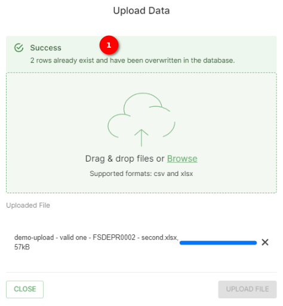
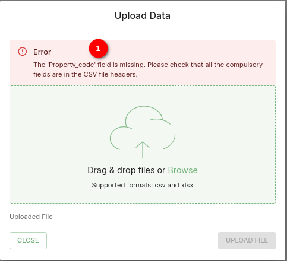

# Template upload Documentation

The data upload feature enables the user to seamlessly upload their data for analysis and integration into the system. When the user clicks on the `DATA UPLOAD` option, an upload data popup window will appear, providing the user with easy-to-use tools for uploading their data. The supported file formats for upload are CSV and XLSX.

> DISCLAIMER: Some of the images in the manual may vary slightly from what you see on the platform due to continuous updates to the platform. On the platform you will see `green question mark`  buttons in the top right corner (underneath the `LOGOUT` button), you can click on these to access the help desk.

## Uploading Data

1. **Download Template**: Click on the `DOWNLOAD TEMPLATE` button to obtain a blank template that the user can use as a starting point for entering the user's species population data. This template is designed to assist the user in organising the user's data correctly.

2. **Upload data**: Click on the `UPLOAD DATA` button, and the upload data popup window will appear, providing the user with easy-to-use tools for uploading the user's data.

3. **Browse Button**: Click on the `Browse` button to select the file that the user wishes to upload. A user can choose a file from the user's local storage that is in either CSV or XLSX format. This file should contain the data the user wants to integrate into the system for further analysis.

4. **Upload File Button**: After selecting the file, click on the `UPLOAD FILE` button to begin the data upload process. The system will validate and process the data, making it available for the user to use.

5. **Close Button**: If the user decides not to proceed with the upload or wishes to cancel the operation, the user can click on the `CLOSE` button. This will close the upload popup without initiating the data upload process.

## Update data

1. **Success Message**: The users can update species data through the data upload feature. To initiate an update, simply upload the same file containing the revised data. The system will process the upload, and upon completion, the data will be successfully updated. This streamlined process ensures an efficient and straightforward method for keeping species information current.
## Error

1. **Error Message**: The error message provides details about the specific issue encountered during the data upload using either the CSV or XLSX file. This message is designed to offer clear and precise information about any errors that may occur, aiding users in identifying and addressing issues effectively.

## Summary

The data upload feature provides a user-friendly way to integrate the user's data into the system. With support for popular file formats like CSV and XLSX, the user can easily upload their data for further analysis and exploration. The `Browse` button allows the user to select their data file, the `UPLOAD` button initiates the upload process, and the `CLOSE` button enables the user to exit the upload popup if needed.
