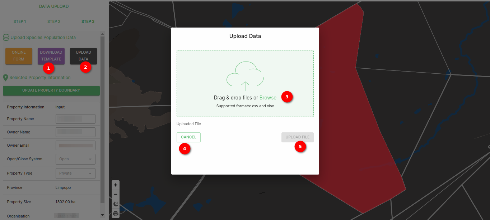

# Template upload Documentation

## Description

The data upload feature enables you to seamlessly upload your data for analysis and integration into the system. When you click on the `DATA UPLOAD` option, a upload data popup window will appear, providing you with easy-to-use tools for uploading your data. The supported file formats for upload are CSV and XLSX.

### Uploading Data

1. **Download Template**: Click on the `DOWNLOAD TEMPLATE` button to obtain a blank template that you can use as a starting point for entering your species population data. This template is designed to assist you in organizing your data correctly.
2. **Upload data**: By clicking the `UPLOAD DATA` button, a upload data popup window will appear, providing you with easy-to-use tools for uploading your data.

3. **Browse Button**: Click the `Browse` button to select the file you wish to upload. You can choose a file from your local storage that is in either CSV or XLSX format. This file should contain the data you want to integrate into the system for further analysis.

4. **Upload File Button**: After selecting the file, click the `UPLOAD FILE` button to begin the data upload process. The system will validate and process the data, making it available for your use.

5. **Close Button**: If you decide not to proceed with the upload or wish to cancel the operation, you can click the `CLOSE` button. This will close the upload popup without initiating the data upload process.

## Summary

The data upload feature provides a user-friendly way to integrate your data into the system. With support for popular file formats like CSV and XLSX, you can easily upload your data for further analysis and exploration. The `Browse` button allows you to select your data file, the `UPLOAD` button initiates the upload process, and the `CLOSE` button enables you to exit the upload popup if needed.
