# User Manual Updating Property/Species Data

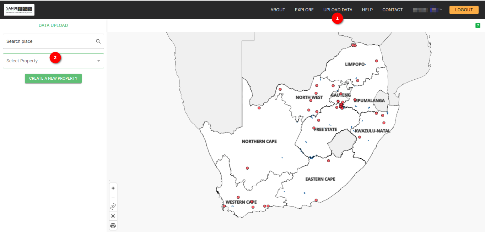

1. **Upload Data:** Click on the `Upload Data` option available in the navigation to navigate to the upload data page.

2. **Search Property:** The user can use the search property dropdown to locate the property they want to edit. Alternatively, they can directly type the property name for quicker access. Click on the property name to go to the upload page, where the user can view or update property details.

## Step 1 Tab

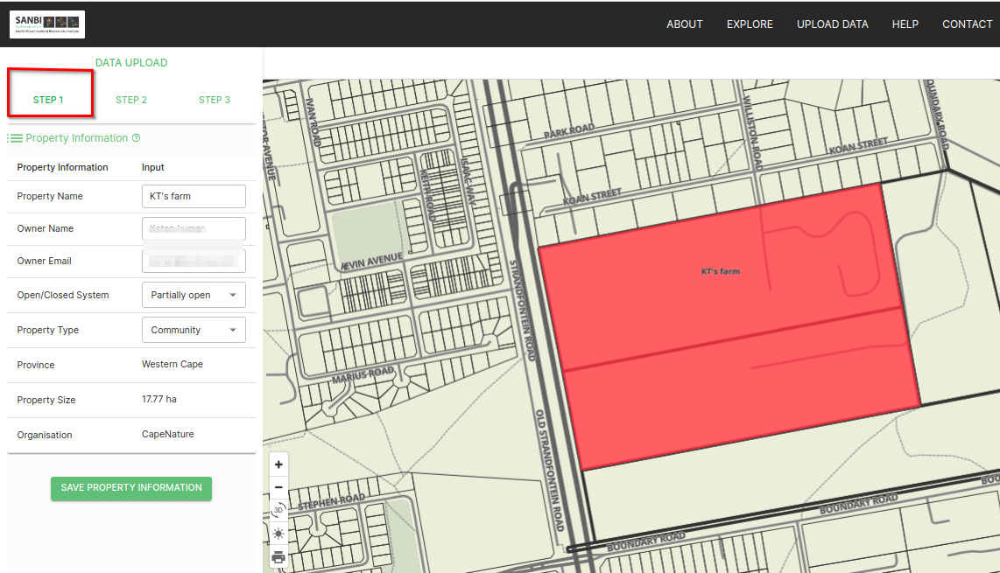

Click on the `Step 1` tab to update property details.

The user can update the property name, open/close system, and property type here. After updating the desired fields, click on the `SAVE PROPERTY INFORMATION` button to save the changes.

Property details before update.

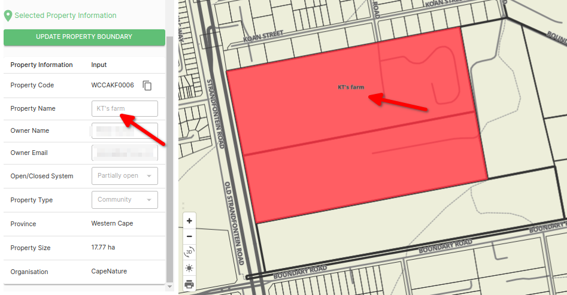

Property details after update.

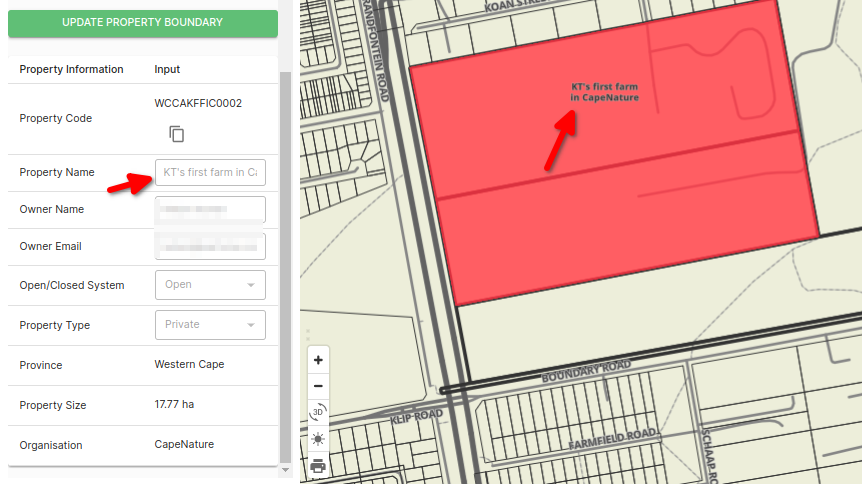

## Step 2 Tab

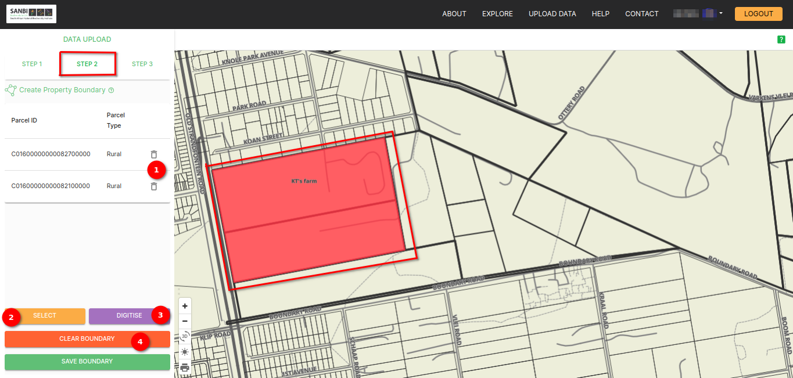

Click on the `Step 2` tab to update property boundaries. The highlighted boundary visible on the map represents the existing property boundary. To modify the boundary, users can utilise the `SELECT` and `DIGITISE` buttons.

1. **Delete Icon:** If the user wants to delete the existing boundaries and add a new boundary they can delete the existing boundary parcel by clicking on the delete icon available with the parcel details or can keep it if do not want to delete the existing boundary.

2. **SELECT:** Click the `SELECT` button to choose and update the property boundary by adding a new parcel from the map. After selecting, click on the `SAVE BOUNDARY` button to save the selected boundary.

Property boundary while selecting new parcels for the property boundary update.

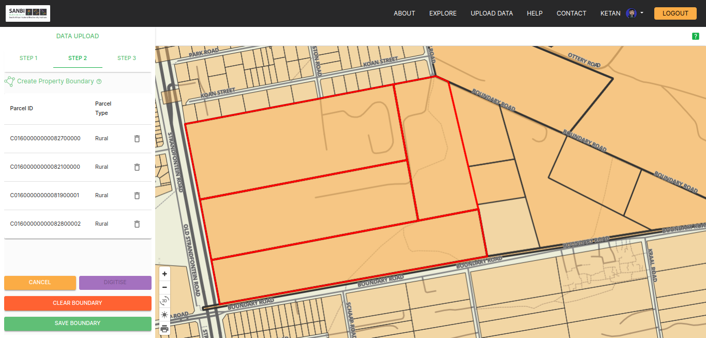

Property boundary after adding new parcels.

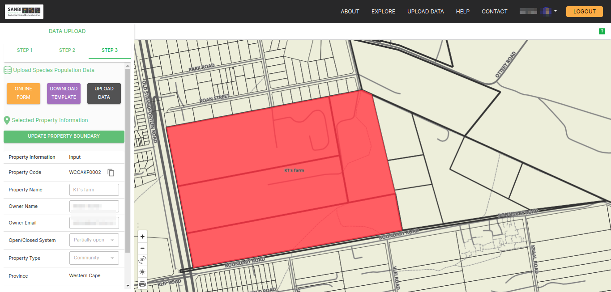

3. **DIGITISE:** Click the `DIGITISE` button to manually digitise and update the boundary on the map.

    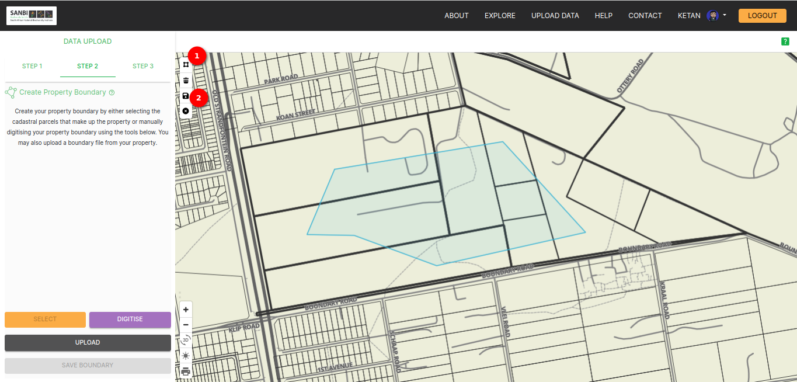

    1. **Polygon Tool Icon** Click on this icon to select the boundary manually on the map. The selected boundary will be visible on the map.

    2. **Save Icon** After selecting, click on the `SAVE` icon at the top left corner of the map to save the digitise boundary. After saving the digitise boundary refresh the page the user will see the new digitise boundaries.

        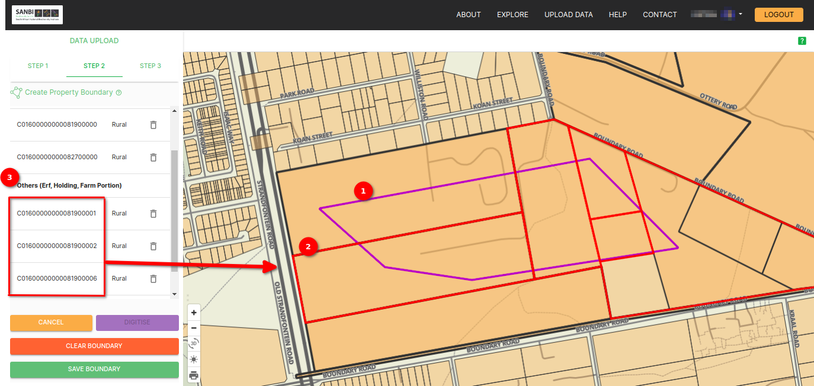

        1. **Blue Boundary:** The `Blue` boundary displays the manually digitised boundary.

        2. **Red Boundary:** The `Red` boundary indicates the digitised boundary selected from specific parcels.

        3. **Farm ID** The selected farm's `Farm ID` can be used to verify whether the user has chosen the correct farm portion.

4. **CLEAR BOUNDARY:** Click on this button to clear all boundaries, then use `SELECT` or `DIGITISE` to add the property boundary.

## Step 3 Tab

Click on the Step 3 tab to update species details.

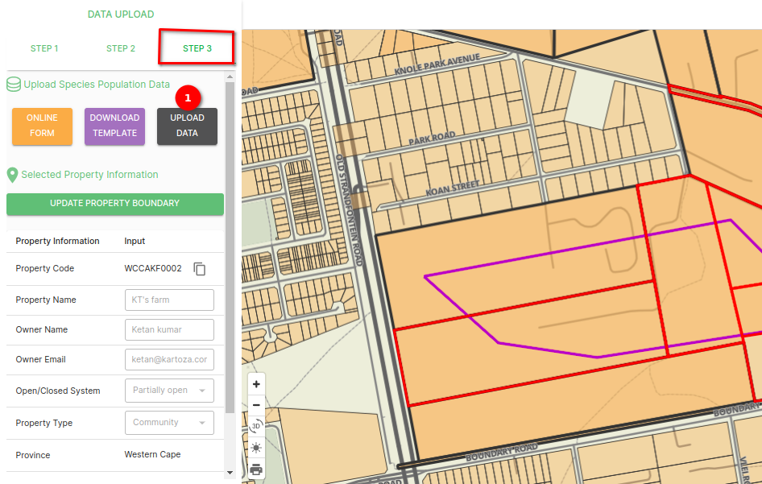

1. **Upload Data:** Use the upload data method to update existing species data. If the user does not have the template, download it by clicking on the `DOWNLOAD TEMPLATE` button. Fill in the data in the downloaded template, ensuring the property ID matches the property ID you want to update. Upon clicking the `UPLOAD DATA` button, the upload data popup window will appear, providing the user with easy-to-use tools for uploading the user's data.

    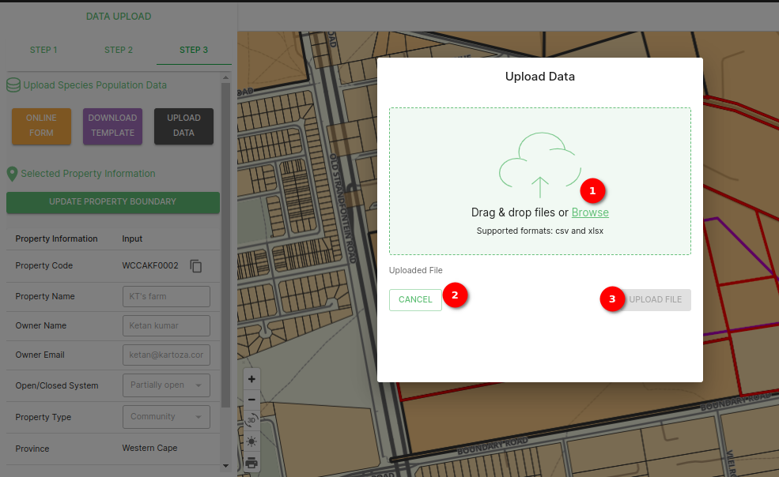

    1. **Browse Button:** Click on the Browse button to select the file that the user wishes to upload. A user can choose a file from the user's local storage that is in either CSV or XLSX format. This file should contain the data the user wants to integrate into the system for further analysis.

    2. **Upload File Button:** After selecting the file, click on the `UPLOAD FILE` button to begin the data upload process. The system will validate and process the data, making it available for the user to use. If there is any error in the uploaded file the system will generate the error file.

        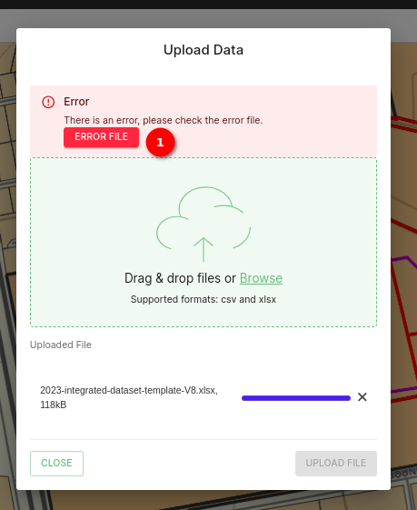

        1. **ERROR FILE:** Click on this button to download the error file. In this file, the user will find the error message indicating the root cause of the issue, facilitating an easier resolution of the error. Open the downloaded error file and click on the first column `error message` to view the error message.

            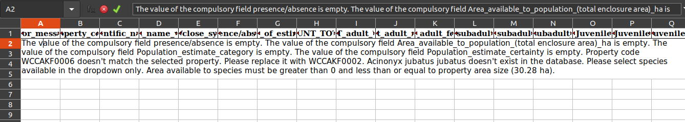

    3. **Close Button:** If the user decides not to proceed with the upload or wishes to cancel the operation, the user can click on the `CLOSE` button. This will close the upload popup without initiating the data upload process.

Ensure that the user saves their changes at each step to update property data accurately.
