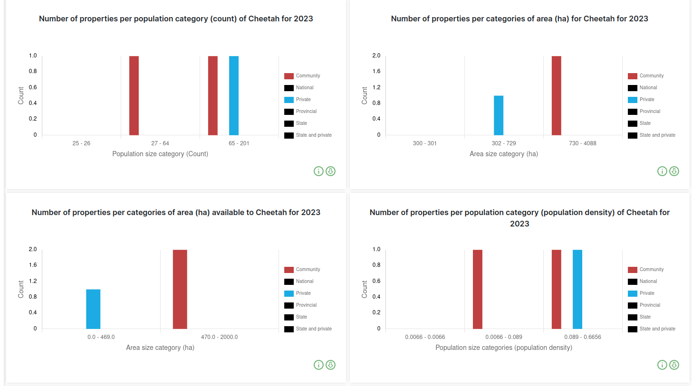

# Charts Page: Download Data Visualisation Functionality Documentation

The `Charts` tab is a powerful tool for visualising data through various charts and graphs. This documentation outlines the functionality of the `Download Data Visualisation` feature, which allows the user to download the charts presented on the page.

## Charts Page

1. **Explore**: By clicking on the `EXPLORE` on the navigation bar the user will be able to see the option for the Charts.

2. **Charts**: By clicking on the `CHARTS` tab, the user will be able to see the various charts. The `Charts` tab offers a variety of charts for data visualisation.

3. **Download Data Visualisation**: The `DOWNLOAD DATA VISUALISATION` button is a convenient feature that enables the user to download the charts and visualisations displayed on the page.

## Usage

To utilise the `Download Data Visualisation` functionality, follow these steps:

- Navigate to the `Charts Page` where the user can visualise their data using charts and graphs.

- Locate the `DOWNLOAD DATA VISUALISATION` button, usually placed in a prominent position on the page.

- Click on the button to initiate the download process.

## Charts On Charts Page
The charts shown to user are configurable via group permission in the Group Table in [Django Admin](../../../administrator/manual/django-table.md).

### Property Count Per Category Charts
These charts show property count per category (population size, property area, area available to species, 
and population density). The colours are configurable via Property Type page in [Django Admin](../../../administrator/manual/django-admin.md) 

## Downloaded Charts PDF

## Summary

The `Download Data Visualisation` functionality on the Charts Page is a valuable feature for saving data visualisations. It allows the user to capture insights presented in charts, making it easier to share and use the data for various purposes, including reporting, analysis, and collaboration with others.
