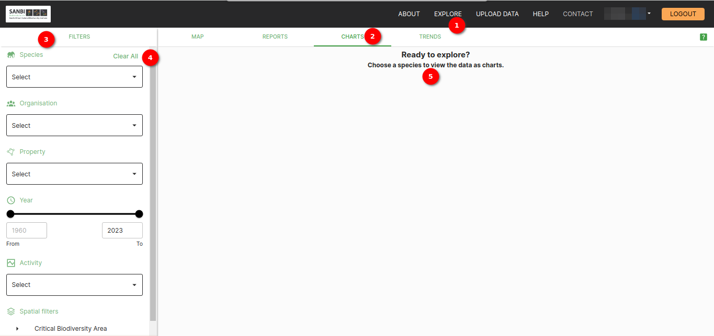
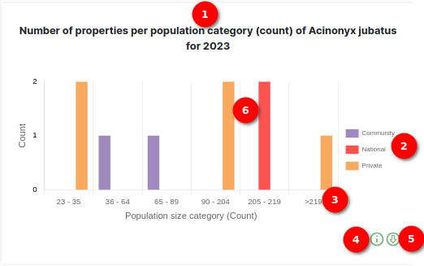
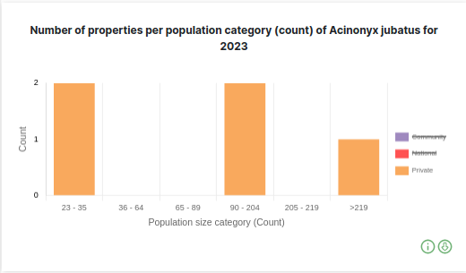
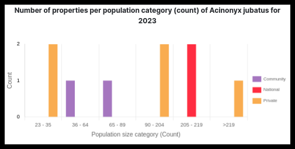
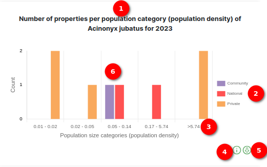
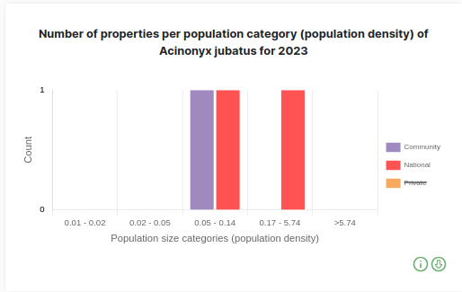
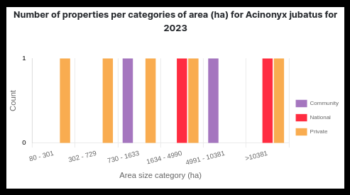
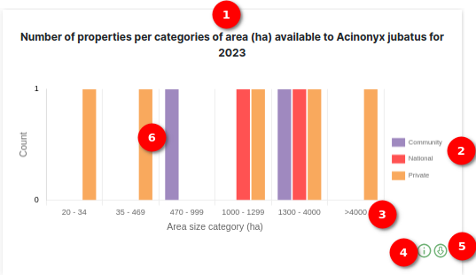
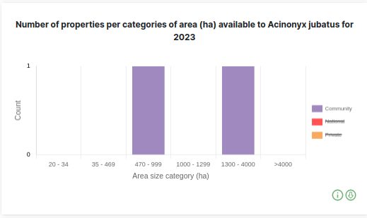
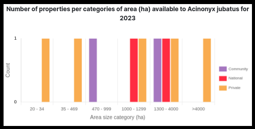

# Charts Page: Download Data Visualisation Functionality Documentation

The `Charts` tab is a powerful tool for visualising data through various charts and graphs. This documentation outlines the functionality of the `Download Data Visualisation` feature, which allows the user to download the charts presented on the page.

> DISCLAIMER: Some of the images in the manual may vary slightly from what you see on the platform due to continuous updates to the platform. On the platform you will see `green question mark`  buttons in the top right corner (underneath the `LOGOUT` button), you can click on these to access the help desk.

## Charts Tab

1. **Explore**: To access the Charts, click on the `EXPLORE` option in the navigation bar.

2. **Charts**: Navigate to the `CHARTS` tab to explore a variety of charts available for data visualisation.

3. **Filters**: Enhance chart visualisation by utilising the available filters for more precise data representation.

4. **Clear All**: Click on `Clear All` to remove all applied filters and reset the chart view. If you click `Clear All`, you will be required to select an organisation or property (or both) before you can view species.

5. **Message**: A helpful and informative message prompts users to explore and view charts.

# Topper

1. **Selected Species**: Indicates the currently chosen species.

2. **Species Icon**: Displays the icon representing the selected species along with its scientific name.

3. **Lists**: Presents a comprehensive list of the selected species, organisations, properties, and activities. This section provides an overview of the elements currently chosen.

4. **DOWNLOAD DATA VISUALISATION**: The `DOWNLOAD DATA VISUALISATION` button serves as a convenient feature, allowing users to download the charts and visualisations presented on the current page. This functionality provides users with the option to retain and share the visualised data for further analysis or documentation.

## Charts

### Number of properties per population category (count) of species for year chart

1. **Chart Title**: The chart title displays the title of the chart, including the year and common name of the selected species. This provides users with key information about the context and scope of the chart.

2. **Tooltip**: The tooltip feature provides additional details about each data point on the chart. It specifically shows the property type along with corresponding colors. Users can interact with the chart by clicking on the name of a property type in the Tooltip, enabling them to selectively remove bars from the chart. This interactive functionality allows users to focus on and explore specific property types of their choice within the chart.

    

3. **Population count Range**: This feature signifies the range of population counts depicted on the chart. It provides users with information about the span of population numbers represented in the visual data.

4. **Information Icon**: Hover over the information icon to access details about the chart.

5. **Download Icon**: Click the download icon to save the currently displayed chart.

    

6. **Bars**: These represent the population distribution. Users can hover over each bar to access information about the property type, population range, and the specific count of the property of that type.

### Number of properties per population category (population density) of species for year chart

1. **Chart Title**: The chart title displays the title of the chart, including the year and common name of the selected species. This provides users with key information about the context and scope of the chart.

2. **Tooltip**: The tooltip feature provides additional details about each data point on the chart. It specifically shows the property type along with corresponding colors. Users can interact with the chart by clicking on the name of a property type in the Tooltip, enabling them to selectively remove bars from the chart. This interactive functionality allows users to focus on and explore specific property types of their choice within the chart.

    

3. **Population Density Range**: This element denotes the extent of population density showcased on the chart. It offers users information about the range of population densities represented in the visual data.

4. **Information Icon**: Hover over the information icon to access details about the chart.

5. **Download Icon**: Click the download icon to save the currently displayed chart.

    

6. **Bars**: These bars represent the distribution of properties based on different population density categories. Users can hover over each bar to access information about the property type, the corresponding population range, and the specific count of properties within that category.

### Number of properties per categories of area (ha) for species for year chart

1. **Chart Title**: The chart title displays the title of the chart, including the year and common name of the selected species. This provides users with key information about the context and scope of the chart.

2. **Tooltip**: The tooltip feature provides additional details about each data point on the chart. It specifically shows the property type along with corresponding colors. Users can interact with the chart by clicking on the name of a property type in the Tooltip, enabling them to selectively remove bars from the chart. This interactive functionality allows users to focus on and explore specific property types of their choice within the chart.

    

3. **Area Size Range**: This feature illustrates the span of area sizes presented on the chart. It provides users with information about the range of different area sizes included in the visual representation.

4. **Information Icon**: Hover over the information icon to access details about the chart.

5. **Download Icon**: Click the download icon to save the currently displayed chart.

    

6. **Bars**: These bars represent the distribution of properties based on different area size categories. Users can hover over each bar to access information about the property type, the corresponding population range, and the specific count of properties within that category.

### Number of properties per categories of area (ha) available to species for year chart

1. **Chart Title**: The chart title displays the title of the chart, including the year and common name of the selected species. This provides users with key information about the context and scope of the chart.

2. **Tooltip**: The tooltip feature provides additional details about each data point on the chart. It specifically shows the property type along with corresponding colors. Users can interact with the chart by clicking on the name of a property type in the Tooltip, enabling them to selectively remove bars from the chart. This interactive functionality allows users to focus on and explore specific property types of their choice within the chart.

    

3. **Area Available Range**: This feature illustrates the span of available area sizes presented on the chart. It provides users with information about the range of different available area sizes included in the visual representation.

4. **Information Icon**: Hover over the information icon to access details about the chart.

5. **Download Icon**: Click the download icon to save the currently displayed chart.

    

6. **Bars**: These bars represent the distribution of properties based on different area size categories. Users can hover over each bar to access information about the property type, the corresponding population range, and the specific count of properties within that category.

### Total count of species per province chart

1. **Chart Title**: The chart title provides an overview of the total count of species across different provinces.

2. **Bars**: These bars represent the total count of species for each province. Users can hover over each bar to access information about the specific province and its corresponding total count of species.

3. **Province Name**: This chart component visually represents the diversity of provinces, with each bar corresponding to a specific province and its associated total count of species. It offers users a comprehensive understanding of the distribution of species across various regions.

4. **Information Icon**: Users can hover over the information icon to access more details about the chart, providing context and additional insights.

5. **Download Icon**: Clicking the download icon allows users to save the current chart for future reference or sharing.

    

### Activity count as % of total population chart

1. **Chart Title**: The chart title displays the title of the chart.

2. **Tooltip**: The tooltip feature provides additional details about each data point on the chart. It specifically shows the activity type along with corresponding colors. Users can interact with the chart by clicking on the name of an activity type in the Tooltip, enabling them to selectively remove bars from the chart. This interactive functionality allows users to focus on and explore specific activity types of their choice within the chart.

    

3. **n=count**: This shows the number of the species affected by the specific activity type

4. **Information Icon**: Hover over the information icon to access details about the chart.

5. **Download Icon**: Click the download icon to save the currently displayed chart.

    

6. **Bars**: These bars represent the distribution of activities as a percentage of the total population. Users can hover over each bar to access information about the activity name, the corresponding percentage, and the specific count of that activity type.

### Total count per population estimate category for species for year chart

1. **Chart Title**: The chart title provides an overview of the total count of species based on different population estimate categories in the year.

2. **Tooltip**: A tooltip feature is available, allowing users to gather additional details for each data point on the chart. It provides insights into specific population estimate categories and facilitates interaction by enabling users to focus on particular areas of interest.

    

3. **Pie Chart**: This chart component visually represents the diversity of Population Estimate Categories for species. Each slice of the pie corresponds to a specific estimate category, offering users a comprehensive understanding of the distribution.

4. **Information Icon**: Hover over the information icon to access details about the chart.

5. **Download Icon**: Click the download icon to save the currently displayed chart.

    

### Mean and standard deviation of age classes for species chart

1. **Chart Title**: The chart title provides an overview of the mean and standard deviation of age classes for the specified species.

2. **Tooltip**: A tooltip feature is available, allowing users to gather additional details for each data point on the chart. It provides insights into specific age classes, mean values, and standard deviations, facilitating interaction and focus on particular areas of interest.

    

3. **Bars**: These data points represent the mean and standard deviation of age classes for the species. Users can hover over each point to access information about the specific age class, its mean value, and standard deviation.

4. **Age Classes**: This chart component visually represents the distribution of age classes for the species. Each data point on the chart is associated with the mean and standard deviation of a particular age class, offering users a comprehensive understanding of the age structure.

5. **Information Icon**: Users can hover over the information icon to access more details about the chart, providing context and additional insights.

6. **Download Icon**: Clicking the download icon allows users to save the current chart for future reference or sharing.

    

## Summary

Welcome to the `Charts Page`, where the site presents visual insights into various aspects of data. Explore the distribution of properties based on area sizes and population categories, understand the total count of species across provinces, and delve into the age structure of a specified species with mean and standard deviation values for different age classes. While these charts offer a convenient way to comprehend complex information.

> DISCLAIMER: Some of the images in the manual may vary slightly from what you see on the platform due to continuous updates to the platform.
