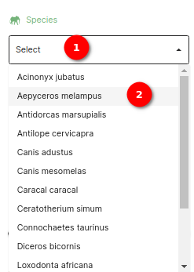
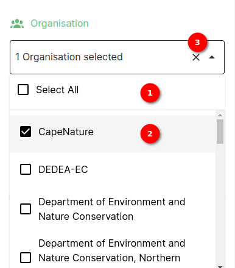
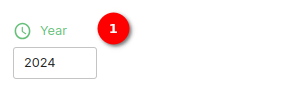
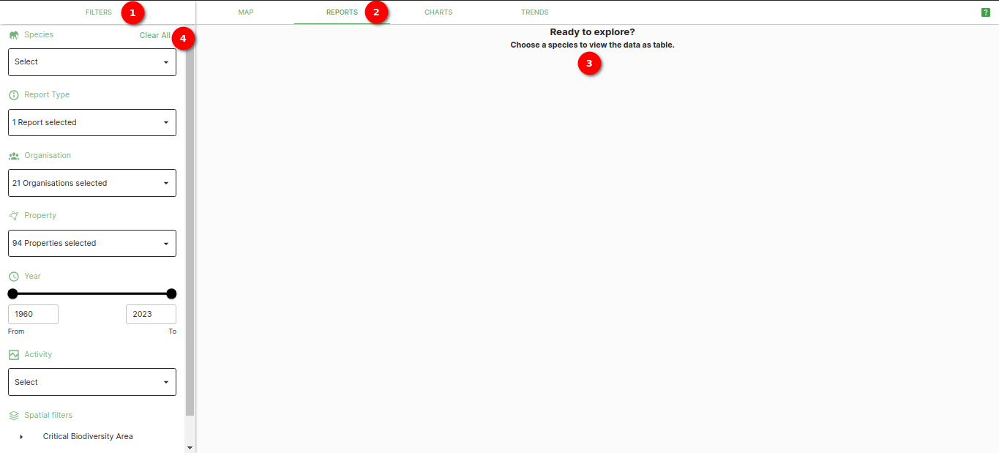
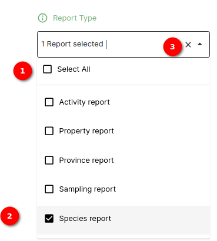
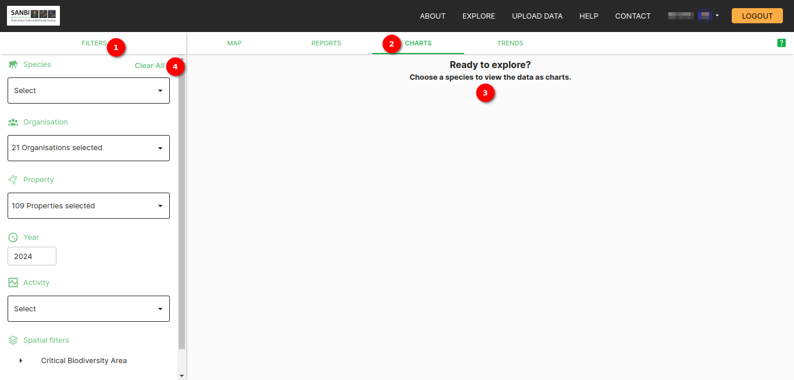
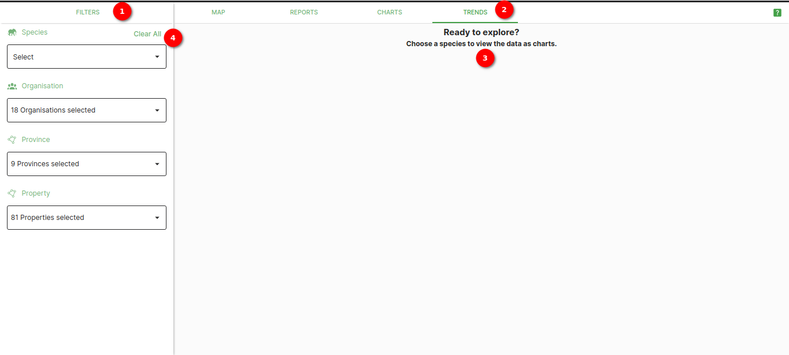

# Filter Side Panel Documentation

The filter side panel allows users to refine and narrow down data based on specific criteria. There are different types of filters are available for customisation.

> **Disclaimer:** Please read the following information carefully. The screenshots may vary slightly due to various user roles on the platform. Some of the images in the manual may vary slightly from what you see on the platform due to continuous updates to the platform. On the platform you will see `green question mark`  buttons in the top right corner (underneath the `LOGOUT` button), you can click on these to access the help desk.

## Map Tab Filter Panel Overview

The filter side panel enhances the user experience by allowing them to focus on specific subsets of data based on their preferences, making it easier to analyse and work with the dataset effectively.

## Viewing the filters

1. **Explore:** Open the Explore page by clicking on `EXPLORE` on the navigation bar.
2. **Filter:** Open the filter side panel by clicking on the `FILTERS` option. Inside the side panel, the user will find all of the filters. For each filter, a user can interact with the available options or input fields to customise their filter criteria. The user can click on the dropdown and select the filter.
3. **Map:** Click on the `MAP` tab to view the map.
4. **Clear All:** Click on the `Clear All` button to clear all the filters. If you click `Clear All`, you will be required to select an organisation or property (or both) before you can view species.

- **Layers**: click [here](./layers.md) to view detailed documentation on layers.

## Filter side panel overview

### Filter Types

#### 1. Search place Filter

* **Filter Description:** This filter allows users to search for places.
* **Usage:** Click on the search place field and type letters to search for places.

    

1. **Search place:** Click on the search place to filter places.

#### 2. Species Filter

* **Filter Description:** The species filter allows users to filter data by species.
* **Usage:** Choose a species from the list to view data specific to that species.

    

1. **Searching for Species:** Click on the Species Filter dropdown. A user will see a list of available species. A user can start typing the name of the species they are looking for in the search box provided. As the user types, the list will dynamically filter to display matching species. The user can select the species that they want to filter from the list.
2. **Single-Select Functionality:** The Species Filter allows the user to select only one species at a time. If the user selects a different species, the filter will replace the previous selection with the newly chosen species.

#### 3. Organisation Filter

* **Filter Description:** This filter allows users to filter data according to the organisation. This filter allows users to make multiple selections for a more customised view.
* **Usage:** Select an organisation from the dropdown menu to filter data specific to that organisation.
* **Permission:** Users associated with more than one organisation or those with `National data scientist` and `Regional data scientist` group permissions can view this filter.

    

1. **Selecting All Organisations:** To view data from all organisations, simply check the "Select All" option within the Organisation Filter.
2. **Selecting Individual Organisations:** To filter data for specific organisations, a user can follow these steps:
    * Uncheck the `Select All` option if it is selected.
    * A list of available organisations will be displayed.
    * Check the checkboxes next to the organisations the user wants to include in the filter.
3. **Cross Icon:** Click on the `Cross` icon to clear organisation filter.

#### 4. Property Filter

* **Filter Description:** The property filter helps users filter data based on properties. This filter is dependent on the organisation filter, meaning the available options are influenced by the selected organisations. Users can make multiple selections for a more customised view.
* **Usage:** Select a property from the available options to view data related to that property.
* **Permission:** The `can view property filter` permission must be added to the group on the admin page,
to allow the user group (e.g. `National data scientist`) to see the property filter.

    

1. **Property Filter:** In the property filter, all properties are initially selected as the default setting. Users have the freedom to hand-pick a property of their choice. If a user is associated with multiple organisations, the filter intelligently displays a list of properties aligned with the selected organisation, ensuring a tailored and organisation-specific selection experience.

#### 5. Year Range Filter

* **Filter Description:** This filter allows users to narrow down data based on a specified year.
* **Usage:** Enter the desired year to view data for that specific year.

    

1. **Input Year Field:** Users can directly input a specific year to filter the data accordingly. An error will be displayed if the entered year falls outside the available range.

#### 6. Activity Filter

* **Filter Description:** This filter allows users to narrow down data based on an activity type. This filter allows users to make multiple selections for a more customised view.
* **Usage:** Filter data based on an activity type.

    

1. **Selected Activity:** Choose the activity type to filter the displayed data based on the selected activities.

#### 7. Spatial Filter

* **Filter Description:** This filter allows users to filter data based on spatial information.
* **Usage:** Specify spatial criteria to view data located within a specific geographical area.

    

1. **Critical biodiversity type dropdown** Using this, the user can filter the data according to the critical biodiversity areas.

    

    1. **Available Critical Biodiversity Areas**: Choose a critical biodiversity area to view data specific to that area. This filter supports multiple selections, providing users with a more customised view.

2. **Ecosystem dropdown:** Using this, the user can filter the data according to the ecosystem types.

    

    1. **Available Ecosystem**: Choose an ecosystem to view data specific to that area. This filter supports multiple selections, providing users with a more customised view.

## Summary

The filter side panel provides a robust toolset for users to refine and explore their datasets effectively. Whether it's searching for specific places, species, or filtering by activities, organisations, properties, years, or spatial criteria, this comprehensive manual ensures users can seamlessly navigate and utilise the filtering functionalities for a more tailored data analysis experience.

## Reports Tab Filter Panel Overview

> **Disclaimer:** Please read the following information carefully. The screenshots may vary slightly due to various user roles on the platform.

1. **Filter:** Available filters on the reports tab.
2. **Reports:** Click on the `REPORTS` tab to view the reports.
3. **Message:** Instructive message to view the reports.
4. **Clear All:** Click on the `Clear All` button to clear all the filters. If you click `Clear All`, you will be required to select an organisation or property (or both) before you can view species.

### 1. Species Filter

* **Filter Description:** The species filter allows users to filter data by species. This filter allows users to make multiple selections for a more customised view.
* **Usage:** Choose a species from the list to view data specific to that species.

    

1. **Searching for Species:** Click on the Species Filter dropdown. A user will see a list of available species. A user can start typing the name of the species they are looking for in the search box provided. As the user types, the list will dynamically filter to display matching species. The user can select the species that they want to filter from the list.
2. **Multi-Select Functionality:** The Species Filter allows the user to select multiple species at a time.

### 2. Report Type Filter

* **Filter Description:** This filter allows users to filter data based on report types. This filter appears on the reports tab. This filter allows users to make multiple selections for a more customised view.
* **Usage:** Choose a report type from the list to view data associated with that report type.

    

1. **Selecting All:** To view data of all reports, simply check the `Select All` option within the reports filter.

2. **Species report:** The species report is selected by default. The user can choose the report type of their choice.

3. **Cross Icon:** Click on the `Cross` icon to clear the report type filter.

### 3. Organisation Filter

* **Filter Description:** This filter allows users to filter data according to the organisation. This filter allows users to make multiple selections for a more customised view.
* **Usage:** Select an organisation from the dropdown menu to filter data specific to that organisation.
* **Permission:** Users associated with more than one organisation or those with `National data scientist` and `Regional data scientist` group permissions can view this filter.

    

1. **Organisation Filter:** All organisation are selected by default. Users can choose the organisation of their choice.

### 4. Property Filter

* **Filter Description:** The property filter helps users filter data based on properties. This filter is dependent on the organisation filter, meaning the available options are influenced by the selected organisations. Users can make multiple selections for a more customised view.
* **Usage:** Select a property from the available options to view data related to that property.

    

1. **Property Filter:** In the property filter, all properties are initially selected as the default setting. Users have the freedom to hand-pick a property of their choice. If a user is associated with multiple organisations, the filter intelligently displays a list of properties aligned with the selected organisation, ensuring a tailored and organisation-specific selection experience.

### 5. Year Range Filter

* **Filter Description:** This filter allows users to narrow down data based on a specified year range.
* **Usage:** Set a range of years to view data within that time frame. For example, selecting a range of "2010-2020" will display data recorded between 2010 and 2020.

    

1. **Year Range Bar:** This is the bar that is used for setting the year range.
2. **From:** This is where the user, can input the starting year value for the year range.
3. **To:** This is where the user, can input the ending year value for the year range.

### 6. Activity Filter

* **Filter Description:** This filter allows users to narrow down data based on an activity type. This filter allows users to make multiple selections for a more customised view.
* **Usage:** Filter data based on an activity type.

    

1. **Activity Filter:** Users can choose the activities of their choice.

### 7. Spatial Filter

* **Filter Description:** This filter allows users to filter data based on spatial information.
* **Usage:** Specify spatial criteria to view data located within a specific geographical area.

    

1. **Critical biodiversity type dropdown** Using this, the user can filter the data according to the critical biodiversity areas.

    

    1. **Available Critical Biodiversity Areas**: Choose a critical biodiversity area to view data specific to that area. This filter supports multiple selections, providing users with a more customised view.

2. **Ecosystem dropdown:** Using this, the user can filter the data according to the ecosystem types.

    

    1. **Available Ecosystem**: Choose an ecosystem to view data specific to that area. This filter supports multiple selections, providing users with a more customised view.

### Summary

The filter side panel provides a robust toolset for users to refine and explore their datasets effectively. Whether it's searching for specific places, species, or filtering by activities, organisations, properties, years, or spatial criteria, this comprehensive manual ensures users can seamlessly navigate and utilise the filtering functionalities for a more tailored data analysis experience.

## Charts Tab Filter Panel Overview

> **Disclaimer:** Please read the following information carefully. The screenshots may vary slightly due to various user roles on the platform.

1. **Filter:** Available filters on the charts tab.
2. **Charts:** Click on the `CHARTS` tab to view the charts.
3. **Message:** Instructive message to view the charts.
4. **Clear All:** Click on the `Clear All` button to clear all the filters. If you click `Clear All`, you will be required to select an organisation or property (or both) before you can view species.

### 1. Species Filter

* **Filter Description:** The species filter allows users to filter data by species.
* **Usage:** Choose a species from the list to view data specific to that species.

    

1. **Searching for Species:** Click on the Species Filter dropdown. A user will see a list of available species. A user can start typing the name of the species they are looking for in the search box provided. As the user types, the list will dynamically filter to display matching species. The user can select the species that they want to filter from the list.
2. **Single-Select Functionality:** The Species Filter allows the user to select only one species at a time. If the user selects a different species, the filter will replace the previous selection with the newly chosen species.

### 2. Organisation Filter

* **Filter Description:** This filter allows users to filter data according to the organisation. This filter allows users to make multiple selections for a more customised view.
* **Usage:** Select an organisation from the dropdown menu to filter data specific to that organisation.
* **Permission:** Users associated with more than one organisation or those with `National data scientist` and `Regional data scientist` group permissions can view this filter.

    

1. **Organisation Filter:** All organisation are selected by default. Users can choose the organisation of their choice.

### 3. Property Filter

* **Filter Description:** The property filter helps users filter data based on properties. This filter is dependent on the organisation filter, meaning the available options are influenced by the selected organisations. Users can make multiple selections for a more customised view.
* **Usage:** Select a property from the available options to view data related to that property.

    

1. **Property Filter:** In the property filter, all properties are initially selected as the default setting. Users have the freedom to hand-pick a property of their choice. If a user is associated with multiple organisations, the filter intelligently displays a list of properties aligned with the selected organisation, ensuring a tailored and organisation-specific selection experience.

### 4. Year Range Filter

* **Filter Description:** This filter allows users to narrow down data based on a specified year.
* **Usage:** Enter the desired year to view data for that specific year.

    

1. **Input Year Field:** Users can directly input a specific year to filter the data accordingly. An error will be displayed if the entered year falls outside the available range.

### 5. Activity Filter

* **Filter Description:** This filter allows users to narrow down data based on an activity type. This filter allows users to make multiple selections for a more customised view.
* **Usage:** Filter data based on an activity type.

    

1. **Activity Filter:** Users can choose the activities of their choice.

### 6. Spatial Filter

* **Filter Description:** This filter allows users to filter data based on spatial information.
* **Usage:** Specify spatial criteria to view data located within a specific geographical area.

    

1. **Critical biodiversity type dropdown** Using this, the user can filter the data according to the critical biodiversity areas.

    

    1. **Available Critical Biodiversity Areas**: Choose a critical biodiversity area to view data specific to that area. This filter supports multiple selections, providing users with a more customised view.

2. **Ecosystem dropdown:** Using this, the user can filter the data according to the ecosystem types.

    

    1. **Available Ecosystem**: Choose an ecosystem to view data specific to that area. This filter supports multiple selections, providing users with a more customised view.

### Summary

The filter panel empowers users to customise their data views efficiently, allowing for a focused exploration of charted information. Whether refining by species, activity, organisation, property, year range, or spatial criteria, users have a versatile toolkit at their disposal for a more tailored and insightful chart-viewing experience.

## Trends Tab Filter Panel Overview

> **Disclaimer:** Please read the following information carefully. The screenshots may vary slightly due to various user roles on the platform.

1. **Filter:** Available filters on the trends tab.
2. **Trends:** Click on the `TRENDS` tab to view the trends.
3. **Message:** Instructive message to view the trends.
4. **Clear All:** Click on the `Clear All` button to clear all the filters. If you click `Clear All`, you will be required to select an organisation or property (or both) before you can view species.

### 1. Species Filter

* **Filter Description:** The species filter allows users to filter data by species.
* **Usage:** Choose a species from the list to view data specific to that species.

    

1. **Searching for Species:** Click on the Species Filter dropdown. A user will see a list of available species. A user can start typing the name of the species they are looking for in the search box provided. As the user types, the list will dynamically filter to display matching species. The user can select the species that they want to filter from the list.
2. **Single-Select Functionality:** The Species Filter allows the user to select only one species at a time. If the user selects a different species, the filter will replace the previous selection with the newly chosen species.

### 2. Organisation Filter

* **Filter Description:** This filter allows users to filter data according to the organisation. This filter allows users to make multiple selections for a more customised view.
* **Usage:** Select an organisation from the dropdown menu to filter data specific to that organisation.
* **Permission:** Users associated with more than one organisation or those with `National data scientist` and `Regional data scientist` group permissions can view this filter.

    

1. **Organisation Filter:** All organisation are selected by default. Users can choose the organisation of their choice.

### 3. Province Filter

* **Filter Description:** The province filter helps users filter data based on provinces. This filter allows users to make multiple selections for a more customised view.
* **Usage:** Select a province from the available options to view data related to that province.

    

1. **Province Filter:** In the province filter, all provinces are initially selected as the default setting. Users have the freedom to hand-pick a province of their choice.

### 4. Property Filter

* **Filter Description:** The property filter helps users filter data based on properties. This filter is dependent on the organisation filter, meaning the available options are influenced by the selected organisations. Users can make multiple selections for a more customised view.
* **Usage:** Select a property from the available options to view data related to that property.

    

1. **Property Filter:** In the property filter, all properties are initially selected as the default setting. Users have the freedom to hand-pick a property of their choice. If a user is associated with multiple organisations, the filter intelligently displays a list of properties aligned with the selected organisation, ensuring a tailored and organisation-specific selection experience.

### Summary

With these versatile filtering options, users can delve into trends with a focused and tailored approach, ensuring a more insightful and efficient chart-viewing experience. Please note that the provided screenshots serve as illustrative examples, and variations may occur based on user roles within the platform.
