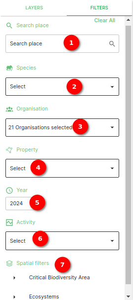
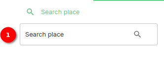
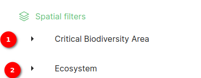

# Filter Side Panel Documentation

## Description

The filter side panel allows users to refine and narrow down data based on specific criteria. There are different type of filters are available for customisation.
The filter side panel enhances the user experience by allowing them to focus on specific subsets of data based on their preferences, making it easier to analyse and work with the dataset effectively.

## Viewing the filters

1. **Explore:** Open the explore page by clicking on `Explore` on the navigation bar.
2. **Filter:** Open the filter side panel by clicking on the `FILTERS` option. Inside the side panel, you will find the all the filters. For each filter, interact with the available options or input fields to customise your filter criteria. Just click on the dropdown and select the filter.

## Filter side panel overview

### Filter Types

#### 1. Search place Filter

* **Filter Description:** This filter allows users to search place.
* **Usage:** Click on search place to search the places.

1. **Search place:** Click on search place to search the places and filter.

#### 2. Organisation Filter

* **Filter Description:** This filter allows users to filter data according to the organisation.
* **Usage:** Select an organisation from the dropdown menu to filter data specific to that organisation.

1. **Selecting All Organisations:** To view data from all organisations, simply check the "Select All" option within the Organisation Filter.
2. **Selecting Individual Organisations:** To filter data for specific organisations, follow these steps:
    * Uncheck the "Select All" option if it is selected.
    * A list of available organisations will be displayed.
    * Check the checkboxes next to the organisations you want to include in the filter.

#### 3. Report Type Filter

* **Filter Description:** This filter enables users to filter data based on report types.
* **Usage:** Choose a report type from the list to view data associated with that report type.

1. **Report type:** The Report Type Filter is a single-select filter that allows users to filter data based on specific report types. With this filter, you can easily narrow down your dataset to view data associated with a particular report type.

#### 4. Property Filter

* **Filter Description:** The property filter helps users filter data based on properties.
* **Usage:** Select a property from the available options to view data related to that property.

1. **Select all:** Select all selects all the properties.
2. **Show selected property count:** You will see the count of the property selected.

#### 5. Species Filter

* **Filter Description:** The species filter allows users to filter data by species.
* **Usage:** Choose a species from the list to view data specific to that species.

1. **Searching for Species:** Click on the Species Filter dropdown. You will see a list of available species. Start typing the name of the species you are looking for in the search box provided. As you type, the list will dynamically filter to display matching species. Select the species you want to filter by from the list.
2. **Single-Select Functionality:** The Species Filter allows you to select only one species at a time. If you select a different species, the filter will replace the previous selection with the newly chosen species.

#### 6. Activity Filter

* **Filter Description:** This filter allows users to narrow down data based on a activity type.
* **Usage:** Filter data based on a activity type.

1. **Select:** Select activity type to filter the data based on the activity type.

#### 7. Year Range Filter

* **Filter Description:** This filter allows users to narrow down data based on a specified year range.
* **Usage:** Set a range of years to view data within that time frame. For example, selecting a range of "2010-2020" will display data recorded between 2010 and 2020.

1. **Year range bar:** This is the bar which is used for setting the year range.
2. **From:** Input field for the from (starting) year value.
3. **To:** Input field for the to (ending) year value.

#### 8. Spatial Filter

* **Filter Description:** This filter allows users to filter data based on spatial information.
* **Usage:** Specify spatial criteria to view data located within a specific geographical area.

1. **Critical biodiversity type dropdown** Using this you can filter the data according to the critical biodiversity areas.
2. **Ecosystem dropdown:** Using this you can filter the data according to the ecosystem types.

## Summary

The Data Table Page is a comprehensive platform for exploring, analysing, and interacting with your data. With filters, column search, and data export options, you have the tools necessary to customise your data view, find specific information, and export data in the format that suits your needs.
